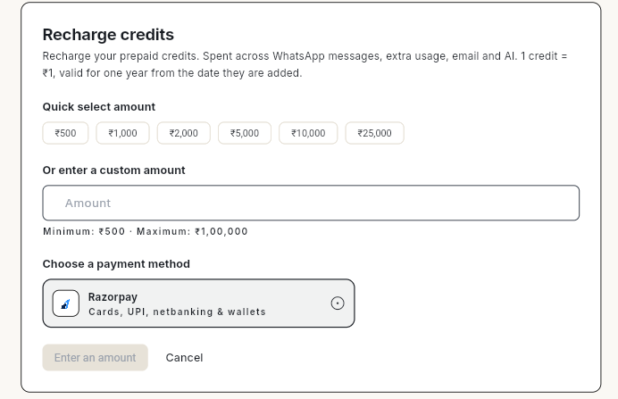
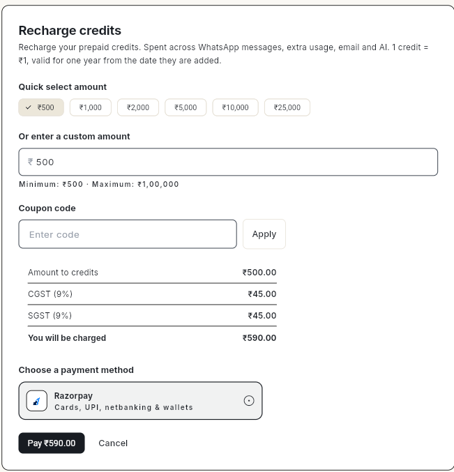
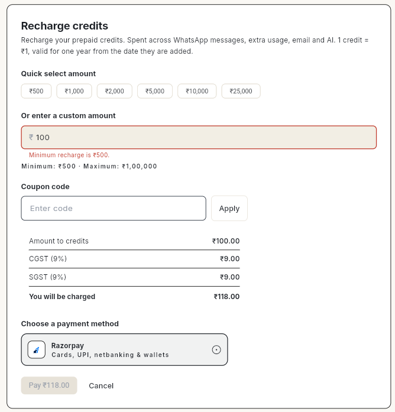

# Add funds to your account

Add funds (recharge credits) to keep sending WhatsApp messages, emails and AI replies. You pick an amount, Ohanvi adds 18% GST, and you pay through Razorpay by card, UPI, netbanking or wallet.

## Before you start

- You are signed in to Ohanvi. See [Sign in to Ohanvi](sign-in.md).
- You know how credits work: 1 credit = ₹1, valid for one year. See [Credits and billing in Ohanvi](credits-and-billing.md).
- You have a card, UPI app, netbanking or wallet ready to pay.
- To claim GST, you have added your GSTIN in **Invoice Details** before recharging.

## Steps

1. Click the **Credits** box in the top-right corner. The **Credits** page opens.
2. Click **Recharge** at the top of the page, or **Recharge credits** in the **This cycle** card. The **Recharge credits** window opens.

    

3. Choose an amount:
    - Click a **Quick select amount**: ₹500, ₹1,000, ₹2,000, ₹5,000, ₹10,000 or ₹25,000, **or**
    - Type your own amount in **Or enter a custom amount**. The minimum is ₹500 and the maximum is ₹1,00,000.
4. If you have a coupon, type it in **Coupon code** and click **Apply**.
5. Check the breakdown before you pay:

    | Line | Example for ₹500 |
    | --- | --- |
    | **Amount to credits** | ₹500.00 |
    | **CGST (9%)** | ₹45.00 |
    | **SGST (9%)** | ₹45.00 |
    | **You will be charged** | ₹590.00 |

    

6. Under **Choose a payment method**, keep **Razorpay** selected.
7. Click **Pay ₹[amount]**, for example **Pay ₹590.00**, and complete the payment in the Razorpay window.
8. When the payment succeeds, the credits are added to your **Credit balance**, and the recharge appears in **Statement** and **Invoices** on the Credits page.

!!! note
    You receive credits equal to the amount you chose. GST is charged on top. A ₹500 recharge costs ₹590 and adds 500 credits.

## Video walkthrough

[VIDEO]

## Troubleshooting

| Issue | Cause | Fix |
| --- | --- | --- |
| **Minimum recharge is ₹500.** and the **Pay** button is grey | The amount is below ₹500. | Enter ₹500 or more. |
| **Pay** button shows **Enter an amount** | No amount is chosen. | Click a quick amount or type one. |
| **'[code]' is not a valid coupon code.** | The coupon is mistyped, expired or not meant for your account. | Check the code with whoever gave it to you, or remove it and pay without a coupon. |
| You want more than ₹1,00,000 | The maximum for one recharge is ₹1,00,000. | Recharge in more than one payment. |
| Money left your bank but the balance did not change | The payment is still being confirmed. | Wait a few minutes and refresh the Credits page. If it still does not show, contact support with the payment reference. |
| Invoice has no GSTIN | GSTIN was not added before the recharge. | Add your GSTIN in **Invoice Details** before your next recharge. |

## Related

- [Credits and billing in Ohanvi](credits-and-billing.md)
- [Sign in to Ohanvi](sign-in.md)
