# Create a WhatsApp chatbot flow

Build a chatbot that starts when a customer sends a keyword, shows a welcome message with buttons, asks for their name and email, and closes with a message that uses those answers.

## Before you start

- Your WhatsApp Business number is connected in **WhatsApp → Manage**.
- You have a test phone number that is not currently assigned to an agent in **Inbox**.
- You have picked a start keyword that no other active flow uses (check in the **Test** tab, step 12).

## Steps

### Create the flow

1. Open **WhatsApp → Flows**.
2. Click **New flow**. A blank canvas opens.

    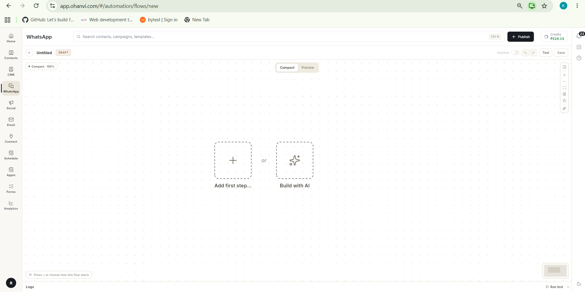

3. Click **Add first step…**, then choose **Start WhatsApp flow**.

    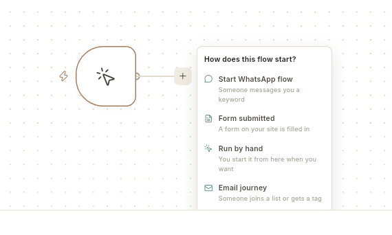

4. In **Keywords**, type the word that starts the bot, for example `hello`. Separate several keywords with commas.
5. Keep **Match when the message** as **Has the keyword as a word**, then click **Start building**.

    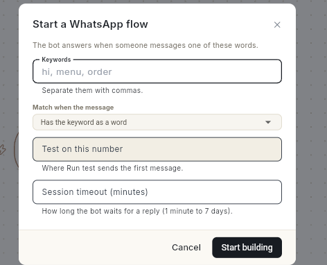

    Keywords are not case-sensitive. `hello`, `Hello` and `HELLO` all start the flow.

### Add the welcome message and buttons

6. Click the **+** next to the start node and choose **Send a message**.
7. In the right panel, type the message, for example `Hi, how can I help you?`.
8. Click **+ Add Button** and type a label, for example `Admission`. Repeat for `Fees` and `Contact Us`.

    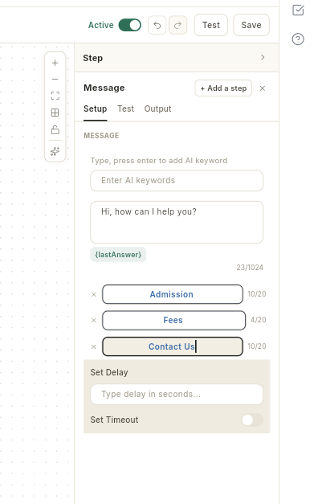

    A message can have up to 3 buttons. Each label can be up to 20 characters.

### Ask for name and email

9. At the bottom of the card, click **+ Add Content** and choose **Ask Question**.
10. Type the question, for example `What is your name?`, and set **Save the answer as** to **Name**. The answer is stored in the variable `name`.

    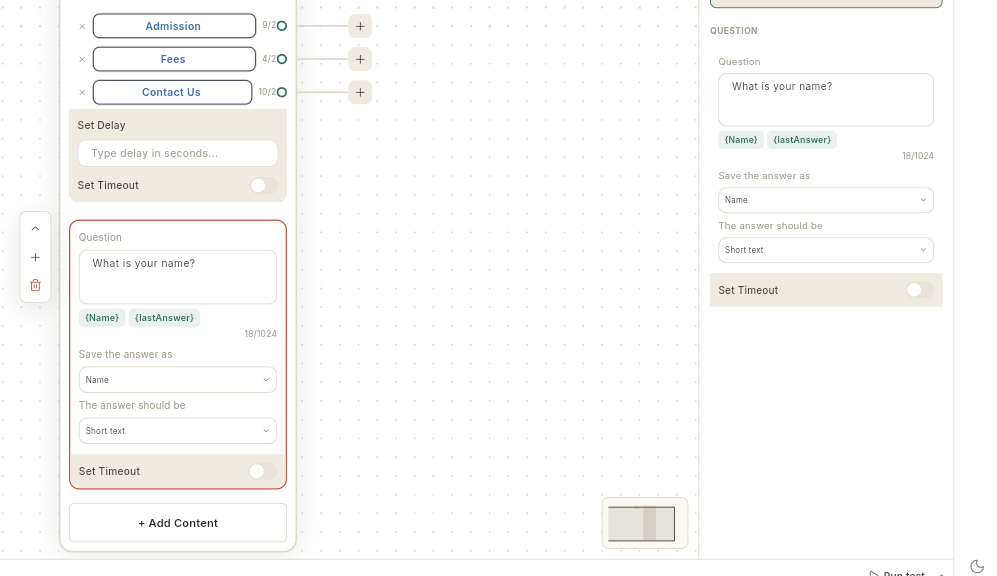

11. Repeat step 9 and 10 for the email: question `What is your email?`, save the answer as **Email**. The answer is stored in the variable `email`.

### Add the closing message

12. Click **+ Add Content** and choose **Text + Button**. Type the closing message using the saved answers with double curly braces:

    ```text
    Thanks {{name}}, we will contact you at {{email}}.
    ```

    !!! warning "Use double curly braces"
        Write `{{name}}` and `{{email}}` in small letters with double braces. `{Name}` or `{{Name}}` is sent to the customer as plain text.

### Send a different message for each button (optional)

By default every button leads to the next block in the same card. To give a button its own reply:

1. On the card, click the **+** at the right end of the button row, for example **Fees**, and choose **Send a message**.

    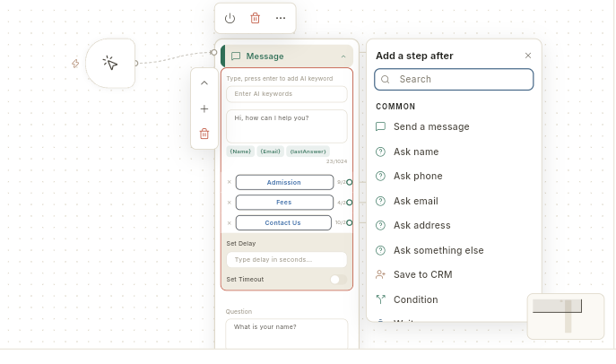

2. A new card opens, wired to that button. Type its message, for example `Fees details will be shared soon.`

    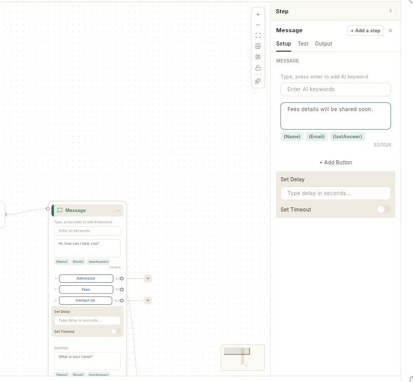

3. Repeat for any other button. Buttons without a wire continue to the next block of the main card.

    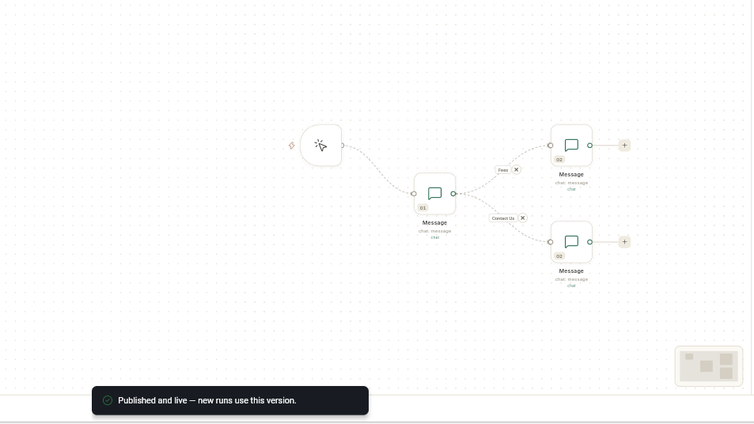

    After the branch card finishes, the conversation returns to the main card and continues with its next block.

    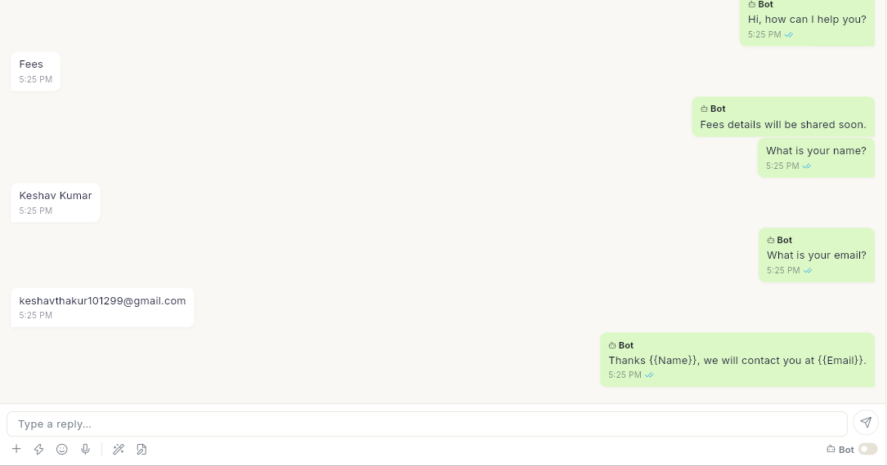

### Save, check and publish

13. Click **Save**. The status chip reads **DRAFT**.
14. Open the **Test** tab in the right panel, type your keyword under **A message a customer might send**, and click **Check**. The result should read **Yes — [your flow] would answer**. If it also says **Another chatbot answers this**, change your keyword before publishing.

    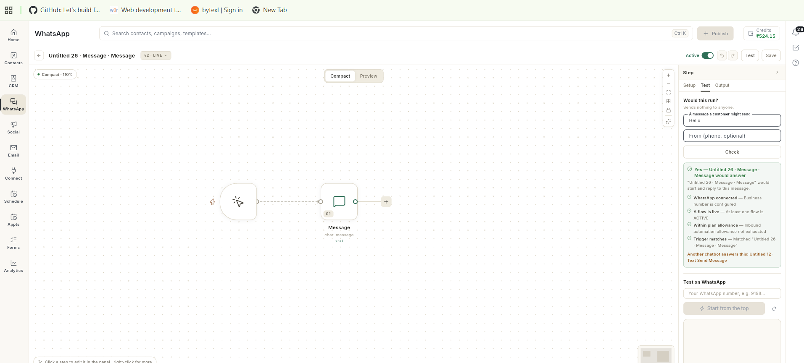

15. Click **Publish**. The message **Published and live — new runs use this version** appears and the **Active** switch turns on.

    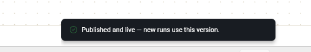

16. From your test phone, send the keyword to your business number. The bot replies with the welcome message and buttons. Tap a button, answer the name and email questions, and check the closing message.

    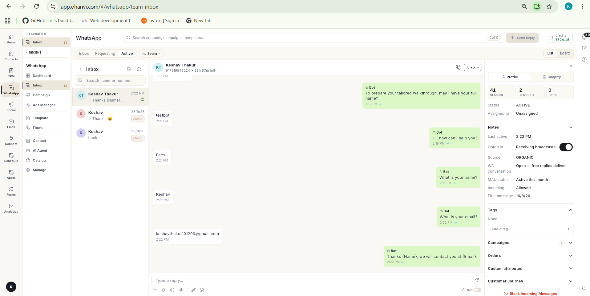

    The same conversation appears in **WhatsApp → Inbox** with each bot message marked **Bot**.

## Build the flow with AI instead

You can let Ohanvi draft the same flow from a sentence, then review and publish it.

1. Click **New flow**, then click **Build with AI**. A chat panel opens on the left.

    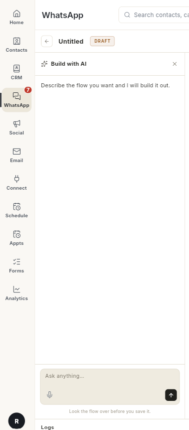

2. In **Ask anything…**, describe the bot and send it, for example:

    ```text
    Create a WhatsApp welcome chatbot that starts when user says hi, sends a welcome message, asks for name, asks for email and then sends a thank-you message.
    ```

3. Wait for **It is on the canvas**. The AI names the flow and draws the cards. Click **Preview** to read every block.

    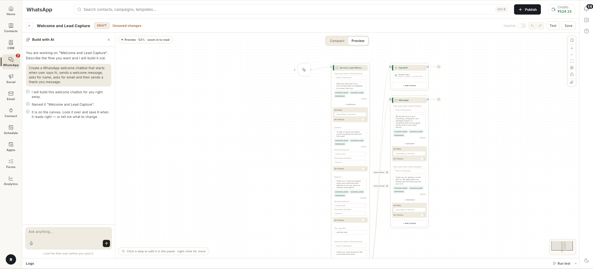

    The AI may add extra steps, such as a tag or a **Speak to Advisor** button. Delete what you do not need.

4. Nothing is saved yet. Click **Save**, run the **Test** tab check for your keyword, then click **Publish**.
5. Send the keyword from your test phone and answer each question.

    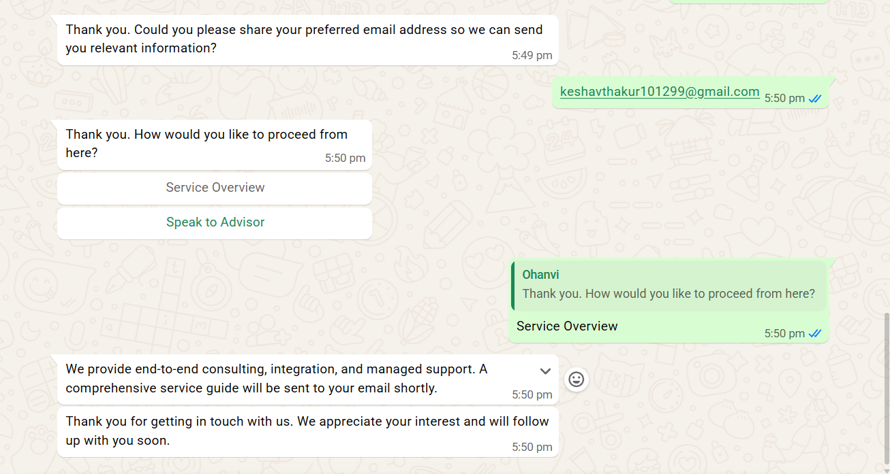

## Video walkthrough

[VIDEO]

## Troubleshooting

| Issue | Cause | Fix |
| --- | --- | --- |
| **Add at least one step before publishing** | The flow has no steps yet. | Add a step, such as **Send a message**, then click **Publish**. |
| No reply on WhatsApp | Another active flow uses the same keyword, so that flow answers instead. | Open **Test** tab → **Check**. If it names another chatbot, change your keyword and publish again. |
| Inbox shows **Bot stopped — its last message could not be delivered** | The flow that answered has an empty message step or an invalid message. | Open that flow, fill every empty message, save and publish. |
| Closing message shows `{Name}` or `{{Name}}` instead of the customer's name | The placeholder must be the attribute key in small letters with double braces. | Change to `{{name}}` and `{{email}}`, save, publish. |
| Changed text still not on WhatsApp | The change was saved but not published. The chip reads **LIVE · NOT PUBLISHED**. | Click **Publish**. Customers already mid-conversation finish on the old version. |
| Bot never replies to your test number | The contact is assigned to an agent or is in **Requesting**. | In **Inbox**, resolve the conversation, then send the keyword again. |
| Fourth button missing on WhatsApp | WhatsApp allows 3 reply buttons per message. | Use a **List / Buttons** block for more than 3 choices. |

## Related

- [Send a WhatsApp broadcast campaign](whatsapp/send-broadcast-campaign.md)
- [Create a WhatsApp template](whatsapp/create-message-template.md)
- [Import and sync contacts](crm/import-and-sync-contacts.md)
