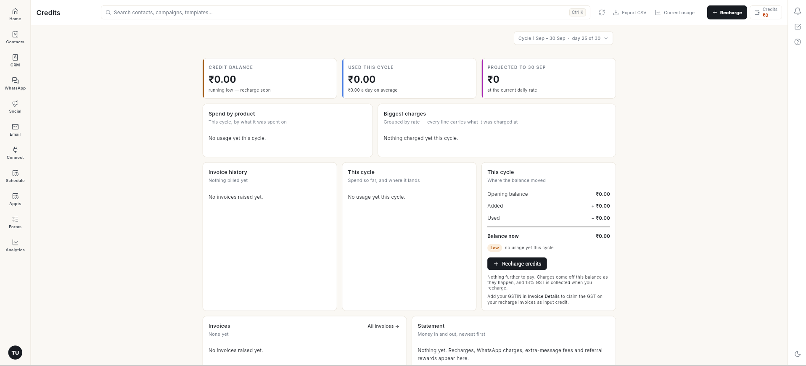

# Credits and billing in Ohanvi

Ohanvi runs on prepaid credits. You add money to your account, it becomes credits, and each paid action takes a little from that balance. The **Credits** page shows what you have, what you used, and every rupee in and out.

## What credits are

- **1 credit = ₹1.**
- Credits are **prepaid**. You add them first (a recharge, also called "add funds"), and charges come off the balance as they happen.
- Credits are spent on **WhatsApp messages, extra usage, email and AI**.
- Credits stay valid for **one year** from the date they are added.
- **18% GST** is charged when you recharge, not when you spend. See [Add funds to your account](add-funds.md).

## Before you start

- You are signed in to Ohanvi. See [Sign in to Ohanvi](sign-in.md).

## Open the Credits page

1. In the top-right corner, click the **Credits** box. It shows your current balance, for example **₹0**.
2. The **Credits** page opens.

    

## Read the Credits page

| Section | What it tells you |
| --- | --- |
| **Cycle** (top right) | The billing cycle you are looking at, for example **Cycle 1 Sep – 30 Sep · day 25 of 30**. Click it to see an earlier cycle. |
| **Credit balance** | Credits left right now. Shows **running low — recharge soon** when the balance will not last the cycle. |
| **Used this cycle** | Credits spent in this cycle, with the average per day. |
| **Projected to [date]** | What you will have spent by the end of the cycle at the current daily rate. |
| **Spend by product** | This cycle's spend split by what it was spent on. |
| **Biggest charges** | Charges grouped by rate. Every line shows the rate it was charged at. |
| **Invoice history** / **Invoices** | Invoices raised on your account: one for each recharge, plus any plan invoices. **Invoice history** charts the total billed in each cycle, and **Invoices** lists the latest ones. Click **All invoices** to see the full list. |
| **This cycle — Where the balance moved** | **Opening balance**, **Added**, **Used** and **Balance now** for the cycle. |
| **Statement** | Every movement of money, newest first: recharges, WhatsApp charges, extra-message fees and referral rewards. |

The buttons at the top of the page:

- **Recharge** — add credits. See [Add funds to your account](add-funds.md).
- **Export CSV** — download your statement as a CSV file: every movement of money, with its date, description, money in, money out and the balance after it. The button stays grey until there is at least one movement.
- **Current usage** — see your usage in detail.

!!! tip "Claim GST as input credit"
    Add your GSTIN in **Invoice Details** so your recharge invoices carry it and you can claim the GST.

## Video walkthrough

[VIDEO]

## Troubleshooting

| Issue | Cause | Fix |
| --- | --- | --- |
| Balance shows **running low — recharge soon** | At your current daily spend, the balance will not last until the end of the cycle. With no spend yet, it shows when the balance is ₹0. | [Add funds](add-funds.md) before your next campaign. |
| **No usage yet this cycle** | Nothing paid has been sent in this cycle. | This is normal for a new account. Usage appears after your first paid message. |
| **No invoices raised yet** | No recharge has been made. | An invoice is raised for each recharge. |
| Recharge invoice has no GSTIN | GSTIN was not added before the recharge. | Add your GSTIN in **Invoice Details** before your next recharge. |

## Related

- [Add funds to your account](add-funds.md)
- [Sign in to Ohanvi](sign-in.md)
