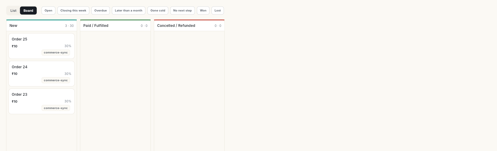

# CRM and contacts

The CRM holds everyone you talk to and every deal you work on. **Contacts** stores the people. **CRM** tracks the companies, deals, activities and sales numbers built on them.

## Where to find it

CRM spans two icons in the left rail:

| Rail icon | Panel items |
| --- | --- |
| **Contacts** | **All contacts**, **Leads**, **Contact groups** · under **Data**: **Import & sync**, **Custom fields** · under **Governance**: **Consent & compliance** |
| **CRM** | **Dashboard** · **Deals**, **Accounts** · **Campaigns**, **Automations** · **Funnel**, **Forecast** |

Some CRM screens are not in the panel:

- **Deal Board** — the **List | Board** toggle on **Deals**.
- **Campaign Templates** — the **Templates** button on **Campaigns**.
- **Sales Quotas** — **Manage quotas** on **Forecast**.
- **Activities**, **Activity Calendar**, **Notes** and **Sales reports** — type the name in the search box at the top, or press **Ctrl+K** (**⌘K** on Mac) and pick it from **Go to…**.
- **Pipelines**, **Lead Sources** and **Products** — click your initials bottom-left, then **Settings** → **CRM**.

## Before you start

- Your workspace has the CRM module, and your role has CRM access. Otherwise the **Contacts** and **CRM** icons do not appear. Ask your admin — see [Manage team members, roles and permissions](../settings/roles-and-permissions.md).
- For contacts to arrive on their own from chats, your WhatsApp number is connected.
- **Dashboard**, **Funnel**, **Forecast** and **Sales reports** need CRM reports access. **Automations** needs automation access.

## Contacts

See [Contacts](contacts/index.md) for every guide in this part.

| Guide | Use it when |
| --- | --- |
| [Manage contacts](manage-contacts.md) | You want to add, find, filter, edit, tag, merge or export contacts. |
| [Call contacts and review your calls](call-contacts-and-review-calls.md) | You call a contact and want to record the outcome and a follow-up. |
| [Call many contacts in a row with Auto Calling](auto-call-contacts.md) | You have a list of contacts to call one after another. |
| [Send a welcome email to a contact](send-a-welcome-email.md) | You want to email one contact with your brochures attached. |
| [Set up the welcome email and your brochures](set-up-the-welcome-email.md) | You want a default welcome message and a shared brochure library. |
| [Jump back to recent contacts](find-recent-contacts.md) | You want the contacts you opened or called lately. |
| [Work with leads](leads.md) | You want to qualify, score and convert new enquiries. |
| [Recover abandoned carts with Commerce leads](recover-abandoned-carts.md) | Shoppers left your online store without paying. |
| [Create and manage contact groups](contact-groups.md) | You want a saved list of contacts to message together. |
| [Import and sync contacts](import-and-sync-contacts.md) | You have contacts in a file, or want them to flow in from WhatsApp, a store or Zapier. |
| [Add custom contact fields](custom-fields.md) | You need to store something about contacts that the built-in fields do not cover. |
| [Track contact consent](consent-and-compliance.md) | You need to check or change who agreed to hear from you, or export a consent log. |

## CRM

See [CRM](sales/index.md) for every guide in this part.

| Guide | Use it when |
| --- | --- |
| [Read the CRM dashboard](track-sales-performance.md) | You want your open pipeline, wins and the deals going cold. |
| [Create and manage deals](manage-deals.md) | You want to add a deal, move it through stages and close it. |
| [Add and manage accounts](manage-accounts.md) | You want to track the companies you sell to. |
| [Log activities and notes](log-activities-and-notes.md) | You want to plan calls and meetings and keep notes on a contact or deal. |
| [Track campaigns and campaign templates](track-campaigns.md) | You want to record a campaign, its audience and its results. |
| [Manage CRM automations](manage-automations.md) | You want to see, pause or resume the rules running on leads and deals. |
| [Read the funnel and move leads on the board](read-the-funnel.md) | You want to see where leads drop off. |
| [Read the sales forecast](read-the-forecast.md) | You want to compare the pipeline with your targets. |
| [Run the sales reports](run-sales-reports.md) | You want a report as an Excel or PDF file. |

## Configure the CRM

Follow these when you set up the CRM for the first time. See [Configure the CRM](configure/index.md).

| Guide | Use it when |
| --- | --- |
| [Set up pipelines](set-up-pipelines.md) | You create the stages a deal moves through. |
| [Manage lead sources and see which ones convert](manage-lead-sources.md) | You add the channels your leads come from. |
| [Add products](add-products.md) | You add what you sell. |
| [Set sales quotas](set-sales-quotas.md) | You give each salesperson a monthly target. |

## Related

- [Email](../email/index.md) — send campaigns to your contacts by email.
- [Schedule](../schedule/index.md) — see CRM activities alongside everything else that is scheduled.
- [Analytics](../analytics/index.md) — see how your WhatsApp broadcasts and store perform.
