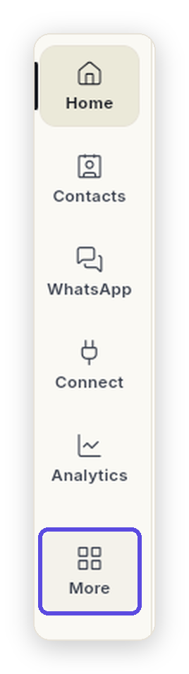
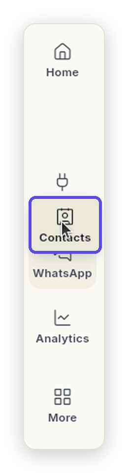
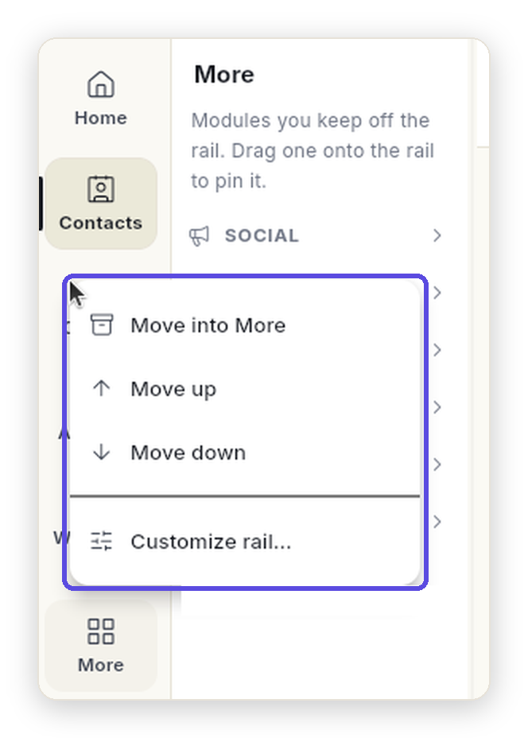
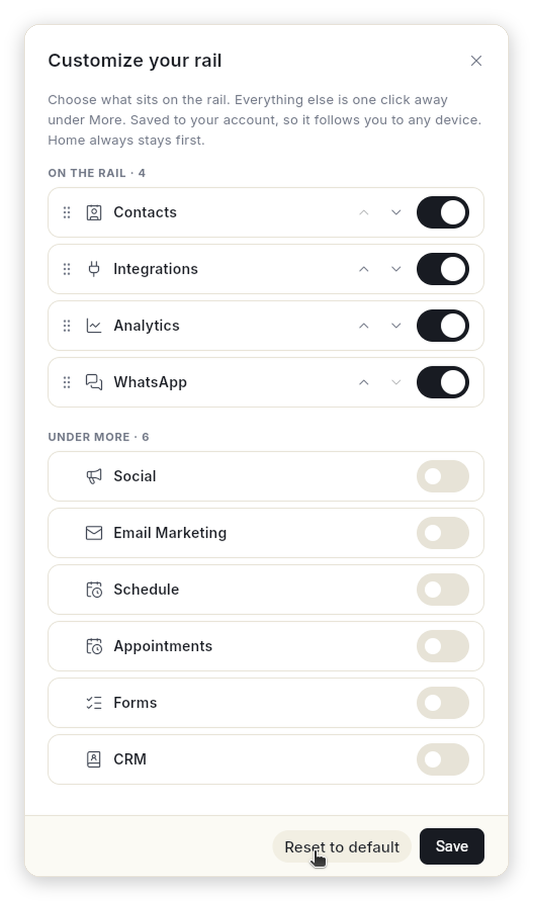

# Customize the left rail

Keep the modules you use every day on the left rail and tuck the rest under **More**. You can drag modules between the rail and More, change their order, and reset to the default. Your rail is saved to your account, so it looks the same on every device you sign in from.

## Before you start

- You are signed in to Ohanvi. If not, see [Sign in to Ohanvi](sign-in.md).
- You use Ohanvi on a computer. Drag and drop needs a mouse or trackpad.

## How the rail works

The rail is the column of icons on the far left. **Home** is always first. Each module below it opens its own menu next to the rail.

**More** is a module of its own. Click it and its menu lists every module you keep off the rail, each as a section with its own pages.

{ loading=lazy width="134" }

- **Keep your daily modules up front.** Put the ones you open every day on the rail, so they are always one click away.
- **Park the rest under More.** Modules you only need now and then wait there, with all their pages, until you want them.
- **Change it whenever your work changes.** Started using CRM every day? Bring it onto the rail. Stopped needing something? Drop it into More. It is saved to your account and follows you to any device.

## Steps

### Open a module that is under More

1. On the rail, click **More**. The More menu opens next to the rail.
2. Click the section you want, for example **CRM**. The section opens and lists its pages.
3. Click a page. It opens, and **More** stays highlighted on the rail while you are on it.

Sections under More start closed. Ohanvi remembers which ones you leave open.

### Move a module onto the rail

1. Click **More** to open its menu.
2. Drag the section heading, for example **CRM**, onto the rail. A line shows where it will land.
3. Drop it. The module now sits on the rail at that place.

Or right-click the section heading and click **Move out of More (show on rail)**. The module goes to the end of the rail.

### Move a module into More

1. Drag the module's icon on the rail, for example **Contacts**. The icon lifts and its place on the rail stays empty while you drag.
2. Drop it on **More** on the rail, or on the open More menu. It becomes a section under More.

Or right-click the module on the rail and click **Move into More**.

{ loading=lazy width="130" }

- **Pick it up.** Press on a module's icon and move your mouse. The icon lifts and an empty gap stays where it was.
- **Watch the line.** A thin line between two modules shows exactly where it will land.
- **Let go.** Drop it on the rail to put it there, or on **More** to tuck it away. That's it, no Save button needed.

### Change the order

- On the rail: drag a module up or down and drop it where you want it.
- Under More: drag a section heading above or below another section.
- With the mouse: right-click a module or a section heading and click **Move up** or **Move down**.

### Use the right-click menu

Right-click any module on the rail, or any section heading under More, to manage it without dragging.

1. Right-click the module, for example **Contacts** on the rail. A menu opens next to it.
2. Click the action you want:

    | Action | Where you see it | What it does |
    | --- | --- | --- |
    | **Move into More** | A module on the rail | Takes the module off the rail and adds it as a section under More. |
    | **Move out of More (show on rail)** | A section heading under More | Puts the module back on the rail, at the end. |
    | **Move up** | Rail and More | Moves it one place up. Not shown for the first module. |
    | **Move down** | Rail and More | Moves it one place down. Not shown for the last module. |
    | **Customize rail…** | Rail and More | Opens **Customize your rail**, described below. |

    { loading=lazy width="332" }

The change is saved as soon as you click. **Home** has no right-click menu, because it always stays first.

### Use Customize rail

**Customize rail** shows every module in one place.

1. Open it one of these ways:
    - Click **Customize rail…** at the bottom of the More menu
    - Right-click a module or a section heading, then click **Customize rail…**
    - Right-click **More** on the rail
2. In **Customize your rail**, look at the two lists:
    - **On the rail** — every module on the rail, top to bottom, with how many there are.
    - **Under More** — every module under More, with how many there are.

    { loading=lazy width="440" }

3. Turn a module's switch on to put it on the rail. Turn it off to move it under More. The module moves to the other list straight away.
4. Reorder the modules **On the rail**:
    - Click the up or down arrow on a row to move it one place.
    - Or drag the dotted handle on the left of a row up or down.
5. Click **Save**. The message **Rail saved to your preferences.** appears and the rail updates.

To leave without changing anything, click the **×** in the top-right corner. Nothing is saved until you click **Save**.

!!! note "Module names in this window"
    **Customize your rail** shows each module's full name. On the rail some names are shorter: **Integrations** is **Connect**, **Appointments** is **Appts** and **Email Marketing** is **Email**.

!!! tip "Go back to the default"
    In **Customize your rail**, click **Reset to default**, then click **Save**. The rail goes back to the default.

## Things to know

- **Home** always stays first. You cannot move it into More or reorder it.
- If a module under More has unread items, for example new WhatsApp messages, the count shows on **More** and on that module's section heading.
- Your rail is saved for your role. If you switch to another role, that role has its own rail.
- Moving a module never changes what is inside it. Only where you open it from changes.

## Troubleshooting

| Issue | Cause | Fix |
| --- | --- | --- |
| A module is missing from the rail | It is under More. | Click **More** and look for its section. To bring it back, right-click its heading and click **Move out of More (show on rail)**. |
| A module is not on the rail or under More | Your role cannot open it. | Ask your workspace admin for access. See [Team, roles and permissions](settings/roles-and-permissions.md). |
| The rail looks different on another device | You signed in with a different role. | Switch to the same role. Each role keeps its own rail. |
| Modules will not drag | Your workspace is locked until its plan is active. | Click any module to see the plan options, or ask your workspace admin. |
| You moved things around and want the original rail back | — | Open **Customize rail…**, click **Reset to default**, then **Save**. |

## Related

- [Sign in to Ohanvi](sign-in.md)
- [Open Settings](settings/open-settings.md)
- [Team, roles and permissions](settings/roles-and-permissions.md)
