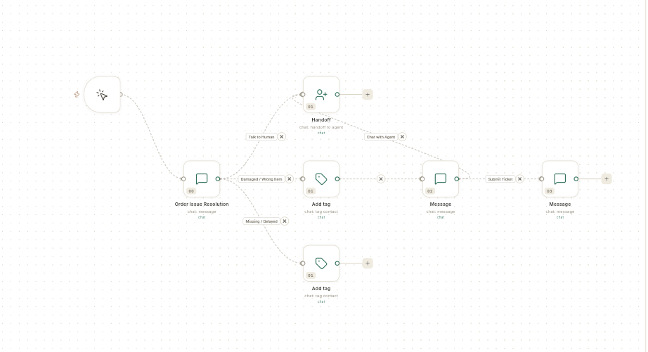

# Flows

A flow runs a set of steps on its own when something happens: a customer messages a keyword, an order is placed, a contact is added, or a time arrives. WhatsApp chatbots, automations and store journeys are all built on the same **Flows** canvas.

## Where to find it

**Flows** opens from 2 places. Both open the same **Automation flows** screen.

- **WhatsApp** → **Flows** — for chatbots and WhatsApp store messages.
- **Connect** → **Flows** (in the **Integration** group, next to Zapier and Pabbly) — for automations that use connected apps. This entry is for admins by default, because every step runs as the flow's owner.

The connector catalog, where you connect outside apps, is under **Connect** → **Connectors**.

## Before you start

- You can see **Flows** under **WhatsApp** or **Connect**. To create or change flows, your role also needs save access to flows. Without it, the screen says **Your role can view flows but not create them.**
- Everything the flow uses is connected first: your WhatsApp number, your store, or the app you want to call.
- The WhatsApp templates the flow sends are approved by Meta. See [Create a WhatsApp message template](../whatsapp/create-message-template.md).

## Guides

The guides follow the order of the screens in the app.

| Guide | Use it when |
| --- | --- |
| [Understand flows and the Flows list](flows-overview-and-list.md) | You are new to flows, or want to pause, copy or delete one. |
| [Start a flow from a template](use-flow-templates.md) | You want a ready-made starter or chatbot template instead of a blank canvas. |
| [The flow panel](flow-panel/index.md) | You want to read a flow's runs, output and versions. |
| [Test a flow and fix failed runs](test-and-monitor-flows.md) | You want to check that a flow works, or a run failed. |
| [Read a run's output in detail](read-a-runs-output.md) | You want to see what each step returned. |
| [Review a flow's versions](review-flow-versions.md) | You want to see which version is live. |
| [Build an automation flow](build-automation-flow.md) | You want steps to run on their own when an event happens. |
| [Automate store messages with flows](store-journeys.md) | You want order, cart and delivery messages on WhatsApp. |
| [Connect an app and use it in a flow](connect-apps-for-flows.md) | A step needs to call an outside app. |

The chatbot guides, such as [Create a WhatsApp chatbot flow](../create-whatsapp-flow.md) and [Understand the flow builder](../whatsapp/understand-the-flow-builder.md), are in **WhatsApp** → **Flows**.

## Related

- [WhatsApp](../whatsapp/index.md)
- [Manage CRM automations](../crm/manage-automations.md) — the lead and deal rules under **CRM** → **Automations** are a separate screen.
- [Automate emails with journeys](../email/create-email-automation.md)
