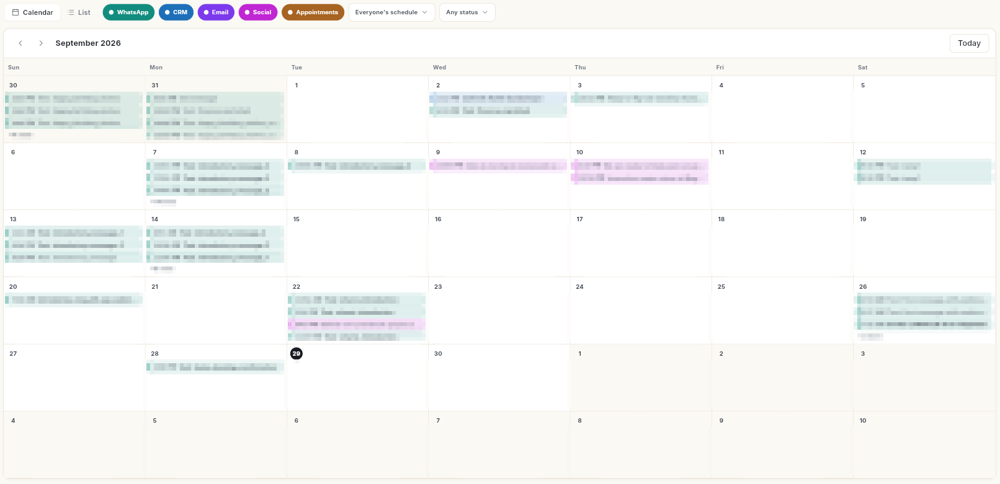

# Schedule

Schedule shows everything that is set to happen later, across every module, in one calendar or list. You create items in their own module; the Schedule is where you see and change them together.

## Where to find it

Open **Schedule** in the left rail. The panel lists:

- **All schedules**, **Today**, **Upcoming**, **Drafts**
- By channel: **WhatsApp**, **CRM**, **Email**, **Social**, **Appointments**
- **Recurring**

## Before you start

- Your role has Schedule access. By default only the **Super Admin** role has it.
- You have created something scheduled in another module, for example a WhatsApp broadcast or a social post.
- To reschedule, cancel or delete, use a window wide enough to show the details pane. On a narrow screen the action buttons are hidden.

## Guides

| Guide | Use it when |
| --- | --- |
| [View everything scheduled](view-schedule.md) | You want to see what goes out today or this week, and filter the calendar. |
| [Reschedule, cancel or delete a scheduled item](reschedule-cancel-delete.md) | Plans changed and an item needs to move or stop. |
| [See what is scheduled for today](view-todays-schedule.md) | You want only today's items. |
| [See what is coming up](view-upcoming-schedule.md) | You want to plan the next days. |
| [Find and finish drafts](find-and-finish-drafts.md) | You saved something and want to finish it. |
| [See your scheduled WhatsApp messages](view-whatsapp-schedule.md) | You want only WhatsApp items. |
| [See your scheduled CRM activities](view-crm-schedule.md) | You want only CRM activities. |
| [See your scheduled email campaigns](view-email-schedule.md) | You want only email campaigns. |
| [See your scheduled social posts](view-social-schedule.md) | You want only social posts. |
| [See your scheduled appointments](view-appointments-schedule.md) | You want only bookings. |
| [Manage recurring schedules](manage-recurring-schedules.md) | You have a repeating WhatsApp send to check, pause or end. |

## Related

- [Schedule posts and manage the queue](../social/schedule-social-posts.md)
- [Send an email campaign](../email/send-email-campaign.md)
- [Log activities and notes](../crm/log-activities-and-notes.md)
- [Manage appointments](../appointments/manage-appointments.md)
