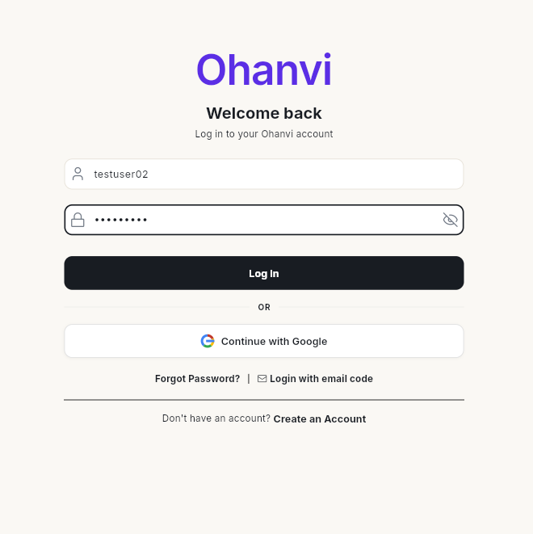
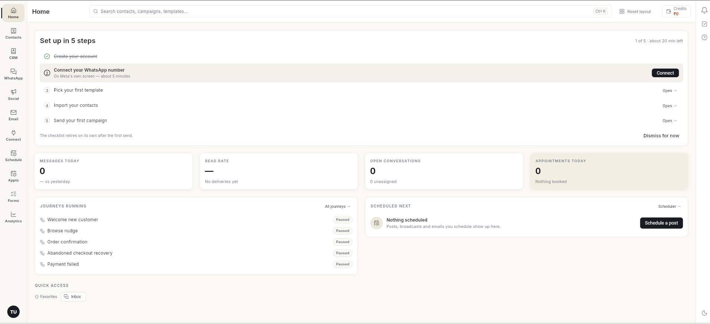
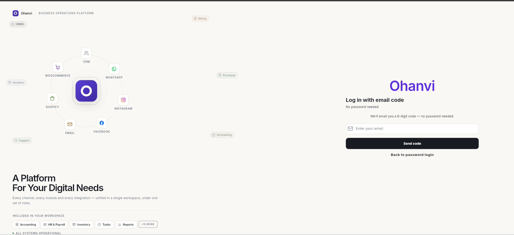
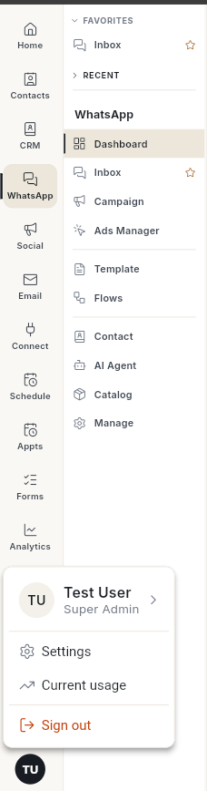

# Sign in to Ohanvi

Sign in to your workspace with your username and password, your Google account, or a code sent to your email. You land on **Home**, where the setup checklist and today's numbers are waiting.

## Before you start

- You have an Ohanvi account. If not, [sign up for Ohanvi](sign-up.md) first.
- You know your **username** (or email) and **password**, or you can open the email inbox linked to your account.

## Steps

### Sign in with username and password

1. Go to [app.ohanvi.com](https://app.ohanvi.com).
2. In **Username or email**, type your username or the email you signed up with.
3. In **Enter your password**, type your password. Click the eye icon to show or hide it.

    

4. Click **Log In**. Ohanvi opens **Home**.

    

### Sign in with Google

1. On the login page, click **Continue with Google**.
2. Choose the Google account that uses the same email as your Ohanvi account. Ohanvi opens **Home**.

### Sign in with an email code

Use this when you do not remember your password.

1. On the login page, click **Login with email code**. The **Log in with email code** screen opens.
2. In **Enter your email**, type the email linked to your account, then click **Send code**.

    

3. Open your email, copy the 6-digit code, enter it, and click **Verify**. The code works for 10 minutes.

To go back to the normal login form, click **Back to password login**.

### Sign out

1. Click your initials in the bottom-left corner.
2. Click **Sign out**. The message **Logged out successfully** appears and the login page opens.

    

## Video walkthrough

[VIDEO]

## Troubleshooting

| Issue | Cause | Fix |
| --- | --- | --- |
| Wrong username or password message | A typo, or Caps Lock is on. | Click the eye icon to check the password, then try again. |
| You forgot your password | — | Use **Login with email code** to sign in, then change your password from **Settings**. |
| **No account found for this email. Please sign up first.** | No Ohanvi account uses that email. | Check the email, or [sign up for Ohanvi](sign-up.md). |
| **Continue with Google** opens an empty workspace | The Google account uses a different email from your Ohanvi account. | Sign out and choose the Google account with the right email. |
| No code in your inbox | The email went to spam or promotions. | Check those folders and wait 1–2 minutes before asking for a new code. |

## Related

- [Sign up for Ohanvi](sign-up.md)
- [Create a WhatsApp chatbot flow](create-whatsapp-flow.md)
