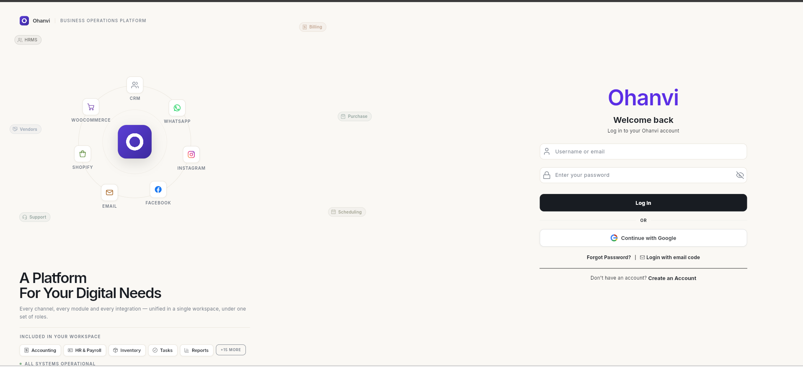
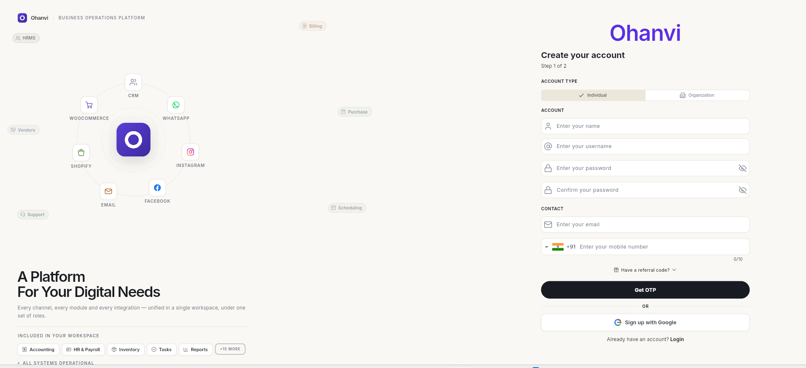
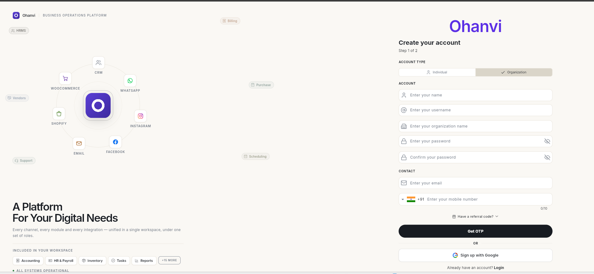
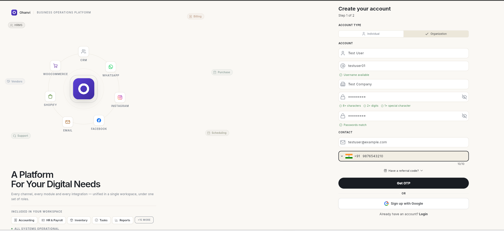
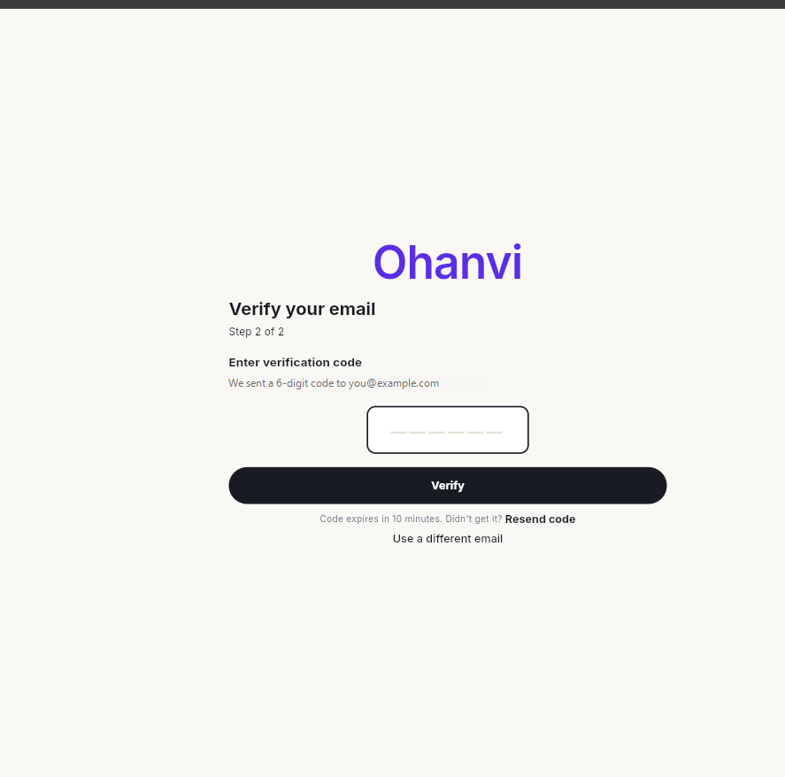
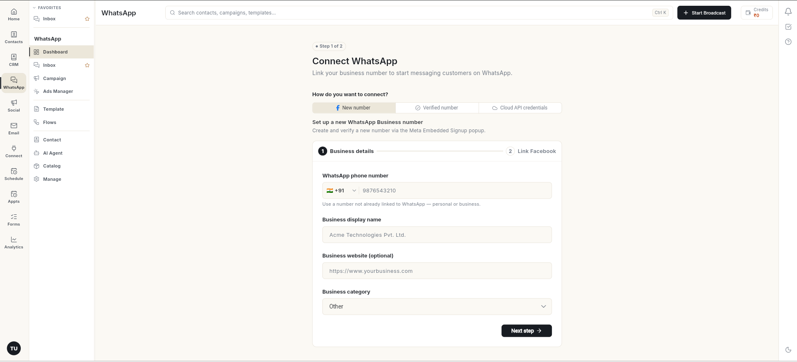

# Sign up for Ohanvi

Create your Ohanvi account in two steps: fill in your details, then verify your email with a 6-digit code. You land on your new workspace, ready to connect WhatsApp.

## Before you start

- You have an email address you can open right now. The verification code arrives there.
- You have a mobile number (10 digits for India).
- You know whether you are signing up for yourself (**Individual**) or for a business (**Organization**).

## Steps

### Open the sign-up form

1. Go to [app.ohanvi.com](https://app.ohanvi.com).
2. Below the login form, click **Create an Account**.

    

### Choose the account type

3. Under **Account type**, pick one:
    - **Individual** — for yourself. You can add teammates later.
    - **Organization** — for a business. This adds one extra field, **organization name**.

    

    

### Fill in your details

4. Enter your **name** and a **username**. The form shows **Username available** when the username is free.
5. For an organization, enter the **organization name**.
6. Enter a **password** and type it again in **Confirm your password**. The password needs:
    - 8 or more characters
    - 2 or more digits
    - 1 or more special character

    The checks turn green as you type, and **Passwords match** appears when both fields agree.

7. Under **Contact**, enter your **email** and **mobile number**.
8. If someone gave you a referral code, click **Have a referral code?** and enter it.

    

9. Click **Get OTP**.

### Verify your email

10. Open your email. Copy the 6-digit code Ohanvi sent you.
11. Type the code in the box and click **Verify**. The code works for 10 minutes.

    

    !!! tip
        Keep the email open in another tab before you click **Get OTP**, so you can enter the code straight away.

12. Your account is created and you are signed in. Ohanvi opens **Connect WhatsApp**, the first setup step for your workspace.

    

## Sign up with Google instead

1. On the sign-up form, click **Sign up with Google** and sign in with your Google account. Your Ohanvi account is created with that Google email, and your username is made from the email address.
2. Check your email. Ohanvi sends you a username and password, so you can also sign in without Google.

!!! note
    Google sign-up always creates an **Individual** account, even if **Organization** is selected. To sign up as an organization, fill in the form and click **Get OTP** instead.

## Video walkthrough

[VIDEO]

## Troubleshooting

| Issue | Cause | Fix |
| --- | --- | --- |
| **Username available** does not appear | Someone already uses that username. | Try a different username. |
| **Get OTP** shows a message such as **Enter a valid mobile number.** | A field is empty or invalid, or a password rule is not met. | Fix the field the message names. For an organization, also fill in **organization name**. |
| No code in your inbox | The email went to spam or promotions. | Check those folders and wait 1–2 minutes. |
| **OTP has expired. Please request a new one.** | More than 10 minutes passed. | Start the sign-up again from [app.ohanvi.com](https://app.ohanvi.com) and enter the new code quickly. |
| **No account found for this email. Please sign up first.** after **Resend code** or **Verify** | Ohanvi no longer holds your sign-up details, so the code cannot finish the sign-up. | Close the tab, open [app.ohanvi.com](https://app.ohanvi.com) in a new window, and sign up again from the start. |

## Related

- [Sign in to Ohanvi](sign-in.md)
- [Create a WhatsApp chatbot flow](create-whatsapp-flow.md)
- [Create a WhatsApp template](create-whatsapp-template.md)
