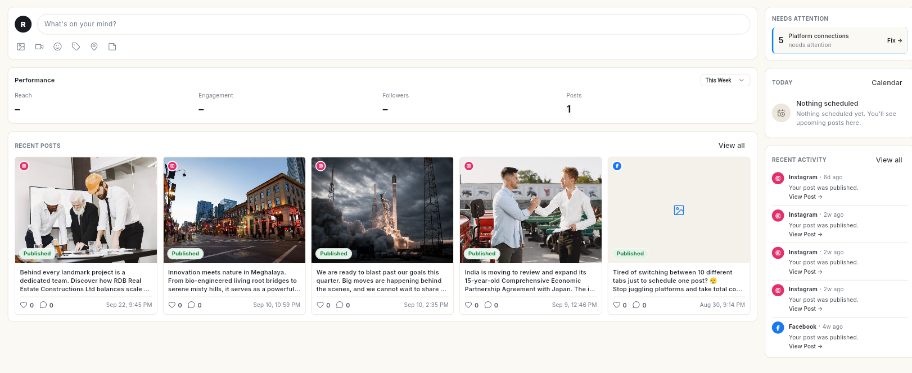

# Social

Social lets you publish to several networks from one composer. Connect your accounts, write a post once, schedule it, and read how it performed.

## Where to find it

Open **Social** in the left rail. The panel lists:

- **Home** — what needs your attention today.
- **Insights** — how your posts perform.
- **Publish** — the post queue, with the tabs **Queue**, **Drafts**, **Approvals** and **Sent**, and a **List** / **Calendar** switch.
- **Templates** — ready-made and saved post templates.
- **Business Info** — your Google Business Profile details.

The panel also has a **New** button (**Post**, **Connect a new channel**) and a **Channels** list of your connected accounts.

Accounts are connected under **Connect** → **Social Connections** in the left rail.

## Before you start

- Your role has Social access. Each panel item has its own permission, so you may see only some of them.
- At least 1 network is connected. See [Connect social accounts](connect-social-accounts.md).
- For a Facebook Page or LinkedIn company page, you are an admin of that Page. For Instagram, the account is a professional (Business or Creator) account.

## Guides

| Guide | Use it when |
| --- | --- |
| [Connect social accounts](connect-social-accounts.md) | You are starting with Social, or a connection has expired. |
| [Use the Social sidebar](use-the-social-sidebar.md) | You want to start a post or open one channel from the panel. |
| [Use Social Home](use-social-home.md) | You want to see what needs action today and reply to comments. |
| [Read social insights](view-social-insights.md) | You want to see what worked. |
| [Explore Insights charts and one channel](explore-insights-charts.md) | You want the follower and post charts and one channel's metrics. |
| [Create and publish a social post](create-social-post.md) | You want to post now, or save a draft. |
| [Use the AI Assistant in the composer](use-ai-assistant-in-the-composer.md) | You want AI to write the caption or find an image. |
| [Schedule posts and manage the queue](schedule-social-posts.md) | You want a post to go out later, or need to change a scheduled post. |
| [Use Publish filters, overview and post details](use-publish-filters-and-extras.md) | You want to filter, copy a post link or see which channel failed. |
| [Review posts before they publish](approve-social-posts.md) | Posts need a second person's approval before going live. |
| [Use post templates](use-post-templates.md) | You want to start from a ready-made post. |
| [Manage your Google Business Profile](manage-google-business-profile.md) | You want to update your listing details, hours or links. |
| [Reply to Google reviews](reply-to-google-reviews.md) | You want to answer or track Google reviews. |

## Related

- [Schedule](../schedule/index.md) — see scheduled posts next to everything else.
- [Analytics](../analytics/index.md)
