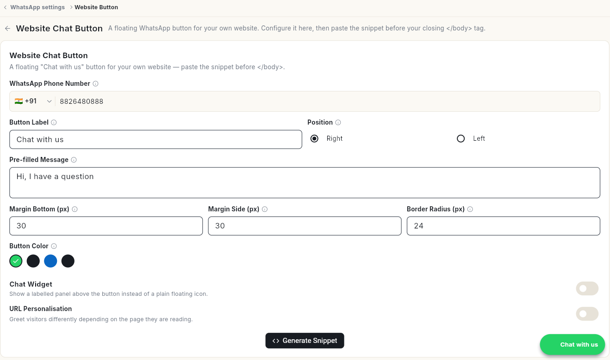

# Add a WhatsApp chat button to your website

Put a floating WhatsApp button on your own website so visitors can message you in one click. At the end, you have a button with your label, colour and opening message, and a snippet ready to paste into your site.

## Before you start

- Your WhatsApp number is connected. See [Connect your WhatsApp number](connect-whatsapp-number.md).
- You can edit your website's HTML, or someone on your team can.

## Steps

### Open the button settings

1. Click your initials in the bottom-left corner, then click **Settings**.
2. Select **WhatsApp**, then **Website Button**. The **Website Chat Button** page opens.

You can also open it from the WhatsApp **Dashboard**: under **Quick Actions**, click **Website Chat Widget**.

### Set up the button

1. Check **WhatsApp Phone Number**. It is filled in with your connected number.
2. In **Button Label**, type the text on the button. It starts as **Chat with us**.
3. Under **Position**, pick **Right** or **Left**.
4. In **Pre-filled Message**, type the first message the visitor sends. It starts as **Hi, I have a question**.
5. Set **Margin Bottom (px)**, **Margin Side (px)** and **Border Radius (px)** to place and shape the button. They start at **30**, **30** and **24**.
6. Pick a **Button Color**.
7. Optional: turn on **Chat Widget** to show a labelled panel above the button instead of a plain icon.
8. Optional: turn on **URL Personalisation** to greet visitors differently depending on the page they are reading.

The preview button in the bottom-right corner shows how it looks.

### Add the button to your website

1. Click **Generate Snippet**.
2. Paste the snippet into your website's HTML, just before the closing `</body>` tag.

## Video walkthrough

[VIDEO]

## Related

- [Read the WhatsApp dashboard](whatsapp-dashboard.md)
- [Connect your WhatsApp number](connect-whatsapp-number.md)
- [Use the WhatsApp inbox](use-whatsapp-inbox.md)
