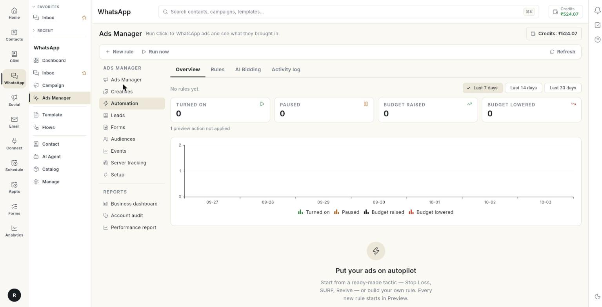

# Automate your ads

Create a rule in **Automation** that checks your ads every 30 minutes and acts when its conditions match. At the end, your rule has run in **Preview**, you have read what it would do, and you have gone live or steered budgets with AI bidding.

## Before you start

- Your Facebook account, Page and ad account are connected in **Setup**. See [Set up Ads Manager](set-up-ads-manager.md).
- You have at least 1 campaign, ad set or ad in your ad account.
- You can see **Ads Manager** in the **WhatsApp** panel. If not, ask your admin.

## What a rule is

A rule is one sentence: **If** some conditions are true, **then** do one action. For example: if an ad set spent more than a set amount today and got fewer than 1 result, then pause it.

- The rule checks every 30 minutes. A saved rule shows **Checked every 30 minutes.** at the bottom of the editor.
- Every new rule starts in **Preview**. It logs what it would do and changes nothing on Meta.
- When you go **live**, the rule really changes your ads on Meta. Every change is logged in the **Activity log**.

!!! warning "Live rules change your ads on Meta"
    A live rule pauses ads and changes budgets without asking you first. Run a rule in **Preview** and read the **Activity log** before you click **Go live**.

## The Automation tabs

Select **Automation** in the left column of **Ads Manager**. It has 4 tabs.

| Tab | What it shows |
| --- | --- |
| **Overview** | Counts of what rules did, a daily chart and **Recent activity**. |
| **Rules** | One card for each rule, with its mode and switches. |
| **AI Bidding** | Budget steering toward a cost-per-result or ROAS target. See [Steer budgets with AI bidding](#steer-budgets-with-ai-bidding). |
| **Activity log** | Every action a rule took, or would have taken in **Preview**. |

The top bar has **New rule**, **Run now** and **Refresh**.

## Steps

### Create a rule from a ready-made tactic

1. Open **WhatsApp** in the left rail, then select **Ads Manager**.
2. Select **Automation** in the left column.

    

3. Click **New rule**. The **New rule** window opens.
4. Pick a card under **Tactics** or **Strategies**, or click **Start from scratch**.

    

5. Change any number in the editor. The header reads **From "[card name]" — change any number you like.**
6. Click **Create rule**. The message **Rule created in Preview. It logs what it would do — go live when you are happy.** appears.

!!! note "Starting numbers"
    Each card comes with starting numbers for spend, cost per result and results. Check them against your own budget before you save. [VERIFY: starting amounts are in the currency of your ad account]

The ready-made cards are:

| Card | Level | What it does |
| --- | --- | --- |
| **Stop Loss** | Ad set level, Ad level | Pauses one that spent without results today, and turns it back on at the reset time. |
| **SURF** | Ad set level, Campaign level | Raises the budget of one having a cheap day, up to your maximum, and puts it back at the reset time. |
| **Sunsetting** | Ad set level | Steps an ad set's budget down each day it keeps running expensive, never below your minimum. |
| **Revive** | Ad set level, Ad level | Turns a paused one back on when its recent numbers show it was working. |
| **Scale winning campaigns** | Campaign level | Adds budget to campaigns that stayed cheap for a week, one step a day, up to your maximum. |
| **Scale winning ad sets** | Ad set level | Same, for ad sets. |
| **Downscale losing campaigns** | Campaign level | Takes budget off campaigns running expensive over a week, never below your minimum. |
| **Downscale losing ad sets** | Ad set level | Same, for ad sets. |
| **Stop Loss for expensive ads with no clicks** | Ad level | Turns off, for today, ads that spend without a single click. |
| **Pause losing ads for today** | Ad level | Pauses ads that are expensive today and turns them back on at the reset time. |
| **Pause losing ads permanently** | Ad level | Pauses ads expensive for three days. Turns them back on if late results show they were fine. |

### Name the rule and choose what it works on

1. In the **New rule** editor, type a **Rule name**, for example "Stop loss — ad sets". Use up to 120 characters.
2. Under **Works on**, choose **Campaigns**, **Ad sets** or **Ads**. Changing it clears any assets you picked.

!!! note "Ads have no budget"
    Budget actions are not offered for **Ads**. The editor shows **Ads have no budget of their own.** Use ad set or campaign level for budgets.

### Add the conditions

1. Under **If … of these are true**, choose **all** or **any**. **all** means every condition must match. **any** means 1 is enough.
2. In the condition, pick a **Metric**. The list is below.
3. Pick a **Period**. The list is below.
4. Pick **Is**: **is more than**, **is at least**, **is less than** or **is at most**.
5. Pick **Compared with**: **a fixed value**, **% of account average** or **% of its previous period**.
6. Type the **Value**. For a % comparison, type a **Percent** above 0, for example 130.
7. Click **Add condition** for another condition.

A rule takes up to 6 conditions.

**Metrics** you can use: **Spend**, **Impressions**, **Link clicks**, **CTR (link, %)**, **Cost per link click**, **CPM**, **Frequency**, **Results**, **Cost per result**, **Conversations**, **Leads**, **Purchases**, **Revenue**, **ROAS** and **Daily budget**.

**Periods** you can use: **Today**, **Yesterday**, **Last 3 days** and **Last 7 days**.

### Choose the action

1. Under **Then**, pick an **Action**. The list is below.
2. For a budget action, fill **By** with a percent between 1 and 100, or fill **New daily budget** with an amount.
3. Fill **Max daily budget**. The budget is never raised above it. It is required for **Increase budget by %**.
4. Fill **Min daily budget**. The budget is never lowered below it. The decrease cards require it.

| Action | What it does |
| --- | --- |
| **Pause** | Pauses the item. |
| **Turn on** | Turns the item on. |
| **Increase budget by %** | Raises the daily budget. Needs a **Max daily budget**. |
| **Decrease budget by %** | Lowers the daily budget. |
| **Set daily budget** | Sets a new daily budget. |
| **Notify me** | Only sends you an alert. Changes nothing on Meta. |

### Set when and how often the rule acts

1. Turn on **Notify me when it acts** to get a bell notification, push and email. You get one summary per check, only when the rule is live.
2. Fill **Wait between actions (hours)**. Use a value from 1 hour to 30 days. Blank means 4 hours for budget actions and 24 hours for others.
3. Fill **Reset at (HH:mm)** to turn a paused item back on, or put the budget back, at that time. Blank keeps the change.
4. Turn on **Turn it back on if late results show it was fine**. Use it for a pause with no reset time. Meta reports some results a day or two late.
5. Choose **Keep checking for**: **1 day**, **2 days**, **3 days**, **5 days** or **7 days**.
6. Under **When it runs**, pick the day chips from **Mon** to **Sun**. No day picked means every day.
7. Fill **From (HH:mm)** and **To (HH:mm)** to limit the hours the rule may act. Fill both or neither. Blank means all day.
8. Choose a **Timezone**: **Account default (India)** or a zone from the list. It is also used for **Reset at**.

### Choose which items the rule covers

1. Under **Apply to**, choose **All [ad sets]** or **Only the [ad sets] I pick**. The words follow your **Works on** choice.
2. If you chose **Only the … I pick**, tick the items.
3. If you chose **All**, use **Skip some [ad sets]** to choose items the rule must leave alone.
4. Click **Create rule**. A new rule starts in **Preview**. When you edit a rule, click **Save changes**.

### Read the Overview tab

1. Select the **Overview** tab.
2. Read the summary line, for example **3 rules · 1 live · checked every 30 minutes**.
3. Pick a range: **Last 7 days**, **Last 14 days** or **Last 30 days**.
4. Read the tiles: **Turned on**, **Paused**, **Budget raised** and **Budget lowered**.
5. Read the grey line under the tiles. It shows how many preview actions were not applied and how many failed.
6. Read the daily chart, then **Recent activity**.
7. Click **See all** to open the **Activity log**.

If you have no rules, the tab shows **Put your ads on autopilot**. Click **Create your first rule**.

### Manage your rules

1. Select the **Rules** tab. Each rule is a card with its name, a **Live** or **Preview** badge, its level and a summary.
2. Read the grey line: actions in 48 hours, actions in 7 days, **last checked**, and the author.
3. Use the switch on the card to turn the rule on or off. The badge **Off** shows when it is off.
4. Open the **More** menu on a card.
5. Click **Edit** to open the editor. Save changes with **Save changes**.
6. Click **Go live** to make the rule real. A window asks **Turn "[name]" live?**
7. Click **Back to preview** on a live rule. The rule only logs again.
8. Click **Run now** to check this rule now.
9. Click **See activity** to open the **Activity log** for this rule.
10. Click **Delete** to stop the rule. Past activity stays. Anything it paused stays paused.

### Test in Preview, then go live

1. Create the rule. It starts in **Preview**.
2. Click **Run now** in the top bar, or wait for the next check. One of these messages appears:
    - **No enabled rules to check.**
    - **Checked N rules — nothing matched.**
    - **Checked N rules — N actions. See the Activity log.**
3. Open the **Activity log**. Rows with the result **Preview only** show what the rule would have done.
4. If the rows look right, open **More** on the rule and click **Go live**.
5. In the window **Turn "[name]" live?**, click **Go live**. The message **Rule is live.** appears.

    

### Read the Activity log

1. Select the **Activity log** tab.
2. Choose a **Rule**, or **All rules**.
3. Pick **Last 7 days**, **Last 14 days** or **Last 30 days**.
4. Read the columns. See the table below.

| Column | What it shows |
| --- | --- |
| **WHEN** | The date and time of the action, in your local time. |
| **RULE** | The rule's name. |
| **ON** | The level and the name of the campaign, ad set or ad. |
| **ACTION** | **Paused**, **Turned on**, **Budget raised**, **Budget lowered**, **Budget set**, **Flagged**, **Turned back on** or **Budget put back**. Budget actions show the old and new budget. |
| **RESULT** | **Done**, **Preview only** or **Failed**. |
| **WHY** | The reason, any error, and when a reset is due. |

If the tab is empty, it says **Nothing yet. Every time a rule acts — or, in Preview, would have acted — it shows here.**

### Steer budgets with AI bidding

AI bidding moves the daily budgets of the campaigns or ad sets you pick toward your target. It closes half the gap at a time, within your minimum and maximum. It checks every hour.

1. Select the **AI Bidding** tab.
2. Click **New AI bidding**.
3. Type a name, for example "Scale Diwali ad sets".
4. Under **Steer the budget of**, choose **Campaigns (campaign budget)** or ad sets. Pick up to 50.
5. Choose the goal: **Cost per result** with **At most**, or **ROAS** with **At least**.
6. Fill **Minimum**. The budget is never lowered below it.
7. Fill **Maximum**. The budget is never raised above it.
8. Choose **Biggest step**: **10%**, **15%**, **20%** or **30%**.
9. Choose **Judge on**: **Last 3 days** or **Last 7 days**.
10. Choose **Wait between changes**: **2**, **4**, **6**, **12** or **24 hours**.
11. Click **Create**. It starts in **Preview** and shows each hour what it would do. The message reads **AI bidding created in Preview — it shows what it would do and changes nothing yet.**
12. Open **More** on the card and click **Go live** when you are ready.

Statuses on a check are **Raised**, **Lowered**, **Would raise**, **Would lower**, **Failed**, **Not found** and **Holding**. The tool holds while the item is still learning or when its budget is not being spent.

!!! warning "Do not point 2 tools at the same ad sets"
    Avoid pointing budget rules and AI bidding at the same ad sets. They would change the same budget.

## Troubleshooting

| Issue | Cause | Fix |
| --- | --- | --- |
| **Give the rule a name.** | The **Rule name** is empty. | Type a name. |
| **Every condition needs a number.** | A **Value** is blank or not a number. | Fill every condition with a number. |
| **A "% of" condition needs a percent above zero, e.g. 130.** | The comparison is a percent and the value is 0 or blank. | Enter a percent above 0. |
| **Set a maximum daily budget so the rule cannot overspend.** | The action raises the budget and **Max daily budget** is blank. | Fill **Max daily budget**. |
| **Ads have no budget — change budgets at ad set or campaign level.** | A budget action is set on **Ads**. | Switch **Works on** to **Ad sets** or **Campaigns**. |
| **Pick at least one campaign, ad set or ad, or apply the rule to all.** | **Only the … I pick** has nothing ticked. | Tick at least 1 item, or choose **All**. |
| The rule never acts | It is in **Preview**, switched off, or no item matches. | Check the **Live** badge and the switch. Click **Run now** and read the **Activity log**. |

## Related

- [Manage your ads](manage-your-ads.md)
- [Use ad creatives](use-ad-creatives.md)
- [Run an account audit](run-an-account-audit.md)
- [Read the performance report](read-the-performance-report.md)
- [Run Click-to-WhatsApp ads](../click-to-whatsapp-ads.md)
