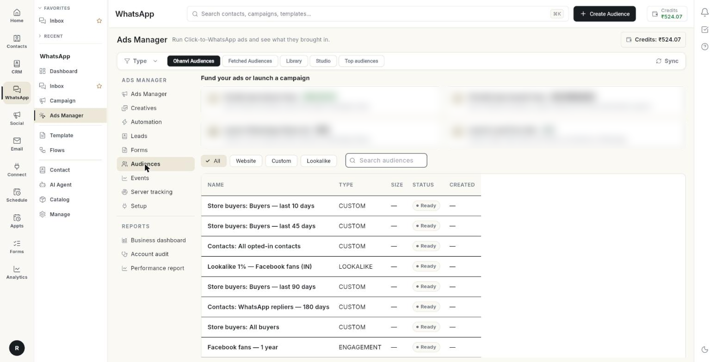

# Build ad audiences

Open the **Audiences** tab to choose who your ads reach and who they skip. At the end, you have an audience on Meta, ready to pick in **Create Ad**. You can also copy ready-made audiences from the **Library** and rank audiences by cost per result. Takes 5 to 10 minutes for the first audience.

## Before you start

- Your Facebook account, Page and ad account are connected in **Setup**. See [Run Click-to-WhatsApp ads](../click-to-whatsapp-ads.md).
- For a **Custom** audience, you have contacts with a phone number or email. See [Manage WhatsApp contacts](../manage-whatsapp-contacts.md).
- For a **Website** audience, you have a dataset (pixel) that records visits. See [Track website events](track-website-events.md).
- For a **Lookalike** audience, you have at least 1 custom or website audience to copy from.
- Meta's **Custom Audience terms** are accepted for this ad account. [VERIFY: where the user accepts the terms]

## Audience types and views

| Type | Who is in it |
|------|--------------|
| **Custom** | People from your own list of contacts, phone numbers or emails. |
| **Website** | People who visited your website and were recorded by a pixel. |
| **Lookalike** | People who are similar to a custom or website audience. |

The **Audiences** tab has five views. Pick one from the strip at the top.

| View | What it holds |
|------|---------------|
| **Ohanvi Audiences** | Audiences you created in Ohanvi. |
| **Fetched Audiences** | Audiences that already exist in your Meta ad account. Click **Sync** to pull them in. |
| **Library** | Ready-made audiences grouped by funnel stage, and groups kept in sync with your own data. |
| **Studio** | A builder for interests, behaviours and audience rules, plus interest insights. |
| **Top audiences** | A ranking of the audiences you have used, by cost per result. |

The first two views show a table.

| Column | What it shows |
|--------|---------------|
| **NAME** | The audience name. |
| **TYPE** | **Custom**, **Website** or **Lookalike**. |
| **SIZE** | The approximate number of people. Shows **—** until Meta has counted. |
| **STATUS** | The audience status, for example **READY**. |
| **CREATED** | The date it was created. |

## Steps

### Find an audience

1. Open **WhatsApp** in the left rail, then select **Ads Manager**.
2. Click **Audiences**.

    

3. Click a type chip to narrow the list: **All**, **Website**, **Custom** or **Lookalike**.
4. Or type in the **Search audiences** box.
5. For audiences that already exist at Meta, open **Fetched Audiences** and click **Sync**. If the list was never synced, the tab shows **No audiences fetched from the Meta ad account yet — tap Sync to pull the ones that already exist there.**

### Create a custom audience

1. Click **Audiences**, then click **Create Audience**. The **Create Audience** window opens.
2. Type an **Audience name \***. Use a name that says who is in it, for example `Buyers last 90 days`.
3. Choose **Custom** under **Type**.
4. Under **Who goes in this list**, choose **My contacts** to add every contact that has a phone number or email. Or choose **Paste a list**.
5. For **Paste a list**, type or paste into **Phone numbers or emails**. Use one phone number or email per line.
6. Optional: type a **Description (optional)**.
7. Click **Create**. The window shows progress such as **Collecting your customers…** and **Sending 120 people to Meta…**. It closes when the audience is created.

    

Rules for the pasted list:

- Commas and spaces are ignored.
- Duplicates are removed.
- Numbers and emails are scrambled before they leave Ohanvi. Meta sees a match, never the number or email itself.

Meta needs a few hours to build the audience. A very small list may never match enough people to be usable.

### Create a website audience

1. Click **Audiences**, then click **Create Audience**.
2. Type an **Audience name \***.
3. Choose **Website** under **Type**.
4. Under **Meta Pixel \***, choose the pixel (dataset) whose visitors you want to reach again. If the list is empty, create a dataset in **Events** first.
5. Under **Include visitors who \***, choose **Viewed any page**, **Viewed a product or service**, **Added to cart** or **Purchased**.
6. Under **Keep visitors for**, choose 7, 14, 30, 60, 90 or 180 days. Meta removes a person after this period.
7. Optional: type a **Description (optional)**.
8. Click **Create**.

### Create a lookalike audience

1. Click **Audiences**, then click **Create Audience**.
2. Type an **Audience name \***.
3. Choose **Lookalike** under **Type**.
4. Under **Modelled on \***, choose the audience Meta should copy. Only custom and website audiences appear.
5. Move the **Audience size** slider from 1% to 20%.
6. Under **Country to find similar people in**, type a 2-letter country code. The default is **IN**.
7. Optional: type a **Description (optional)**.
8. Click **Create**.

The slider sets how close the match is:

- 1% is the smallest and most similar audience.
- 2% to 3% is balanced.
- 10% or more is a wide, looser match.

### Use a ready-made audience from the Library

The **Library** holds audiences you can create in 1 click. They are grouped by funnel stage.

1. Click **Audiences**, then click **Library**.
2. Pick a stage tab:
    - **Prospecting**: new people who look like your best customers.
    - **Re-engagement**: people who know you but have not visited or bought.
    - **Retargeting**: people who showed intent and did not buy.
    - **Retention**: your customers, to bring them back and grow their spend.
3. Click **Popular** to see the most used audiences from every stage.
4. Type in **Search audiences** to search all stages.
5. On a card, click **Create**. Some cards ask for one value first:
    - **Number of days (1–365)**, for example 45. Website cards allow 1 to 180 days.
    - **Part of the page URL**, for example `/collections/shoes`.
    - **Pixel event name**, for example `Subscribe`.
6. Wait for the message **"Name" created on Meta, with its exclusions.** The card now shows a **Created** tag.
7. Click **Use in ad** to open **Create Ad** with this audience filled in.

    

A card can show these details:

- **Leaves out:** the groups the audience excludes, such as past buyers.
- **Modelled on 5,000 people** or **5,000 people in the group**: the size of the source group.
- **Add another**: a card with a value can hold more than one version, for example 30 days and 90 days.
- A yellow note: the reason a card cannot be created yet, for example no source data.

#### Remove an audience from the Library

1. Find the card.
2. Click the bin icon (**Remove from library**).
3. Read the message **Removed from the library. The audience stays on Meta for running ads.**

#### Launch several audiences at once

1. Tick the box on each card you want, or click **Select all in this view**.
2. Click **Launch selected (3)**. The **Launch 3 audiences** window opens.
3. Choose **One ad set per audience** to copy an ad set you already run. Only the audience changes. Ad sets are created paused.
4. Under **Ad set to copy**, choose the ad set.
5. Or choose **All together in one new ad** to open **Create Ad** with all audiences and their exclusions filled in.
6. Click **Create paused ad sets** or **Open Create Ad**.
7. Turn the ad sets on in **Ads Manager** when you are ready.

You can launch up to 10 audiences at a time.

### Keep a group of contacts in sync

**Synced from your data** sits at the top of the **Library**. It keeps a Meta audience up to date with your own groups.

1. Click **Sync a group**. The **Sync a group to Meta** window opens.
2. Under **Where the people come from**, choose the source.
3. Under **Group**, choose the group. Groups already synced show **(synced)**.
4. Click **Create and sync**.

The audience is created and filled. It re-syncs every night. Only people who have not opted out are sent. Phone and email are hashed before they reach Meta.

To manage a synced group, use the icons beside it:

1. Click **Sync now** to sync at once.
2. Click **Pause nightly sync** to stop the nightly sync. Click **Resume nightly sync** to start it again.
3. Click **Stop syncing (the Meta audience stays)** to end syncing and keep the audience on Meta.

Each synced group shows one status:

| Status | Meaning |
|--------|---------|
| **Synced** | The last sync worked. |
| **No one yet** | The group has no one to send. |
| **Failed** | The last sync failed. The error shows under the name. |
| **Pending** | The first sync has not run yet. |

### Design targeting in the Studio

Use the **Studio** to build targeting that is not tied to one ad.

1. Click **Audiences**, then click **Studio**. The **Builder** view opens.
2. Optional: pick **Start from a saved audience** to load an earlier setup.
3. Type **Countries**, for example `IN, AE`.
4. Under **Include — people matching any of**, search interests, behaviours and demographics, and add them. The audience matches a person with at least 1 of them.
5. Optional: click **Narrow further ("and must also match")**. A person must also match this extra box.
6. Under **Your audiences**, choose audiences in **Reach**. **Reach** includes everyone in the list.
7. Under **Your audiences**, choose audiences in **Exclude**. **Exclude** removes them.
8. Read **Monthly reach**. It shows an estimate such as 1.2M – 1.8M people.
9. Type an **Audience name**, then click **Save audience**. The message **Saved. Pick "Name" in Create Ad → Audience.** appears.
10. Or click **Use in ad** to open **Create Ad** with this targeting.

!!! note "Meta no longer allows excluding by interest"
    To leave people out, exclude one of your audiences under **Your audiences**.

### Find the interests that cost least

1. In the **Studio**, click **Interest insights**.
2. Read the columns: **INTEREST**, **AD SETS**, **SPEND**, **RESULTS**, **COST / RESULT** and **VS AVERAGE**.
3. Click the add icon (**Add to builder**) on a row to use that interest.

Interest figures are an estimate. Meta does not report results per interest.

### See which audiences perform best

1. Click **Audiences**, then click **Top audiences**.
2. Pick the date range and filters at the top.
3. Open **Audiences** to see each audience with **AD SETS**, **SPEND**, **RESULTS**, **COST / RESULT**, **TREND**, **VS AVERAGE** and **EXCLUDED IN**.
4. Read the verdict in **VS AVERAGE**: **Better than average**, **About average**, **Worse than average** or **No results**. **Excluded only** means the audience was only used to skip people.
5. Open **Funnel** to see spend by stage in **% OF SPEND**, and **LIVE / CREATED** ad sets.
6. Open **Breakdowns** to see who responds by age, region and placement, and the top landing pages.
7. Click **Use in ad** on a row to reuse an audience.

An ad set counts in full for every audience it included. A star (*) marks audiences that shared ad sets.

## Troubleshooting

| Issue | Cause | Fix |
|-------|-------|-----|
| **Audience name is required.** | The name box is empty. | Type a name and click **Create** again. |
| **Pick the audience this lookalike should be modelled on.** | **Modelled on \*** is empty. | Choose a source audience. |
| **No Custom Audience is available yet. Create a customer-list audience first, then refresh.** | No source audience exists for a lookalike. | Create a **Custom** audience, then click **Refresh source audiences**. |
| **Choose the Pixel whose visitors you want to retarget.** | No pixel was chosen for a **Website** audience. | Choose a pixel. If the list is empty, create a dataset in **Events**. |
| **Paste at least one phone number or email, one per line.** | **Paste a list** is empty. | Paste your list. |
| **No contacts with a phone number or email were found.** | **My contacts** has no usable contact. | Add contacts, or use **Paste a list**. |
| **Custom Audience terms are still not active for this exact Meta ad account.** | Meta's terms are not accepted for this ad account. | Open the link Meta gives you while logged in to this ad account, accept the terms, wait a few minutes, reconnect Meta Ads and try again. |
| **No audiences fetched from the Meta ad account yet — tap Sync to pull the ones that already exist there.** | **Fetched Audiences** has not been synced. | Click **Sync**. |
| **Could not load audiences** | The list did not load. | Click **Retry**. |

## Related

- [Create an ad](create-an-ad.md)
- [Track website events](track-website-events.md)
- [Read the performance report](read-the-performance-report.md)
- [Automate your ads](automate-your-ads.md)
- [Run Click-to-WhatsApp ads](../click-to-whatsapp-ads.md)
