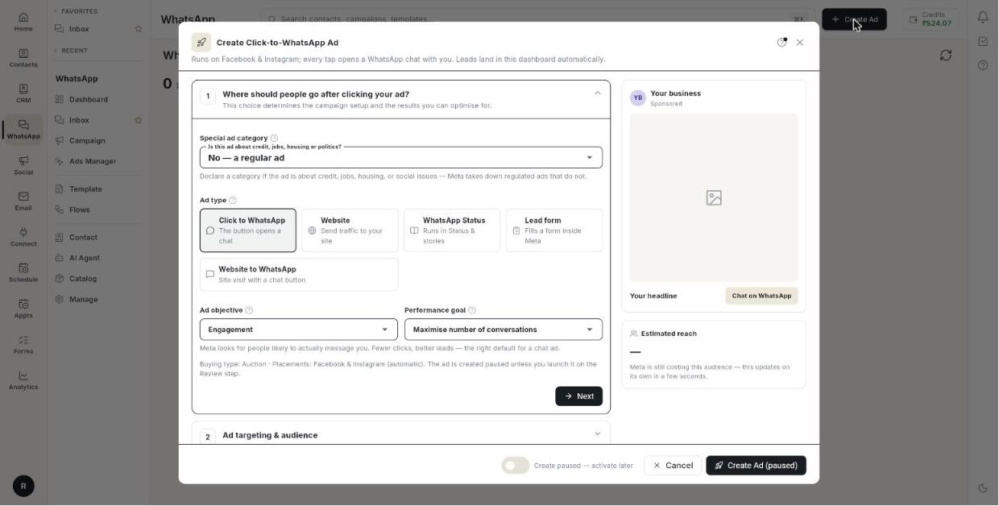
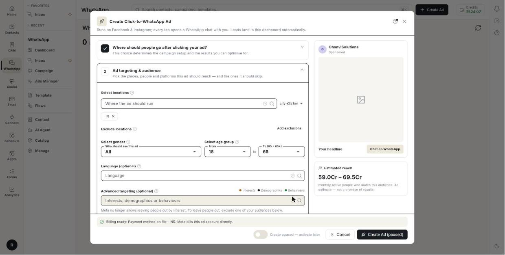

# Create an ad

Fill in the **Create Click-to-WhatsApp Ad** form, check the preview, and launch the ad or save it paused. At the end, your ad is **In review** at Meta, or saved paused. The form has 5 sections and takes about 15 minutes. Meta reviews the ad, usually within 24 hours.

## Before you start

- **Setup** is complete. The Ads Manager page shows **Setup complete**. See [Set up Ads Manager](set-up-ads-manager.md).
- You have ad credits, or a payment method on the Meta ad account. See [Set up Ads Manager](set-up-ads-manager.md#pay-for-the-ads).
- You have the image or video for the ad. Use a square image, or a 1080×1920 image for Stories and Reels.
- For a Sales ad, you have a pixel or a product catalogue. See [Track website events](track-website-events.md).
- For a lead form ad, you have a privacy policy page that starts with https://.

## How the form works

- Click **Create Ad** in **Ads Manager**. The form opens with a live preview beside it.
- The form has 5 numbered sections. Click a section to open it. Click **Next** to finish it and open the next one. A finished section shows a tick.
- A small **(i)** icon beside a field opens a short hint.
- Section 5 changes with the ad type. It is **Greeting & icebreakers (optional)**, **Landing page** or **Lead form**.

## What you choose first

The **Ad type** decides what happens when someone taps the ad. It also decides which objectives and goals you can pick. Choose it first.

### Choose an ad type

| Ad type | What happens on tap | Objectives you can pick |
|---------|---------------------|-------------------------|
| **Click to WhatsApp** | The button opens a chat with you. | **Awareness**, **Traffic**, **Engagement**, **Sales** |
| **Website** | Sends traffic to your site. | **Awareness**, **Traffic**, **Sales** |
| **WhatsApp Status** | Runs in Status and stories. | **Awareness**, **Traffic**, **Engagement**, **Sales** |
| **Lead form** | Fills a form inside Meta. | **Leads** only |
| **Website to WhatsApp** | Site visit with a chat button. | **Awareness**, **Traffic**, **Sales** |

### Choose an objective and goal

The **Ad objective** is what you buy from Meta. The **Performance goal** is the exact action Meta optimises for. The goal list is rebuilt when you change the objective.

| Objective | Performance goal options | What Meta does |
|-----------|--------------------------|----------------|
| **Awareness** | **Maximise reach**, **Maximise impressions** | **Maximise reach** shows the ad to as many people as possible in your audience. **Maximise impressions** optimises for visibility and repeated delivery, not clicks or leads. |
| **Traffic** on a chat ad | **Maximise number of link clicks** | Buys the cheapest clicks. Expect more taps and fewer real chats. |
| **Engagement** on a chat ad | **Maximise number of conversations**, **Maximise number of link clicks** | **Maximise number of conversations** looks for people likely to message you. |
| **Traffic** on a website ad | **Maximise landing page views**, **Maximise number of link clicks** | **Maximise landing page views** needs a pixel on the site. |
| **Sales** | **Maximise number of conversions** | Looks for people likely to buy. Needs a pixel or a product catalogue. |
| **Leads** | **Maximise number of leads** | The result is the submitted form. |

!!! tip "For an impression ad"
    Choose **Awareness**, then **Maximise impressions**. Do not click **Apply this setup** in the **Suggested first ad** box. That setup uses a conversation goal and a ₹100/day test.

## Steps

### Choose where the click goes

1. Open **WhatsApp** in the left rail, then select **Ads Manager**.
2. Click **Create Ad**. The **Create Click-to-WhatsApp Ad** form opens, with a preview beside it.

    

3. Open section 1, **Where should people go after clicking your ad?**.
4. Under **Special ad category**, answer **Is this ad about credit, jobs, housing or politics?**. Choose **No — a regular ad** for most ads.
5. If the ad is regulated, choose **Credit (loans, cards, finance)**, **Employment (jobs, hiring)**, **Housing (property, rentals)** or **Social issues, elections or politics**. The form clears age, gender, detailed and audience targeting.
6. Under **Ad type**, click one card: **Click to WhatsApp**, **Website**, **WhatsApp Status**, **Lead form** or **Website to WhatsApp**. The objective and goal lists change.

Special category limits:

- For credit, jobs and housing, locations must cover at least 24 km.
- For **Social issues, elections or politics**, the Page needs Meta ad authorisation before the ad can run.
- Pick the right category. Meta takes down regulated ads that do not declare one.

!!! note "Website to WhatsApp"
    [VERIFY: where the website address and button are entered for Website to WhatsApp ads]

### Pick the objective and goal

1. Under **Ad objective**, choose **Awareness**, **Traffic**, **Engagement** or **Sales**. A lead form ad has only **Leads**, so there is nothing to pick.
2. Under **Performance goal**, keep the goal the form picks, unless you need another. See the goal table above.
3. Read the line under the two fields. It says what Meta will do with your choice.
4. Read the line that starts **Buying type: Auction**. It is read-only. A **Click to WhatsApp** ad shows **Placements: Facebook & Instagram (automatic)**. A **WhatsApp Status** ad shows **Placements: WhatsApp Status, plus Facebook and Instagram stories**.
5. Click **Next**. Section 2 opens.

Goal notes:

- **Traffic** buys taps, not customers. It looks cheap in the report and brings the fewest real chats.
- A goal that no longer applies is replaced when you change the objective. Check the goal again after each change.

### Set up a Sales ad

Do this when you chose **Sales**.

1. Under **Pixel**, pick a pixel, or keep **Choose a pixel** if you use a catalogue only. A Sales ad does not launch without a pixel or a product catalogue.
2. Under **Conversion event**, choose **Purchase**, **Add to cart**, **Checkout started**, **Lead** or **Registration**. On a new pixel, pick an event that happens often, such as **Add to cart**.
3. Under **Product catalogue**, pick a catalogue. Leave it empty if you do not run catalogue ads. [VERIFY: label of the manual ID field]
4. Optional: under **Product set (optional)**, pick one slice of the catalogue.

Sales limits:

- A product set on its own is refused. Fill the catalogue too.
- The form says **Pick a pixel for website conversions or a product catalogue for catalogue sales.** until you pick one.

### Set up a Website ad

Do this when you chose **Website**.

1. Under **Website URL \***, type the page the tap opens, for example `https://yourshop.com/offer`. The form shows **The URL must start with https://** if it does not.
2. Under **Button**, choose **Learn more**, **Shop now**, **Sign up**, **Book now**, **Get quote**, **Apply now**, **Contact us** or **Download**. The default is **Learn more**.
3. Optional: under **Pixel (optional)**, choose **No pixel**, or pick a pixel. Without a pixel, Meta buys clicks. With one, it buys landing page views.

### Set up a WhatsApp Status ad

Do this when you chose **WhatsApp Status**.

1. Open section 2. Find **Platforms & placements**.
2. Check that **WhatsApp** **Status** and **Instagram** **Stories** are selected. You cannot change them. Meta requires both.
3. In section 4, upload a vertical 9:16 image or video. Status and Stories are full screen.

### Choose locations

1. Open section 2, **Ad targeting & audience**. **Estimated reach** beside the form updates as you choose.

    

2. Under **Select locations**, type in **Where the ad should run**. Search cities, regions, countries or pin codes, then pick from the list. Add as many as you need.
3. Choose the radius in the list beside the box: **city +17 km**, **city +25 km**, **city +40 km**, **city +60 km** or **city +80 km**. It applies to the next city you add.
4. Optional: click **Add exclusions**. Under **Where the ad must not run**, search and pick places to cut out. Click **Hide** to close it. People in these places do not see the ad.

Location notes:

- Empty means all of India. For a shop, add the pin codes around it.
- The radius applies to cities only. Regions, countries and pin codes use their own boundaries.

### Set age, gender and interests

1. Under **Select gender**, in **Who should see this ad**, choose **All**, **Men** or **Women**. Keep **All** unless the product is for one group.
2. Under **Select age group**, choose **From** and **To (65 = 65+)**. The range runs from 13 to 65. For example, from 25 to 55.
3. Optional: under **Language (optional)**, search a language, for example Hindi.
4. Optional: under **Advanced targeting (optional)**, search **Interests, demographics or behaviours**, for example online shopping or new parents. Pick two or three. The chips are coloured: **Interests**, **Demographics**, **Behaviours**.
5. Optional: under **Your audiences (optional)**, click **Reach this audience** or **Exclude this audience**, then pick a list.
6. To build a list now, click **Create custom or lookalike**. The **Audiences** tab opens.
7. Tick **Already your customers** to skip people who already like your Page.
8. Turn on **Audience expansion**. Meta may go beyond your interests when it expects cheaper results.

Targeting limits:

- A wide age range delivers better than a narrow one.
- Leave **Language (optional)** empty unless the ad text works in one language only. A language can shrink the audience a lot.
- Many interests make the audience too small. Two or three are enough.
- Meta no longer allows leaving people out by interest. Exclude one of your audiences instead.
- **Already your customers** covers Page followers only. To skip a customer list, exclude it under **Your audiences**.
- Your locations, age and gender still apply when **Audience expansion** is on.

!!! note "Special ad categories"
    For credit, jobs and housing ads, the form clears age, gender, detailed targeting and audiences, and hides **Your audiences**. [VERIFY: gender field remains visible]

### Choose placements and brand safety

1. Under **Placements**, keep the default. Meta places the ad where it gets results.
2. To pick places yourself, click **Choose manually**. Under **Placements (optional)**, tick **Facebook feed**, **Facebook stories**, **Facebook reels**, **Marketplace**, **Instagram feed**, **Instagram stories**, **Instagram reels**, **Instagram explore** or **Audience Network**.
3. Use a shortcut if it fits: **Instagram only** or **Facebook only**.
4. To undo, click **Back to automatic**.
5. Under **Brand safety**, choose a level for each of **Video & Reels**, **Audience Network** and **Feeds**: **Meta default**, **Relaxed**, **Standard** or **Strict**.
6. Optional: under **Publisher block list IDs (optional)**, type Meta block list IDs, separated by commas. Leave it empty if you have no list.

Placement notes:

- Choosing manually usually costs more per result.
- Stories and Reels are vertical. A square image shows with bars above and below.
- Stricter brand safety levels cost reach. **Meta default** keeps whatever the ad account already uses.

### Save and reuse the audience

1. Under **Save this audience as**, type a name, for example `Indore home-decor buyers`. Name it by who it is.
2. Click **Save**. The audience is saved with all choices on this screen.
3. Next time, under **Saved audiences**, use **Load a saved audience** and pick it.
4. Click **Next**. Section 3 opens.

### Set the budget

1. Open section 3, **Ad budget**.
2. Under the budget type, choose **Daily budget** or **Lifetime budget**. The heading changes to **Select per day budget** or **Select total budget**.
3. Type the **Budget amount** in ₹, for example `500` for a daily budget.
4. Read **Meta minimum** under the box. Raise the amount if it is below.

Budget notes:

- **Daily budget** spends about the amount each day.
- **Lifetime budget** is a fixed total spread over your dates.
- Below Meta's minimum, the ad does not deliver.

### Set the dates

1. Under **Start date**, keep **Today**, or pick a date. The ad starts after Meta approves it, usually within a few hours.
2. Tick **Set an end date**, then pick the **End date**.
3. Optional: on a **Lifetime budget**, turn on **Run ads on a custom schedule**. Tap or drag on the hour grid.
4. Choose **Viewer's time zone** or **Ad account's time zone**. Use the ad account's clock for your opening hours.
5. Read the summary box under the section. It shows the total spend, for example **Total estimated budget**. Check it before you continue.
6. Click **Next**. Section 4 opens.

Date limits:

- A **Lifetime budget** needs an end date at least a day after the start. A past date is refused.
- The custom schedule works only on a **Lifetime budget**. With a daily budget the switch is off and shows **Ad scheduling is only available on a lifetime budget**.
- Nothing selected on the grid means any hour.

### Write the ad text

1. Open section 4, **Ad creative**. The preview beside the form updates as you type.
2. Optional: under **Write it for me**, type a brief, for example `monsoon sale on rain jackets, 30% off`. Click **Draft**. The text and headline fill in. Edit them. Nothing is launched.
3. Optional: click **Load preset** to reuse saved creative fields. [VERIFY: what a preset stores]
4. Type the **Ad name**. It is required, and only you see it. For example `Monsoon sale — Indore`.
5. Type the **Primary text**. Put the offer and place in the first line.
6. Optional: type the **Headline (optional)**, for example `Chat on WhatsApp`.
7. Optional: type the **Description (optional)**.
8. Open **Competitor inspiration** to see ideas. [VERIFY: what this section does and how to use it]
9. Pick the **Facebook Page \***. If the list is empty, type the **Facebook Page ID \***.
10. Optional: type a **WhatsApp number (optional)** with the country code and digits only, for example `919812345678`.
11. After you finish, click **Save as preset** to reuse these fields.

Text limits:

- **Ad name**: up to 255 characters.
- **Primary text**: up to 2,200 characters. It is required, unless the media is **Existing post**. Only two lines show before **See more**.
- **Headline (optional)**: up to 40 characters. Empty means Meta shows your Page name.
- **Description (optional)**: up to 30 characters. It does not always show.
- For chat ads, the Page must have a linked WhatsApp number. Other Pages show **no WhatsApp number**.
- **WhatsApp number (optional)**: empty uses the number from **Setup**.

### Add the picture or video

1. Under **Media**, choose a tab: **Image**, **Carousel**, **Video** or **Existing post**. Upload from your media library, paste a URL, or generate with AI. [VERIFY: Carousel and Existing post tabs show for every ad type]
2. For **Image**, upload one picture, or click **Choose from library**.
3. Optional: under **Story & Reels image (optional)**, upload a 1080×1920 image. Click **Remove** to delete it.
4. For **Carousel**, click **Add card** for each card. Add an image to each one. Click **Remove this card** to delete one.
5. For each card, type the **Card headline**. Type the **Card description (optional)** and the **Card link (optional)** if you need them. [VERIFY: shown for website ads only]
6. For **Video**, upload the video file. Then add the thumbnail image.
7. For **Existing post**, pick the post from your Page. [VERIFY: how the post is picked]
8. Optional: under **Generate the picture with AI**, describe the picture. Add a **Product photo** and a **Logo**. Pick a tone: **General**, **Festive**, **Premium**, **Playful** or **Minimal**. Click **Generate image**.
9. Click **History** to see earlier images. Pick one to use it.
10. Optional: under **Test another version (optional)**, click **Add version**. Fill **Version 2 text** and **Version 2 headline (optional)**.
11. Optional: for a website ad, type **UTM parameters** under **Tracking (optional)**, for example `utm_source=meta&utm_campaign=monsoon`.
12. Read the line under the media. It shows the button: **Call to action: Send Message (WhatsApp)** for chat ads. Other ads show the button from section 1.
13. Click **Next**. Section 5 opens.

Media limits:

- Use a square image. Status and Stories need a vertical 9:16 image.
- Without a **Story & Reels image (optional)**, the square image shows with bars above and below.
- **Carousel**: 2 to 10 cards, each with an image. **Card headline** up to 40 characters. **Card description (optional)** up to 30 characters.
- A video ad without a thumbnail is rejected. Meta does not pick a frame.
- The AI button shows how many images are left today. Nothing is published until you pick an image.
- Each extra version runs as its own ad on the same budget and audience. Meta shifts spend to the better one. Change one thing per version.
- **UTM parameters** are needed for website ads only.

### Write the greeting and icebreakers

Do this for **Click to WhatsApp**, **WhatsApp Status** and **Website to WhatsApp** ads. Section 5 is **Greeting & icebreakers (optional)**.

1. Optional: under **Use a saved set**, pick a saved greeting and icebreakers.
2. Type the **Greeting message**. For example `Hi! Thanks for tapping our ad. What are you looking for?`. It is pre-filled in the customer's WhatsApp when they tap the ad.
3. Under **Icebreakers (up to 4)**, type a tappable question, for example `Show me offers`. Add up to 4.
4. Optional: in the flow list beside an icebreaker, pick a chatbot flow, or **No flow**.
5. Optional: to save the set, type a **Set name (to save it for later)**, for example `Store enquiries`. Click **Save set**.

Greeting limits:

- **Greeting message**: up to 1,000 characters. Greet, name the offer and ask one question. Empty means Meta sends a default message.
- **Icebreakers**: up to 80 characters each. People tap instead of typing.
- A flow starts when the icebreaker is tapped. The icebreaker text is added as a keyword on the flow.
- With **No flow**, an agent answers in the inbox.

### Set up a lead form ad

Do this when you chose **Lead form**. Section 5 is **Lead form**. A website ad has **Landing page** instead. It shows **Where the click goes** with **Destination**, **Button** and **Measured with**, and has no greeting. To open a chat instead, pick **Click to WhatsApp** or **Website to WhatsApp** in section 1.

1. Under **Use an existing form**, pick a form from your Page, or choose **Create a new form**.
2. Under **What to ask for**, tick **Name**, **Phone**, **Email**, **City** or **Company**.
3. Optional: type a **Custom survey question (optional)**, for example `What product are you interested in?`.
4. Type the **Privacy policy URL \***, for example `https://your-site.com/privacy`.

Lead form limits:

- Reusing a form keeps leads in one place.
- At least one field stays ticked. Every extra field loses people.
- Ask the question that qualifies the lead.
- Meta refuses a lead form without a privacy policy URL.
- Leads land in **Ads Manager** → **Leads** when someone submits the form.

### Launch the ad

1. Check the billing strip. **Billing ready** with the payment method means Meta can bill the account.
2. If the strip says **No payment method on the Meta ad account**, click **Open Meta Billing**. Add a card or UPI. You can still create the ad paused.
3. Use the switch. **Create paused — activate later** is the default. **Goes live after Meta approves** sends the ad for review and starts it by itself.
4. Click **Launch Ad**. If the switch is off, the button reads **Create Ad (paused)**.

One of these messages appears:

- **Ad launched — it is now live on Meta (Ad ID …).**
- **Ad created in paused state (Ad ID …). Activate it when you are ready to spend.**

Meta reviews the ad, usually within 24 hours. Until then it shows **In review**.

!!! warning "A live ad spends money"
    Choose **Goes live after Meta approves** only when the budget, dates and audience are right. Change them on a running ad and Meta restarts delivery.

## Video walkthrough

[VIDEO]

## Troubleshooting

| Issue | Cause | Fix |
|-------|-------|-----|
| **Select a Facebook Page for the ad.** | No Page is picked in section 4. | Pick a Page under **Facebook Page \***. |
| **Pick an end date for a run-once ad.** | A **Lifetime budget** has no end date. | Pick an **End date** at least a day after the start. |
| **Meta's minimum on this account is ₹…** | The budget is below Meta's minimum. | Raise the amount to the minimum shown under the box. |
| **The URL must start with https://** | The **Website URL \*** uses http://. | Change it to an https:// address. |
| The launch stops on a video ad. | The video has no thumbnail. | Add the thumbnail image under the video. |
| Ad shows **Not approved**. | Meta rejected the ad. | Change the text or image to follow Meta's ad rules. Create the ad again. |
| **Connect your Facebook account in Setup before creating an ad.** | Setup is not complete. | Finish **Setup**. See [Set up Ads Manager](set-up-ads-manager.md). |

## Related

- [Set up Ads Manager](set-up-ads-manager.md)
- [Run Click-to-WhatsApp ads](../click-to-whatsapp-ads.md)
- [Send a broadcast campaign](../send-broadcast-campaign.md)
- [Credits and billing](../../credits-and-billing.md)
