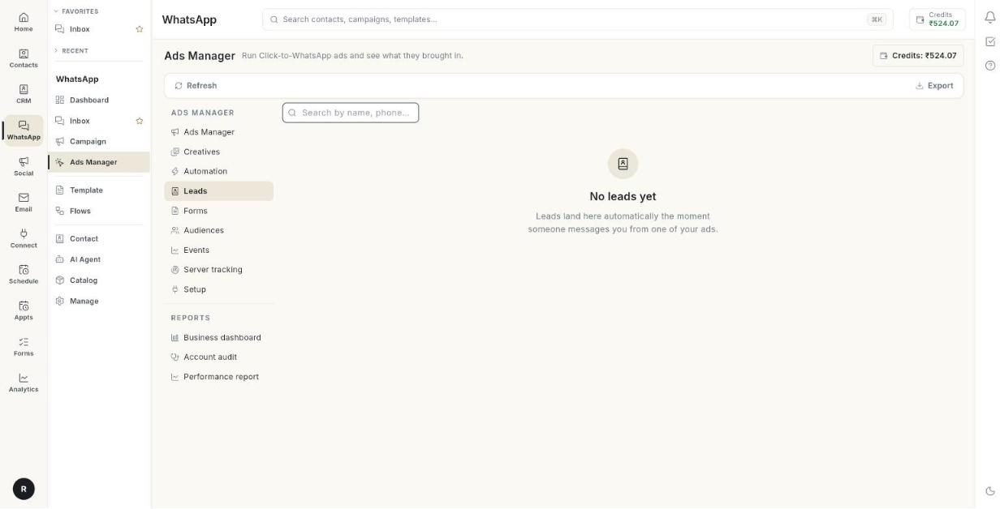

# Manage ad leads

Open the **Leads** tab to see every person who messaged you from one of your ads. At the end, you can search the list, check whether your messages were delivered and read, download the list as an Excel file, and reply from the **Inbox**. Takes about 2 minutes.

## Before you start

- Your Facebook account, Page, ad account and WhatsApp number are connected in **Setup**. See [Run Click-to-WhatsApp ads](../click-to-whatsapp-ads.md).
- At least 1 ad is live and someone has tapped it. See [Create an ad](create-an-ad.md).
- You can see **Ads Manager** in the **WhatsApp** panel. If not, ask your admin.

## What the Leads tab shows

Leads arrive on their own. You do not add them by hand. A lead appears the moment someone messages you from one of your ads.

| Column | What it shows |
|--------|---------------|
| **LEAD** | The person's name. If there is no name, the phone number shows instead. |
| **PHONE** | The country code and phone number. |
| **AD** | The name of the ad the person tapped. |
| **LEAD DATE** | The date the person messaged you. |
| **ASSIGNED TO** | The team member the lead is assigned to. Shows **—** when nobody is assigned. |
| **SENT** | How many messages you sent to this lead. |
| **DELIVERED** | How many of those messages reached the lead's phone. |
| **READ** | How many of those messages the lead opened. |
| **REPLIED** | How many times the lead replied. |

The last four columns show the message funnel: sent, then delivered, then read, then replied. A lead with a high **SENT** and a **READ** of 0 has not opened your messages.

## Steps

### Open the list

1. Open **WhatsApp** in the left rail, then select **Ads Manager**.
2. Click **Leads**. The lead list opens, 25 rows at a time.

    

    

3. Click **Refresh** to load the newest leads.

### Find a lead

1. Click the **Search by name, phone or ad** box.
2. Type part of a name, a phone number or an ad name. The table filters as you type.
3. Clear the box to see all leads again.

!!! note "Search covers the page you are on"
    Search filters only the rows on the current page. To search more leads, raise **Rows per page** or go to the next page.

### Move between pages

1. Look at the bottom of the table. It shows **Rows per page:** and a count such as **1–25 of 140**.
2. Change **Rows per page:** to show more leads at once.
3. Use the page arrows to go to the next or previous page. [VERIFY: exact arrow labels]

### Check message delivery

1. Find the lead in the table.
2. Read **SENT** to see how many messages you sent.
3. Read **DELIVERED** to see how many reached the phone.
4. Read **READ** to see how many the lead opened.
5. Read **REPLIED** to see how many times the lead answered.

### Download the list

1. Click **Export** in the top bar. On a page without the top bar, the button reads **Download Report**.
2. Open the file **ad_leads.xlsx** from your downloads folder.

The button is greyed out when there are no leads to download.

### Reply to a lead

1. Open **Inbox** from the **WhatsApp** panel.
2. Find the lead's chat. Their first message is already there.
3. Reply like any other chat.

    

### Assign a lead to a team member

1. Open the lead's chat in **Inbox**.
2. Assign the chat to a team member.
3. Return to **Leads** and click **Refresh**. **ASSIGNED TO** shows the name.

The **ASSIGNED TO** column is read-only in this tab.

## Troubleshooting

| Issue | Cause | Fix |
|-------|-------|-----|
| **Connect your Meta ad account** with a **Set up now** button | Setup is not finished and no leads exist yet. | Click **Set up now** and finish the 3 steps in **Setup**. |
| **No leads yet** | Nobody has messaged you from an ad yet. | Check that your ad is **Active** in **Ads Manager**. Leads land here as soon as someone messages. |
| **Could not load leads** | The list did not load. | Click **Retry**. If it keeps failing, reload the page. |
| **Could not download the leads report.** | The Excel file could not be built. | Click **Download Report** again. If it fails twice, click **Refresh** first. |
| **ASSIGNED TO** shows **—** | No team member is assigned to the lead. | Assign the chat from the **Inbox**. |
| **READ** is 0 for many leads | Leads have not opened your messages, or have read receipts off. | Check the message in **Inbox** and send a short follow-up. |

## Related

- [Create an ad](create-an-ad.md)
- [Manage lead forms](manage-lead-forms.md)
- [Manage your ads](manage-your-ads.md)
- [Run Click-to-WhatsApp ads](../click-to-whatsapp-ads.md)
