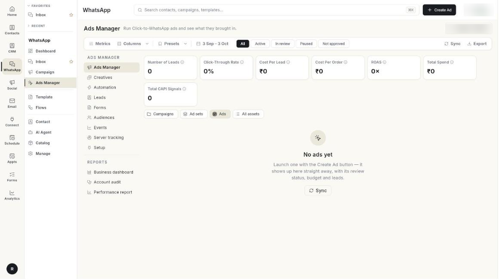

# Manage your ads in Ads Manager

Use the **Ads Manager** tab to see every ad on your Meta ad account, check its status, spend and leads, and pause, rename or change budgets without leaving Ohanvi. At the end, you can find any ad, read its numbers and change it from one table. Takes about 5 minutes to learn.

## Before you start

- Your Facebook account, Page, ad account and WhatsApp number are connected. See [Run Click-to-WhatsApp ads](../click-to-whatsapp-ads.md).
- You can see **Ads Manager** in the **WhatsApp** panel. If not, ask your admin.
- You have created at least 1 ad. See [Create an ad](create-an-ad.md).

## What the tab shows

The **Ads Manager** tab has 5 parts, from top to bottom.

| Part | What it holds |
|------|---------------|
| Command bar | **Create Ad**, **Sync**, **Export**, **Metrics**, **Columns**, **Presets** and the date range. |
| Status filters | **All**, **Active**, **In review**, **Paused** and **Not approved**. |
| Metric cards | Totals for the date range, such as **Total Spend** and **Number of Leads**. |
| Level chips | **Campaigns**, **Ad sets**, **Ads** and **All assets**. |
| Table | One row per campaign, ad set or ad, with a checkbox and an **ACTIONS** menu. |

!!! note "Where the buttons are"
    In some layouts the command bar is a row of buttons under the page title. They are labelled **Sync**, **Download Report**, **Customize Metrics**, **Columns** and **Presets**, and the date range sits beside them. They do the same things.

## Steps

### Find the ads you want

1. Open **WhatsApp** in the left rail, then select **Ads Manager**.

    

2. Click the date range, for example **7 Aug – 6 Sep**.
3. Pick a start and end date, up to 2 years back. The default is the last 30 days. The cards and table reload.
4. Click a status filter: **All**, **Active**, **In review**, **Paused** or **Not approved**.
5. Type in **Search by Ad name** to find an ad by name or ID.
6. Click **Sync** to pull the latest ads and numbers from Meta. The button reads **Syncing…** until it finishes.

Each status filter uses Meta's real delivery state. An ad that is in review or rejected never appears under **Active**. **In review** also covers ads waiting on billing information. **Not approved** covers ads Meta rejected or flagged with issues.

### Switch between campaigns, ad sets and ads

1. Click **Campaigns**, **Ad sets**, **Ads** or **All assets** above the table.
2. In a campaign row, click the name, or open **ACTIONS** and choose **Show its ad sets**. A chip such as **In campaign: Monsoon sale** appears.
3. In an ad set row, click the name, or choose **Show its ads**. The chip changes to **In ad set: …**.
4. Click the **x** on the chip to go **Back to all**.

Campaign and ad set rows add up the numbers of the ads inside them. Their **Daily Budget** cell reads **Ad set budgets** or **Campaign budget** when the budget is set one level away.

### Choose which metric cards you see

1. Click **Metrics**, or **Customize Metrics**.
2. Tick the cards you want. At least 1 card stays on.
3. Click **Done**.
4. Hover the info icon on a card to read its definition.

A card shows **₹0** or **0×** when there is no data yet.

| Card | What it counts |
|------|----------------|
| **Number of Leads** | Leads captured from your ads in the date range. |
| **Click-Through Rate** | Clicks divided by impressions on the ad account. |
| **Cost Per Lead** | Total spend divided by the number of leads. |
| **Cost Per Order** | Ad spend divided by purchases reported back to Meta. |
| **ROAS** | Revenue divided by ad spend, from accepted conversion events. |
| **Total Spend** | Money spent by the Meta ad account. |
| **Total CAPI Signals** | Conversion events sent back to Meta. |

### Choose which columns you see

1. Click **Columns**.
2. Tick or untick a column. At least 1 column stays on.
3. Read the column you added. A dash (—) means Meta has not returned that number yet.

 [VERIFY: add after step "Choose which columns you see"]

| Column | What it shows |
|--------|---------------|
| **Ad Name** | The ad name, its ID and a thumbnail. Reads **Name** on campaign and ad set views. |
| **Start Date** | The date the ad started. |
| **Status** | Meta's delivery state. A red circle beside it holds Meta's rejection reasons. Tap it to read them. |
| **Ad Type** | The ad type. On campaign rows it shows the objective. On ad set rows it shows the optimisation goal. |
| **Daily Budget** | The ad set's daily budget. A lifetime budget shows the total with the word **total**. |
| **Impressions** | How many times the ad was shown. |
| **Spend** | Money spent in the date range. |
| **Leads** | People who messaged you from the ad. |
| **Performance overtime** | A small chart of the last 7 days. Bars show spend and the green line shows results. Hover for each day. |
| **Latest actions** | The last change to the ad, who made it and when. A bolt icon means an automation rule made it. |
| **Active optimization** | The automation rules watching this row. Green means the rule is live. Amber means preview only. Click it to open **Automation**. |

### Pause, activate, rename or preview one ad

1. Click the three dots in the **ACTIONS** column of the ad row.
2. To see the ad as people see it, choose **Preview ad**. Meta's own preview opens.
3. To see changes and results by day, choose **Storyline**.
4. To stop spending, choose **Pause**. The message **Paused — this ad will stop spending.** appears.
5. To start spending again, choose **Activate**. The message **Ad activated.** appears.
6. To rename, choose **Rename**. In **Rename ad**, type the new **Ad name** and click **Save**.
7. To see who messaged you from this ad, choose **View leads**.

!!! warning "Activate starts spending at once"
    An approved ad goes live the moment you click **Activate**. Meta does not review it again. An ad still **In review** cannot be activated.

### Change the budget of a campaign or ad set

1. Switch to **Campaigns** or **Ad sets**.
2. Click the three dots in the **ACTIONS** column of the row.
3. Choose **Change daily budget**.
4. In the **Change budget** window, pick **Set daily budget**, **Increase by %** or **Decrease by %**.
5. Type the amount in **New daily budget** (or **Percent**), then click **Apply**.

**Change daily budget** is available only on rows that have a daily budget of their own. Campaign and ad set rows also have **Show its ad sets** or **Show its ads**, **Storyline**, and **Pause** or **Activate**.

### Change many rows at once

1. Tick the checkbox on each row. Tick the box in the header to select the whole page.
2. Read the bar that shows **2 selected** or the matching count, with **Turn on**, **Pause** and **Change budget**.
3. Click **Turn on** or **Pause** and confirm. **Turn on** asks **Turn on 2 rows?** and warns that approved ads start spending right away.
4. To change budgets, click **Change budget**.
5. Choose **Increase by %**, **Decrease by %** or **Set daily budget**.
6. Type the **Percent** or **New daily budget**.
7. Click **Apply**.
8. Click **Clear** to drop the selection.

Bulk change limits:

- Up to 50 rows at a time.
- An increase can be up to 500%.
- A decrease can be up to 90%.
- Only ad sets with their own daily budget change.

The change takes effect on Meta right away. If some rows fail, a window titled for example **3 updated · 1 not changed** lists each failed row and Meta's reason.

### Save a view as a preset

1. Set the level, status filter, search text, columns and metric cards the way you want them.
2. Click **Presets**, then **Save current view…**.
3. Type a **Preset name**.
4. Click **Save**. If the name exists, the button reads **Replace**.
5. To use it later, click **Presets** and pick the name. The message **Preset “…” applied.** appears.
6. To remove one, click **Presets**, then **Manage presets…**, then the delete icon.

!!! warning "Presets are shared"
    A deleted preset is removed for everyone in your team. A preset does not save the date range.

### Download the report

1. Pick the date range.
2. Click **Export**, or **Download Report**.
3. Open the Excel file. It is named `ads_report_` followed by the start and end dates.

The button is off while the table is empty.

## Troubleshooting

| Issue | Cause | Fix |
|-------|-------|-----|
| **Connect and Setup Meta Ad Account to continue!** | Setup is not finished. | Click the message to open **Setup**, then finish all steps. |
| **Could not load ads**, with **Could not fetch ads from the Meta ad account.** | Meta did not answer, or the connection expired. | Click **Retry**. If it repeats, reconnect in **Setup**. |
| **No ads yet** | The ad account has no ads. | Click **Create Ad**. A new ad appears here straight away. |
| **Nothing matches this filter** | The status filter or search hides every row. | Click **All** and clear the search box. |
| A red circle beside **Status** | Meta found a problem with the ad. | Tap the circle, read Meta's reason, fix the ad and create it again. |
| **Nothing ticked has a daily budget of its own to change.** | The rows you ticked have no daily budget. | Tick ad sets with a daily budget, or change the budget on the campaign. |
| **Could not update the ad.** | Meta refused the change, for example a budget below the account minimum. | Read the message from Meta that appears with it and adjust the value. |
| **Could not download the report.** | The export did not finish. | Click **Export** again. |

## Related

- [Set up Ads Manager](set-up-ads-manager.md)
- [Create an ad](create-an-ad.md)
- [Read the performance report](read-the-performance-report.md)
- [Read the business dashboard](read-the-business-dashboard.md)
- [Automate your ads](automate-your-ads.md)
- [Run Click-to-WhatsApp ads](../click-to-whatsapp-ads.md)
