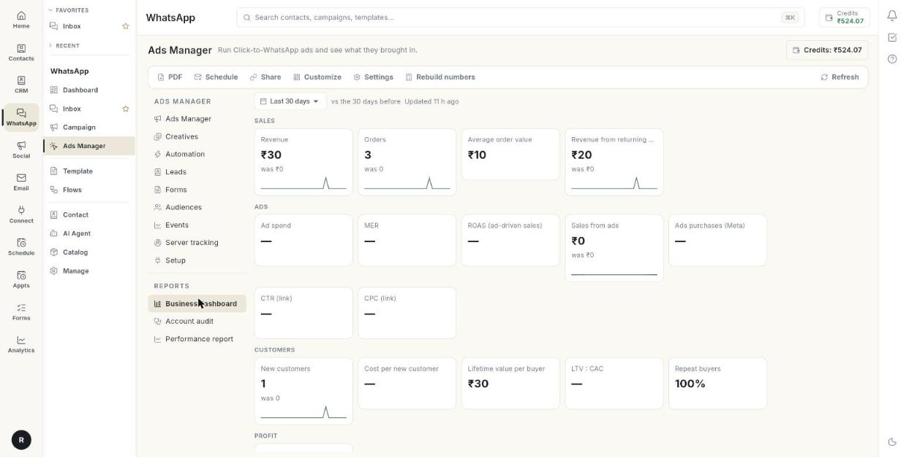

# Read the business dashboard

Use the **Business dashboard** to see what your store sold next to what your ads cost. At the end, you have read revenue, return on ad spend, cost per new customer and profit for a period, and you can download, schedule or share the report. It takes about 10 minutes.

## Before you start

- Your Meta ad account is connected. See [Set up Ads Manager](set-up-ads-manager.md).
- Shopify or WooCommerce is connected, so Ohanvi can see your store orders. See [Webhooks and integrations](../whatsapp-webhooks-and-integrations.md).
- Your ads send people to your store. Ohanvi matches orders to ads from the ad link, so the dashboard needs orders to match. [VERIFY: page that explains order matching]
- You can see **Ads Manager** in the **WhatsApp** panel. If not, ask your admin.

## What the dashboard shows

The numbers are grouped as **Sales**, **Ads**, **Customers** and **Profit**. Each card shows the value, the change against the earlier period, such as **+12% vs before**, and a small trend line. A green change is better. A red change is worse. A dash (—) means there is no data for that card.

| Card | What it means |
|------|---------------|
| **Revenue** | Money your store took in the period. |
| **Orders** | Number of store orders in the period. |
| **Average order value** | Revenue divided by orders. |
| **Revenue from returning customers** | Revenue from buyers who had ordered before. |
| **Ad spend** | Money your ads spent. |
| **MER** | Store revenue divided by total ad spend. |
| **ROAS (ad-driven sales)** | Sales traced to an ad divided by ad spend. |
| **Sales from ads** | Revenue from store orders traced to an ad. |
| **Ads purchases (Meta)** | Purchases as Meta reports them, using Meta's own attribution. |
| **CTR (link)** | Link clicks divided by impressions, across all ad platforms. |
| **CPC (link)** | Ad spend divided by link clicks. |
| **New customers** | Buyers whose first order fell in the period. |
| **Cost per new customer** | Ad spend divided by new customers. Also called CAC. |
| **Lifetime value per buyer** | All-time revenue per buyer. |
| **LTV : CAC** | Lifetime value divided by cost per new customer. |
| **Repeat buyers** | Share of buyers who ordered more than once, all time. |
| **Net profit after ads** | Revenue times your margin, minus ad spend. |

!!! tip "MER and ROAS are not the same"
    **MER** divides all store revenue by all ad spend. **ROAS (ad-driven sales)** counts only orders Ohanvi traced to an ad. MER is the larger number when many buyers do not come from ads.

## Steps

### Open the dashboard and pick a period

1. Open **WhatsApp** in the left rail, then select **Ads Manager**.
2. In the left column, under **Reports**, click **Business dashboard**.

    

3. Pick a period from the date list at the top: **Today**, **Yesterday**, **Last 3 days**, **Last 7 days**, **Last 14 days**, **Last 30 days**, **Last 90 days** or **Custom range…**.

    

4. For a custom range, pick the dates. The range can be up to 200 days. For longer ranges the message **Pick at most 200 days.** appears.
5. Read the text next to the period, **vs the 7 days before**. It tells you what each number is compared with.
6. Read the second line, for example **Updated 10 minutes ago**. It shows when the numbers were last built. They rebuild every 15 minutes. The wording is **Updated just now**, **Updated 10 min ago**, **Updated 3 h ago** or **Updated** with a date.

### Read the number cards

1. Read the **Sales** cards: **Revenue**, **Orders**, **Average order value** and **Revenue from returning customers**.
2. Read the **Ads** cards: **Ad spend**, **MER**, **ROAS (ad-driven sales)**, **Sales from ads**, **Ads purchases (Meta)**, **CTR (link)** and **CPC (link)**.
3. Read the **Customers** cards: **New customers**, **Cost per new customer**, **Lifetime value per buyer**, **LTV : CAC** and **Repeat buyers**.
4. Read the **Profit** card, **Net profit after ads**.
5. If the card asks you to **Set your margin**, follow [Set your margin and report settings](#set-your-margin-and-report-settings).

### Read the charts and tables

1. Scroll to **Revenue vs ad spend**. It shows revenue and ad spend per day, with MER on the right axis.

    

2. Read **By ad platform**. It has one row per platform.
3. Read **SPEND**, **CTR**, **CPC**, **CPM** and **PURCHASES\***. They come from the platform. A star means the platform's own figure.
4. Read **STORE ORDERS**, **STORE SALES**, **STORE ROAS** and **COST / NEW CUSTOMER**. They come from your store.
5. Read **Meta vs your store**. It shows what Meta says its ads sold, next to store orders traced to Meta ads, with the gap as a percentage.
6. Read the badge on that block. See the badge table below.
7. Read **Campaigns**. It has one row per Meta campaign: **SPEND**, **RESULTS**, **COST / RESULT**, **PURCHASES\***, **ROAS\***, **STORE ORDERS** and **STORE SALES**.
8. Read **Latest orders from ads**. Its columns are **ORDER**, **DATE**, **AMOUNT**, **FROM**, **CUSTOMER** and **SENT TO META**.
9. Read the **FROM** column. It names the platform and how the order was matched. See the match table below.
10. Read **SENT TO META**. It reads **Sent** or **Failed**. Hover it for details.

Click-to-WhatsApp sales are also sent to Meta as purchases. In **By ad platform**, a platform whose spend has not arrived reads **Not synced yet**.

| Badge | Meaning |
|-------|---------|
| **Close match** | Meta's count and your store's count agree. |
| **Usual gap** | The two differ by an expected amount. |
| **Check your setup** | The gap is large. Read the reasons listed under it. |
| **Different currencies** | The store and the ad account use different currencies. |
| **No store sales traced** | No store order could be matched to a Meta ad. |

| FROM value | How the order was matched |
|------------|---------------------------|
| **Click-to-WhatsApp ad** | The customer came through a Click-to-WhatsApp ad. |
| **Ad id in the link** | The store link carried the ad ID. |
| **Google ad click** | The order came from a Google ad click. |
| **Paid UTM link** | The store link carried paid campaign tags. |

### Set your margin and report settings

1. Click **Settings**. If a margin is saved, it reads **Settings · margin 40%**.
2. In **Report & naming settings**, type your **Gross margin** as a percentage, for example 40. It is the share of revenue left after product cost. Empty hides **Net profit after ads**.

    

3. Under **Reports (PDF and shared links)**, fill **Company name on reports** if you want a name other than your organisation's.
4. Pick a **Report currency**, or **Same as the store**.
5. Pick an **Attribution window**. It controls how Meta credits sales to ads in every report. Changing it re-reads the last 30 days.
6. Under **Naming convention**, set the template for **Campaign** names created from Create Ad.
7. Set the template for **Ad set** names.
8. Set the template for **Ad** names.
9. Click **Save**.

| Attribution window | What it counts |
|--------------------|----------------|
| **Same as Ads Manager (each ad set's setting)** | Each ad set's own setting. |
| **1-day click** | Sales within 1 day of a click. |
| **7-day click** | Sales within 7 days of a click. |
| **28-day click** | Sales within 28 days of a click. |
| **1-day click or 1-day view** | Sales within 1 day of a click or a view. |
| **7-day click or 1-day view** | Sales within 7 days of a click or 1 day of a view. |

### Choose what the dashboard shows

1. Click **Customize**.
2. In **Customize dashboard**, tick the numbers to show.
3. Drag the numbers to reorder them.
4. Under **Sections**, hide the blocks you do not need.
5. Click **Save**. Click **Reset** to return to the default layout.

Your own list appears under the heading **Your numbers**.

### Download a PDF

1. Click **PDF**, or **Download PDF**.
2. Open the file. It is named `business-dashboard-` followed by the days or dates.

If it fails, the message **Could not build the PDF.** appears.

### Email the report on a schedule

1. Click **Schedule**, or **Schedule email**. The window **Scheduled report emails** opens.
2. Click **New schedule**. The **New scheduled email** form opens.

    

3. Type a **Name (optional)**, for example Monday numbers for the owner.
4. Choose the **Report**: **Business dashboard** or **Account audit**.
5. Choose the frequency: **Daily**, **Weekly** or **Monthly**.
6. Pick the day, then pick the hour under **At**.
7. Choose what **Report covers**: **Last 7 days**, **Last 14 days**, **Last 30 days** or **Last 90 days**.
8. In **Send to**, type up to 10 email addresses, separated by commas. Click **Add team members** to pick from your team.
9. Fill **CC (optional)**. They are copied on the same email. Everyone sees who got it.
10. Click **Edit PDF view** to choose the sections and measures in the attached PDF.
11. Under **Numbers in the email body**, pick the numbers shown in the email. None picked uses a standard few.
12. Turn **Active** on or off to run or pause the schedule.
13. Click **Send a test email**. The message **Test email sent. It can take a minute to arrive.** appears.
14. Save the schedule.

!!! warning "A shared email cannot be recalled"
    Check the **Send to** list before you save. Everyone listed receives the report.

### Share a live link

1. Click **Share**, or **Share link**. The window **Share the …** opens.
2. Pick an expiry: **Expires in 7 days**, **Expires in 30 days** or **Expires in 90 days**.
3. Click **Create & copy link**.
4. Send the link. Anyone with it sees a live page of the last 7, 14, 30 or 90 days, with a PDF download. No login is needed.
5. To stop access, revoke the link from the list in the same window.

!!! warning "Anyone with the link can read the numbers"
    Revoke a link when you no longer need it.

### Rebuild the numbers

1. Click **Rebuild numbers** to match new store orders to ads and recount. The button reads **Rebuilding…** while it works.
2. Read the result message, for example **3 new orders matched to ads.**

## Troubleshooting

| Issue | Cause | Fix |
|-------|-------|-----|
| **No numbers yet. They build every 15 minutes from your store orders and Meta spend — or press "Rebuild numbers" now.** | The first build has not run. | Click **Rebuild numbers**. |
| **No store orders in this period. Connect Shopify or WooCommerce to see revenue, MER and profit next to your ad spend.** | No store is connected, or the period has no orders. | Connect your store, or pick a longer period. |
| A message that your store and ad account use different currencies | Store and ad account currencies differ, so MER, ROAS, cost per customer and profit are hidden. | Use the same currency on both, or set **Report currency** in **Settings** to the ad account's currency. |
| **Net profit after ads** shows **Set your margin** | No gross margin is saved. | Click **Settings** and fill **Gross margin**. |
| **Could not load the business dashboard** | The dashboard did not load. | Click **Retry**. |
| **Could not build the PDF.** | The PDF did not finish. | Click **PDF** again. |
| **Could not create the link.** | The share link was not created. | Click **Create & copy link** again. |

## Related

- [Read the performance report](read-the-performance-report.md)
- [Manage your ads](manage-your-ads.md)
- [Run an account audit](run-an-account-audit.md)
- [Track website events](track-website-events.md)
- [Run Click-to-WhatsApp ads](../click-to-whatsapp-ads.md)
