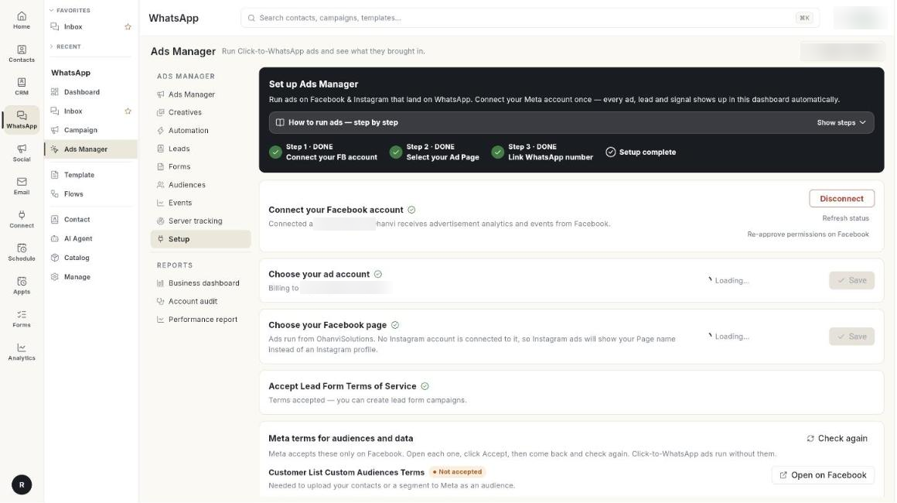

# Set up Ads Manager

Connect your Facebook account, Page, ad account and WhatsApp number in **Setup**, and choose how Meta is paid for ad spend. At the end, the page shows **Setup complete** and **Create Ad** is ready to use. Setup is done once and takes about 10 minutes.

## Before you start

- Your WhatsApp number is connected to Ohanvi. See [Connect your WhatsApp number](../connect-whatsapp-number.md).
- You manage a Facebook Page and a Meta ad account. No ad account yet? Create one in Meta Business Settings → Ad Accounts.
- You can see **Ads Manager** in the **WhatsApp** panel. If not, ask your admin. See [Roles and permissions](../../settings/roles-and-permissions.md).

## What the Setup page shows

Open **WhatsApp** in the left rail, then select **Ads Manager** → **Setup**. The page title is **Set up Ads Manager**. The tab reads **Setup · pending** until all steps are done.

| Item | What it shows |
|------|---------------|
| **Connect your FB account** | Step 1. Shows **DONE** or **PENDING**. |
| **Select your Ad Page** | Step 2. Shows **DONE** or **PENDING**. |
| **Link WhatsApp number** | Step 3. Shows **DONE** or **PENDING**. |
| **Setup complete** | Appears when all 3 steps are **DONE**. |
| **How to run ads — step by step** | A short guide you open with **Show steps** and close with **Hide**. |

## Steps

### Connect your Facebook account

1. Open **WhatsApp** in the left rail, then select **Ads Manager**.
2. Click **Setup**. The **Set up Ads Manager** page opens.

    

3. Under **Connect your Facebook account**, click **Continue with Facebook**.
4. Log in with the Facebook account that manages your business.
5. On Meta's screen, choose **Opt in to all current and future** for both Businesses and Pages.
6. Return to Ohanvi. The message **Facebook connected!** appears and the card shows **Connected as** your Facebook name.

The card now reads **Ohanvi receives advertisement analytics and events from Facebook.**

### Refresh or re-approve the Facebook connection

1. On the **Connect your Facebook account** card, click **Refresh status** to reload the connection after you change something on Meta.
2. If Meta shows an opt-in error, click **Re-approve permissions on Facebook**.
3. On Meta's screen, choose **Opt in to all current and future** again for Businesses and Pages.

### Use the Business login when Facebook refuses the login

1. On the card, open **Facebook refused the login?**
2. Read **Permissions requested:**. If Meta names one as an invalid scope, that permission must be added in the Meta App Dashboard. [VERIFY: who adds the permission in the Meta App Dashboard — Ohanvi or the customer]
3. Or click **Use the Business login**. It takes its permissions from Meta Business settings.

### Pick your Page and ad account

1. Under **Choose your Facebook page**, open **Choose your page** and pick the Page your ads will run from.
2. Check the line under the Page. If an Instagram account is linked, it reads **Instagram ads run as @your_username.**
3. If none is linked, the line reads **No Instagram account is connected to it, so Instagram ads will show your Page name instead of an Instagram profile.**
4. Under **Choose your business portfolio**, open **Business portfolio** and pick the Meta business that owns your ad account.
5. Under **Choose your ad account**, open **Ad account** and pick the account your campaigns are billed to.
6. Click **Save**. Each card now shows what you chose, for example **Billing to** and the ad account.

!!! tip
    If two Pages have the same name, the list shows **Name - id**. Pages from another business are grouped under **Other Pages**.

### Accept the Meta terms

1. Find **Accept Lead Form Terms of Service**.
2. Tick **I accept the** **Terms of Service for Lead Form Ads**.
3. Click **Accept Terms**. The status changes from **Not accepted** to **Accepted**.

You need this only for lead form ads. Click to WhatsApp ads run without it.

Next, accept the audience and data terms:

1. Find **Meta terms for audiences and data**. It lists more terms.
2. Click **Open on Facebook** next to each term and accept it on Facebook. Meta accepts these only there.
3. Return to Ohanvi and click **Check again**.
4. When all are accepted, the card reads **All set. Contact audiences and chat conversion events can reach Meta.**

Click to WhatsApp ads run without these terms.

### Link your WhatsApp number

1. Under **Link WhatsApp Number**, open **WhatsApp number** and pick the number where leads should land. Only numbers already connected in WhatsApp setup appear.
2. Click **Send code**. The message **Code sent to … on WhatsApp.** appears.
3. Type the code in **Code from WhatsApp**. Click **Resend** if it does not arrive.
4. Click **Verify**. The message **WhatsApp number linked to your page.** appears.

Linking the number to your Page makes an ad open a chat with you. To change the number later, click **Link another number**.

### Pay for the ads

The **Credits & billing** card shows how ad spend is paid. It lists **Credits balance (shared)**, **Old ads credits**, **Meta payment method**, **Total ad spend** and **Unbilled spend**. The card sits on the **Performance report** page.

Choose one way to pay:

- **Add Meta payment method**: add a card or UPI on the ad account at Meta. Meta bills it directly. If a method is on file, the page shows **Billing ready**.
- **Pay with Ohanvi**: Meta bills Ohanvi, and the spend comes off your Ohanvi credits. Ohanvi adds a 2% fee on the ad spend, taken from your credits too.

### Add credits

1. Click **Buy Credits**. The **Add money to Ads Credits** window opens.
2. Type an **Amount (₹)**. The minimum recharge is ₹10.
3. Click **Pay with Razorpay**. A payment page opens with UPI (scan the QR), card and netbanking. [VERIFY: netbanking shown on the payment page]
4. If a recharge is pending, click **Pay now** to finish it, or **I have paid — check** after you pay.

### Turn on Pay with Ohanvi and set a spend cap

1. On the **Pay with Ohanvi** card, click **Turn on**.
2. Click **Change cap**. The **Spend cap** window opens.
3. Type the **Cap (₹)**.
4. Click **Save**. The message **Spend cap updated.** appears.

The cap is the most this ad account may spend on Ohanvi's credit line. Meta stops delivery when it is reached. The cap is limited by your credits balance, so add money first.

### Pause, resume or turn off Pay with Ohanvi

1. To stop spending for a while, click **Pause** on the **Pay with Ohanvi** card. The card shows **Paused**.
2. To start spending again, click **Resume**.
3. To return to the payment method at Meta, click **Turn off**.

!!! warning "Turn off Pay with Ohanvi"
    Turning it off sends billing back to the payment method at Meta. Turning it on later creates a new allocation, which is checked again.

### Disconnect Facebook

1. On **Connect your Facebook account**, click **Disconnect**.
2. Read **Disconnect Facebook?** and click **Disconnect**.

Ad analytics and ad launching stop until you connect again. Your Page, terms acceptance and WhatsApp number are kept. To reconnect, click **Continue with Facebook** once.

### Check that setup is complete

1. Look for **Setup complete** at the top of the page.
2. Check that the **Create Advertisement** card reads **You are all set — click Create Ad to start receiving leads**.
3. Click **Create Ad** to continue. See [Create an ad](create-an-ad.md).

## Video walkthrough

[VIDEO]

## Troubleshooting

| Issue | Cause | Fix |
|-------|-------|-----|
| **Please select OPT-IN to all for Business and Page to proceed.** | On Meta's screen, not every Business and Page was opted in. | Click **Continue with Facebook** again. Choose **Opt in to all current and future** for both. |
| **Facebook closed without connecting.** | The Facebook window was closed, or Meta showed **Invalid Scopes**. | Click **Continue with Facebook** again. If **Invalid Scopes** shows, click **Use the Business login**. |
| **Facebook is connected, but ads access is still pending** | The login did not include permission to manage ads. | Your Page and WhatsApp steps still work. Ad creation turns on when Meta approves the permission. |
| **Facebook login could not start. Reload the page and try again.** | The login did not open in the browser. | Reload the page and click **Continue with Facebook**. |
| **Enter the code Meta sent to your WhatsApp.** | **Verify** was clicked with an empty code field. | Type the code from WhatsApp, or click **Resend**. |
| The Page list is empty, or a Page is greyed out with **no WhatsApp number**. | Meta has not given Page access, or the Page has no linked number. | Click **Re-approve permissions on Facebook**. Then link the number for that Page. |

## Related

- [Run Click-to-WhatsApp ads](../click-to-whatsapp-ads.md)
- [Create an ad](create-an-ad.md)
- [Connect your WhatsApp number](../connect-whatsapp-number.md)
- [Credits and billing](../../credits-and-billing.md)
