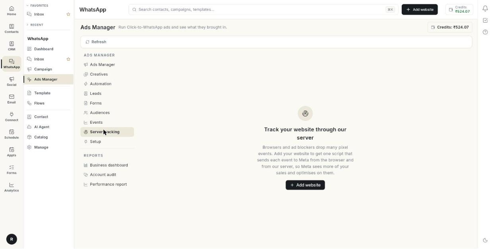

# Set up server tracking

Add your website to **Server tracking** and install one script, so each event reaches Meta from the browser and from our server. Browsers and ad blockers drop many pixel events. The server copy lets Meta see more of your sales. Takes about 15 minutes.

## Before you start

- Your Facebook account, Page and ad account are connected in **Setup**. See [Run Click-to-WhatsApp ads](../click-to-whatsapp-ads.md).
- You have a dataset (pixel) on the ad account. See [Track website events](track-website-events.md).
- You can edit your website's theme or code. On Shopify you can instead connect your store and install in 1 click.
- You know your website's domain, for example `myshop.com`. If you use Shopify, also know your checkout domain, for example `myshop.myshopify.com`.

## How it works

You add a website and get one tracking script. The script sends a **PageView** by itself. Each event goes to the browser pixel and, with the same event id, through our server to Meta's Conversions API. Meta keeps one copy. Orders from your store can also be reported from the server.

The tab shows your websites on the left and the selected website on the right. Each website has 4 tabs: **Overview**, **Health**, **Install** and **Settings**.

## Steps

### Add a website

1. Open **WhatsApp** in the left rail, then select **Ads Manager**.
2. Click **Server tracking**.

    

3. Click **Add website**. The **Add website** window opens.

    

4. Type a **Website name \***, for example `Main store`.
5. Type your **Domains \***, for example `myshop.com, myshop.myshopify.com`. Sub-domains are included. Events from any other site are refused.
6. Turn on **This website already has the Meta pixel** only if your site already loads a Meta pixel.
7. Click **Add**.

If you leave a box empty, the message **Name and domain are required.** appears.

!!! warning "Two pixels can double-count events"
    If your site already has the pixel and you turn on the switch, the script sends server events only. Meta may count some events twice because your pixel's events carry different ids. Removing the old pixel and letting this script load it avoids that.

### Install the script on every page

1. Select the website, then click **Install**. The tab has 5 steps. Open each step to see it.
2. Open step 1, **Add the script to every page**.
3. Click the copy button on the **Tracking script** box. The message **Script copied** appears.
4. Paste the script just before `</head>` on every page.
5. On Shopify, paste it in Online Store → Themes → Edit code → theme.liquid.
6. On WordPress, paste it with a header-scripts plugin or in your theme's header.
7. Or, if your Shopify store is connected, click **Install on Shopify**. It installs the script on every store page with no theme edit. The message **Installed on your Shopify store** appears.
8. To take it off Shopify, click **Remove**.

To send events other than **PageView**, call this from your site:

```js
ohTrack('track', 'AddToCart', {value: 499, currency: 'INR'})
```

### Track orders on the thank-you page

This links each order to the shopper's ad click. Purchases then reach Meta even when the browser pixel is blocked. Open step 2 on the **Install** tab and follow the platform you use.

#### On Shopify

1. In Shopify admin, open Settings → Customer events.
2. Click Add custom pixel and name it.
3. Paste the **Custom pixel code** from step 2.
4. Click Save, then click Connect.
5. Add your checkout domain, for example `yourstore.myshopify.com`, to this website's domains.

#### On WooCommerce

1. Click **Download WordPress plugin**.
2. In WordPress, open Plugins → Add New → Upload Plugin and upload the file.
3. Click Activate. The plugin adds the script to every page and sends product views, add to cart, checkout and orders.
4. Skip step 1 and the snippet.

If you use the PHP snippet for WooCommerce instead of the plugin, add it with a code snippets plugin or in the theme's `functions.php`. The script from step 1 must already be in the header.

#### On any other website

1. Copy the code from the **Thank-you page** box.
2. On the order confirmation page, after the tracking script, call `ohTrack('identify', …)`.
3. Then call `ohTrack('track', 'Purchase', …)`.

### Test the connection

1. In Meta Events Manager, open your dataset, then **Test events**. Copy the test code shown there.
2. Open step 3 on the **Install** tab.
3. Paste the code in **Test event code**. The hint reads **e.g. TEST12345**.
4. Click **Send test event**.
5. Read the result. **Sent. Open Events Manager → Test events: a server PageView should appear within a minute.** means it worked.
6. Open your website. The dot beside it in the list turns green once our server receives its first event.
7. Click **Refresh** to check the dot.

### Watch live events

1. Open step 4 on the **Install** tab.
2. Click **Watch live events**. The view stays on for 30 minutes and refreshes every 5 seconds. Before the first event it reads **Waiting for the first event…**.
3. Open your website in another tab and click around.
4. Read each row. It shows the time, the event name, the customer details it carried (never their values), the page, and what Meta did with it.
5. Click **Stop live view** to end it early.

| Result | Meaning |
|--------|---------|
| **Sent to Meta** | Meta accepted the event. |
| **Failed** | Meta refused the event. The reason shows in the row. |
| **Not sent here** | The event is held back, for example by a setting. |
| **Waiting** | The event is queued. |

### Verify your domain with Meta

Meta wants to know you own the website your ads send people to.

1. Open step 5 on the **Install** tab.
2. Read the status of each domain.
3. For a domain that is **Not in Business Manager**, click **Add to Business Manager**.
4. Prove ownership with a DNS TXT record on the domain. Click the copy icon to copy the TXT value.
5. Or put the copied meta tag in the `<head>` of the home page.
6. Click **Open Business settings** and press Verify there.
7. Come back and click **Check again** to refresh the status.

Each domain shows one of these statuses:

- **Verified**
- **Added, not verified yet**
- **Not in Business Manager**
- **Check in Business settings**

The WordPress plugin adds the meta tag for you. Download it again after adding the domain. On Shopify, use the DNS record, or paste the meta tag into theme.liquid inside `<head>`.

### Read the Overview

1. Select the website, then open **Overview**.
2. Read **Status**. It shows **Receiving events**, **Waiting for the first event — install the script**, or **No events in the last 24 hours**.
3. Read **Domains**. These are the domains you added.
4. Read **Dataset**. This is the dataset events go to. It shows **None selected** when empty.
5. Read **Browser pixel**. It shows **Loaded by this script**, or **Already on the site — the script sends server events only**.
6. Read **Last event**. This is the date of the last event.
7. Read **Website purchases**. It shows **Sent by us from your store orders**, or **Reported by your store's own Meta app**.
8. Read **Received**. These are events that reached our server.
9. Read **Sent to Meta**. These are events Meta accepted.
10. Read **Failed**. These are events Meta refused.
11. Read the table below them. It lists **Event**, **Received**, **Sent** and **Failed** for each event name.

The counts cover the last 14 days, counted on our server. Pick **Last 7 days**, **Last 14 days** or **Last 30 days** above the counts to change it.

### Check the tracking audit

1. Select the website, then open **Health**. The **Tracking audit** is at the top.
2. Read the score, for example **6 / 8 checks pass**.
3. Read each open check. It has a name, a detail and a fix.
4. Click **Open** on a check to go to the tab or step that fixes it.
5. After a fix, click **Run again**.
6. Click **Show 5 passed checks** to see the checks that passed.

| Label | Meaning |
|-------|---------|
| **Pass** | The check is fine. |
| **Fix this** | Something is broken. Follow the line that starts with an arrow. |
| **Check** | Something may be wrong. Look at it. |
| **Tip** | An optional improvement. |

### Read the health charts

1. On **Health**, choose **Last 7 days**, **Last 14 days** or **Last 30 days**.
2. Read **Events through our server**. It shows events per day, split into **Sent to Meta** and **Failed**.
3. Read **What Meta received**. It shows the last 7 days as Meta counts them, **Browser (pixel)** against **Server**. Server events reach Meta even when an ad blocker stops the pixel.
4. Read **Purchases Meta credited to your ads**. It shows **Per day before**, **Per day since** and **Change**, for the last 28 days. Meta can take up to 3 days to credit a sale.
5. Read **Store orders reported to Meta**. It shows the share of orders sent as a **Purchase**. The lines are **Sent**, **Waiting for COD confirmation**, **Not sent**, **Failed at Meta**, and the reasons some were not sent.
6. Read **Meta match quality**. This is Meta's Event Match Quality, from 0 to 10, for each event. Higher means more sales credited to your ads. Meta needs a few days of events before it shows a score.

If fewer than 6 in 10 orders come with the thank-you page details, check step 2 on the **Install** tab. Those orders still go, with less to match the buyer on.

### Change the website settings

1. Select the website, then open **Settings**.
2. Change **Website name \*** or **Domains \*** to rename the website or change its domains.
3. Choose a **Dataset** for the events. **Ads account dataset** uses the dataset of your ad account.
4. Turn on **This website already has the Meta pixel** to send server events only.
5. Optional: in **Also send to datasets**, type up to 5 dataset ids, separated by commas. Use it for an agency pixel and a brand pixel. Every event also goes to them.
6. Turn on **Wait for visitor consent** if your site shows a cookie or privacy banner. Nothing is stored or sent until your banner calls `ohTrack('consent', 'grant')`.
7. Call `ohTrack('consent', 'revoke')` when a visitor says no. Browsers with Global Privacy Control are always sent as limited data use.
8. Optional: in **Never send these events**, type event names, for example `PageView, Search`. They are dropped in the browser and on our server.
9. Turn on **Don't send customer details** to send no email, phone, name or address. Meta then matches fewer sales. When off, details are hashed before they leave our server.
10. Click **Save**. The message **Website saved** appears.

### Serve the script from your own sub-domain

Use **Tracking sub-domain** so browsers keep ad-click cookies longer and blockers see the script as your own site.

1. Open **Settings**.
2. Type the sub-domain in **Tracking sub-domain**, for example `track.myshop.com`. This field is optional.
3. Click **Save**.
4. At your domain provider, add a CNAME record. The name and value show under the box.
5. Click **Check DNS**.
6. When the line reads **is verified**, open **Install** and copy the script again. It now loads from your domain.

### Choose how purchases are reported

Below the website form, **Purchases — all websites and stores** applies to every website. Each choice saves at once. The message **Saved** appears.

1. Under website purchases, choose one option.
    - **My store's Meta app reports website purchases**: keep this if Shopify's Facebook & Instagram app or another plugin already sends purchases. We still report sales from Click-to-WhatsApp ads.
    - **Send website purchases from our server**: every online order goes to Meta from your store data and the thank-you page code.
2. If you choose **Send website purchases from our server**, turn off purchase tracking in your store's Meta app first. Otherwise Meta counts each sale twice.
3. Under **Cash on delivery**, choose when to report a COD order.
    - **Report when the order is placed**: Meta learns from every COD order straight away.
    - **Report once the order is confirmed**: sent once the store marks it shipped, paid or completed. Cancelled orders never count. Sent within 7 days of the order.
4. Under **Google Ads conversion**, paste the resource name of a Google Ads conversion, for example `customers/1234567890/conversionActions/987654321`. Store sales from a Google ad click are sent to it. Leave it empty to skip.
5. Click **Save** beside it.

### Replace the script key or remove a website

1. To make a new key, click **New script key**. The script on your website stops working until you paste the new one.
2. Open **Install** and copy the script again.
3. To stop tracking a website, click **Remove website**, then click **Remove**. Its script stops sending events. Past counts are kept.

!!! warning "A new script key stops the old script"
    Use **New script key** only if the key was misused. Copy the script again from **Install** afterwards.

## Troubleshooting

| Issue | Cause | Fix |
|-------|-------|-----|
| **Connect your Meta ad account** with a **Set up now** button | Setup is not finished. | Click **Set up now** and finish **Setup**. |
| **Could not load your websites** | The list did not load. | Click **Retry**. |
| **Name and domain are required.** | A box in **Add website** is empty. | Fill **Website name \*** and **Domains \***. |
| **Waiting for the first event — install the script** | No event has reached our server. | Paste the script on every page, open your site, then click **Refresh**. Use **Watch live events** to see events arrive. |
| **No events in the last 24 hours** | The script was removed, or the site has no traffic. | Check the script is still on the page. Open the site and watch live events. |
| **Paste the test code from Events Manager → Test events first.** | **Test event code** is empty. | Copy the code from Meta Events Manager and paste it. |
| **Meta did not accept the test event.** | The test code is wrong or expired. | Copy a fresh test code and click **Send test event** again. |
| A domain shows **Not in Business Manager** | The domain was not added to your Business Manager. | Click **Add to Business Manager**, then verify in **Open Business settings**. |
| **Could not read domains.** | Meta did not return the domain list. | Click **Check again**. |
| **Could not change live view.** | The live view did not start or stop. | Click the button again. |

## Related

- [Track website events](track-website-events.md)
- [Build ad audiences](build-ad-audiences.md)
- [Run an account audit](run-an-account-audit.md)
- [Read the performance report](read-the-performance-report.md)
- [Run Click-to-WhatsApp ads](../click-to-whatsapp-ads.md)
