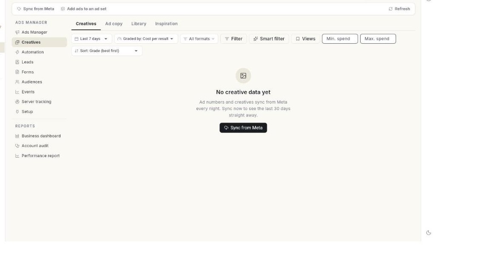

# Use ad creatives

Read how each picture and ad text performed in **Creatives**, filter the data, store your files in the **Library**, and find ideas. At the end, you know which creatives to keep, which are tired, and you have reused the best ones in a new ad.

## Before you start

- Your Facebook account, Page and ad account are connected in **Setup**. See [Set up Ads Manager](set-up-ads-manager.md).
- You have at least 1 ad that has run. Numbers sync from Meta every night.
- You can see **Ads Manager** in the **WhatsApp** panel. If not, ask your admin.

## How Creatives is organised

**Creatives** has 4 tabs at the top.

| Tab | What it shows |
| --- | --- |
| **Creatives** | How every image, video or carousel performed across all ads that used it. |
| **Ad copy** | How each piece of primary text performed. Also length, emoji, link and phrase results. |
| **Library** | Every image and video in your ad account. Upload, rename, archive and reuse them. |
| **Inspiration** | Search Meta's Ad Library, save ads you like and keep notes. |

If **Creatives** shows **Setup** instead of data, finish the connection in **Setup** first.

## Steps

### Open Creatives and sync the numbers

1. Open **WhatsApp** in the left rail, then select **Ads Manager**.
2. Select **Creatives** in the left column. The **Creatives** tab opens.
3. Click **Sync from Meta** to pull the latest numbers now. The message **Ad data synced from Meta.** appears.

    

4. Pick a date range. Choices are **Last 7 days**, **Last 14 days**, **Last 30 days** and **Last 90 days**.
5. Set **Graded by**. Choices are **Cost per result**, **Results**, **ROAS**, **Revenue** and **CTR**. The grade decides how each creative is ranked.
6. Optional: click **All formats** and tick the formats to keep. Choices are **Image**, **Short video**, **Medium video**, **Long video**, **Carousel** and **Catalog**.
7. Optional: click **Filter** to narrow the data. See [Filter the data](#filter-the-data).
8. Optional: type **Min. spend** or **Max. spend**.
9. Optional: choose a **Sort** order. The spend and sort settings change the lists and the matrix, not the totals.
10. Read the summary tiles: **Spend**, the result name for your ads, **Cost per result**, **CTR (link)** and **Revenue · ROAS**.

### Read the format cards and the matrix

1. Scroll to the format cards. Each card shows the format and the number of creatives, for example **Image (4)**.
2. Read **Spend**, **Cost / result**, **CTR** and **Conv. rate** on each card.
3. Read the **Spend** and **Results** bars. They show each format's share.
4. If a card says **Not used yet — worth testing.**, click **Find inspiration**. The **Inspiration** tab opens.
5. Read the **Creative matrix**. It plots spend against your grade.
6. Click a dot to open that creative.
7. Check the legend under the matrix. Each creative falls in one group.

| Group | How it appears |
| --- | --- |
| **Core performer** | Green dot. [VERIFY: rule used to place a creative in this group] |
| **Scalable** | [VERIFY: rule used to place a creative in this group] |
| **Overspend** | Red dot. [VERIFY: rule used to place a creative in this group] |
| **Getting started** | The default group for creatives with little data. |

### Read the creative list

1. Scroll to the creative list. Each row is one creative.
2. Read the **CREATIVE**, **FORMAT** and **ADS** columns. They show the picture, its type and how many ads used it.
3. Read the **SPEND**, result, **COST / RESULT**, **CTR** and **ROAS** columns. Read **STATUS** last.
4. Click a row to open the creative. The window shows the picture, headline, text, **Spend**, **Cost / result**, **CTR**, **Revenue** and **ROAS**.
5. Read the line **Last 7 days vs the 7 before**. It shows the change in CTR and cost per result. [VERIFY: how Fatigued and Watch are decided]
6. Read **Used in N ad(s)** at the bottom of the window. It lists each ad and its status.

| Column | What it shows |
| --- | --- |
| Checkbox | Tick creatives to reuse them. |
| **CREATIVE** | Thumbnail, name, and headline or primary text. |
| **FORMAT** | Image, video length class, carousel or catalog. |
| **ADS** | How many ads used this creative. |
| **SPEND** | Money spent on it. |
| Result column | The result your ads are measured on, for example conversations. |
| **COST / RESULT** | Spend divided by results. |
| **CTR** | Link clicks divided by impressions. |
| **ROAS** | Revenue divided by spend. |
| **STATUS** | The matrix group, plus **Fatigued** or **Watch** when the creative is wearing out. |

!!! note "Fatigued and Watch"
    **Fatigued** is shown in red. **Watch** is shown in amber. Both mean the creative performs worse than it did the week before. Replace a **Fatigued** creative with a new one.

### Read AI tags and the trend

1. Scroll to **AI tags**. It shows what the pictures contain, such as people, product, text, logo, offer badge, style, setting and colour.
2. Click a category chip. The table shows **TAG**, **CREATIVES**, **SPEND**, **SHARE**, the result column, **COST / RESULT** and **ROAS**.
3. Read the line **N of M creatives tagged. Tags are AI guesses, not always right.**
4. Click **Tag now** to tag the next batch of creatives. The message **Tagged N creatives** appears.
5. Scroll to **Performance trend**. The chart and table show the last four weeks of the creatives above it.
6. Read the metrics: **Spend**, **Cost per result**, **CTR**, **Conversion rate**, **Revenue**, **Average order value** and **ROAS**.

New creatives are tagged every two hours after they sync. If there are no tags yet, the page says **No tags yet. New creatives are tagged every two hours after they sync.**

### Filter the data

1. Click **Filter**. The **Smart filter** menu opens. The button reads **Filter · N** when filters are on.
2. Choose a ready-made filter:
    - **Active ads only**
    - **Spending with no results**
    - **Big spenders (over 1,000)**
    - **Low CTR (under 1%)**
    - **Tired ads (frequency over 3)**
    - **Prospecting only**
    - **Retargeting & retention**
3. Or open the custom **Filter data** window.
4. Type in **Name contains** to match a campaign, ad set or ad name.
5. Type in **ID** to match a campaign, ad set or ad ID.
6. Choose a **Status**: **Any**, **Active** or **Not active**.
7. Choose a **Funnel stage** from the stage chips. [VERIFY: stage names shown]
8. Under **Ad sets where**, pick a metric, a comparison and a value. Metrics are **Spend**, **Results**, **Cost per result**, **CTR %**, **CPM**, **CPC**, **ROAS** and **Frequency**.
9. Click **Views** to open **Saved views**.
10. Click **Save the current filter…** to name and keep it.
11. Click **Clear filters** to remove all filters.

The filter applies to both the **Creatives** and **Ad copy** tabs.

### Read the Ad copy tab

1. Select the **Ad copy** tab. The summary tiles are **Copies**, **Spend**, **Cost per result** and **CTR (link)**.
2. Read **Pieces of copy**. It is a matrix of all ad texts. Click a dot to open that text.
3. Read the list. Columns are **COPY**, **LENGTH**, **ADS**, **SPEND**, the result column, **COST / RESULT**, **CTR** and **STATUS**.
4. Read **Ad copy length**. See the table below.
5. Read **Emoji performance** and **Link performance**. Each compares copies with it against copies without it.
6. Read **Top emojis** and **Top links**. They list the winners.
7. Read **Top phrases**. It lists two- and three-word phrases found in at least two copies, ranked by results.
8. Read **Top AI tags by category**. It shows what the ad text does: offer, urgency, social proof, opening, tone and call to action.

| Length | Meaning |
| --- | --- |
| **Short** | Up to 125 characters. All visible before "See more". |
| **Medium** | 126–300 characters. |
| **Long** | Over 300 characters. |

If the tab shows **No ad copy yet**, ads with primary text appear once their numbers sync from Meta.

### Reuse creatives and copy in a new ad

1. In the creative list, tick the checkbox of each image creative to reuse.
2. Click **Open selected in Create Ad**. The form opens with the pictures filled in.

    

3. On the **Ad copy** tab, tick copies instead. Click **Open selected in Create Ad**. Meta rotates the texts.
4. Click **Clear** to remove the ticks.

Limits:

- Only images can be reused. Videos, carousels and catalogue ads cannot be reused from here.
- One ad takes up to 3 pictures.
- One ad takes up to 5 texts and 5 headlines.

### Add ads to an ad set that is running

1. Click **Add ads to an ad set** in the top bar.
2. Choose an **Ad set**. New ads copy the Page, button, link and WhatsApp greeting of an ad already in it. The audience and budget stay as they are.
3. Under **Pictures**, click **Add from library**.
4. Under **Texts**, fill **Primary text 1**.
5. Fill **Headline 1 (optional)**.
6. Click **Add text** for more texts.
7. Read the line that multiplies pictures by texts, for example **2 pictures × 3 text(s) = 6 ads**.
8. Turn **Start them right away** on or off. Off creates the ads paused. Switch them on in **Ads Manager**.
9. Click **Add N ads**. The message **Ads added. Their numbers show here after the next sync.** appears.

### Use the Library tab

1. Select the **Library** tab.
2. Read the counts line, for example **N files · N images · N videos · N not used yet**.
3. Set the type filter: **Images & videos**, **Images** or **Videos**.
4. Set the source filter: **All sources**, **From Meta**, **Uploaded** or **AI generated**.
5. Set the shape filter: **Any shape**, **Square**, **Portrait** or **Landscape**.
6. Set the use filter: **Used & unused**, **Used in ads** or **Not used yet**.
7. Set the sort: **Newest**, **Most spend**, **Cheapest result** or **Most used**.
8. Type in **Search by name** to find a file.
9. Click **Upload image** and pick a file. The message **Uploaded to your ad account.** appears.
10. Open the **More** menu on a file and click **Rename** to change its name.
11. Click **Add to an existing ad set** to put the file into a running ad set.
12. Archive a file from the same menu. Archived files leave the library.
13. Click **Archived** to see archived files and restore them.
14. Click **Use in new ad** on a file. **Create Ad** opens with that image chosen.

Upload limit: images must be under 30 MB.

!!! tip
    The **Generated with AI** strip shows AI images not yet in the library. Add the ones you like to reuse them in any ad.

### Find ideas in the Inspiration tab

1. Select the **Inspiration** tab.
2. Under **Find competitor ads**, type a brand or keyword in the search box, for example "saree".
3. Pick a country: **India**, **UAE**, **United Kingdom**, **United States**, **Germany** or **France**.
4. Click **Search**. The ads from Meta's Ad Library appear under **Results for "…"**.
5. Click **Follow** on an ad to add the brand to **Brands you follow**.
6. Click **Save** to add the ad to **Saved ads**.
7. Click **View** to open the ad on Meta.
8. Click **Make one like this** to open **Create Ad** with the ad's text as a start.
9. Click **Note** to save a note, for example what to borrow.
10. Click **Remove** to delete an ad from your saved ads.
11. Click **Open Meta Ad Library** to search on Meta's website instead.
12. To save an ad you found elsewhere, paste its Ad Library link in the **Saved ads** box and click **Save link**.
13. Click **Collection** on a saved ad to file it. Choose **New collection…** to create one.

## Troubleshooting

| Issue | Cause | Fix |
| --- | --- | --- |
| **No creative data yet** | Ad numbers sync every night and none have synced yet. | Click **Sync from Meta** to load the last 30 days. |
| **No creatives match these filters** | The format, spend or filter settings hide every creative. | Clear the format filter or pick a longer date range. |
| **Pick image creatives — videos, carousels and catalogue ads cannot be reused in a new ad from here.** | Only video, carousel or catalogue creatives were ticked. | Tick at least 1 image creative. |
| **Images must be under 30 MB — Meta refuses larger files.** | The upload is over the size limit. | Compress the image and upload it again. |
| **AI tagging is not set up on this server.** | AI tagging is turned off for your account. [VERIFY: who enables it] | Ask your admin. |
| **Meta did not return ads for this search.** | The search found nothing, or Meta's Ad Library did not respond. | Try another keyword or country. Or click **Open Meta Ad Library**. |

## Related

- [Set up Ads Manager](set-up-ads-manager.md)
- [Create an ad](create-an-ad.md)
- [Manage your ads](manage-your-ads.md)
- [Automate your ads](automate-your-ads.md)
- [Run Click-to-WhatsApp ads](../click-to-whatsapp-ads.md)
