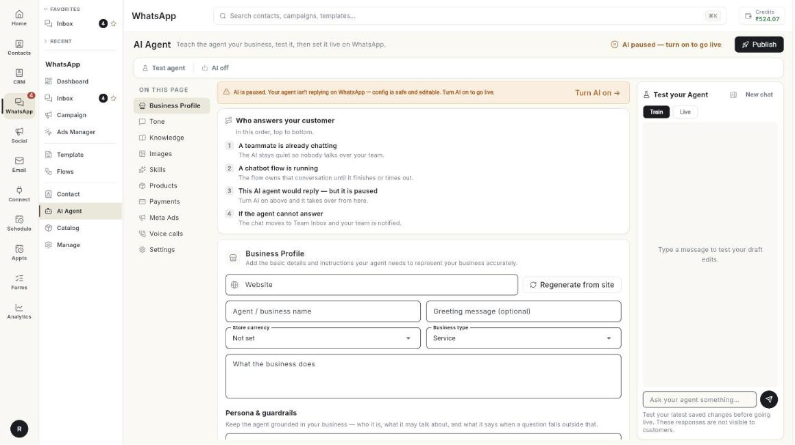

# AI Agent

The AI Agent answers customer questions on WhatsApp using what you teach it about your business. You can test it and publish it when you are ready.

**Where to find it:** open **WhatsApp** in the left rail, then select **AI Agent**.

## Guides

| Guide | Use it when |
| --- | --- |
| [Set up the AI agent](../set-up-ai-agent.md) | You are building and publishing your agent. |
| [Review and correct AI answers](../review-and-correct-ai-agent-answers.md) | You want to see why the agent answered a certain way and fix it. |

## Before you start

- Your WhatsApp number is connected to Ohanvi. See [Connect your WhatsApp number](../connect-whatsapp-number.md).
- Your role has access to this screen. If you do not see it, ask your admin.
