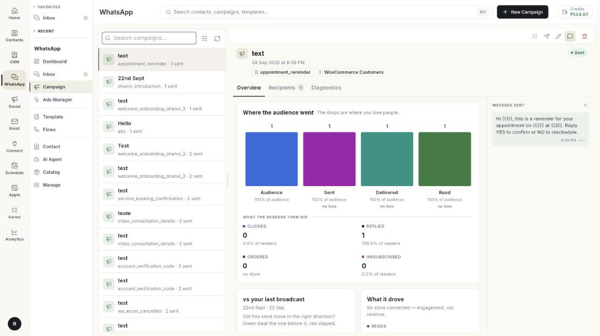

# Campaign

Campaigns send one approved template message to many people at once. You can send now, schedule for later, and see who got it.

**Where to find it:** open **WhatsApp** in the left rail, then select **Campaign**.

## Guides

| Guide | Use it when |
| --- | --- |
| [Send a broadcast campaign](../send-broadcast-campaign.md) | You want to message a group of contacts. |
| [Read a campaign report](../read-campaign-report.md) | You want to see delivered, read and failed messages. |

## Before you start

- Your WhatsApp number is connected to Ohanvi. See [Connect your WhatsApp number](../connect-whatsapp-number.md).
- Your role has access to this screen. If you do not see it, ask your admin.
