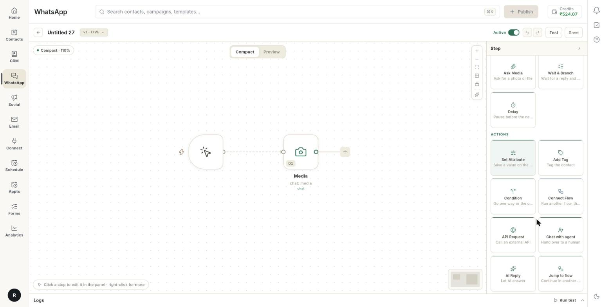

# Add action blocks to a chatbot flow

Add blocks that do something in the background of a chat: save a value on the contact, tag them, call an API, pass the chat to an agent, let AI reply, move to another flow, or end the conversation. Each block takes about 2 minutes.

## Before you start

- You have a chatbot flow open on the canvas. See [Create a WhatsApp chatbot flow](../create-whatsapp-flow.md).
- For **Jump to flow** and **Connect Flow**, at least 1 other flow exists in **WhatsApp** → **Flows**.
- For **Chat with agent**, your team members are added. See [Add WhatsApp agents](add-whatsapp-agents.md).

## What each block does

| Block | What happens in the chat |
| --- | --- |
| **Set Attribute** | Saves a value on the contact. |
| **Add Tag** | Tags the contact. |
| **Condition** | Sends the chat to a **True** or **False** exit. See [Ask for name, phone, email and address, then wait or branch](chatbot-ask-details-blocks.md). |
| **Connect Flow** | Runs another flow, then comes back. |
| **API Request** | Calls an external API and keeps the reply. |
| **Chat with agent** | Hands the chat over to a human. |
| **AI Reply** | Lets AI write the reply. |
| **Jump to flow** | Moves the conversation to another flow. It does not come back. |
| **End** | Ends the conversation. |

## Steps

### Open the Actions blocks

1. Open **WhatsApp** → **Flows**, then open your flow.
2. Click the **+** after the block where the action should run. The **Add a step after** menu opens.
3. Click **All steps**.
4. Find the **Actions** group. It holds all the blocks on this page.

    

5. Click the block you want. Its settings open in the right panel.

### Save a value on the contact

1. Add a **Set Attribute** block.
2. In **Question**, type the text the block uses. The box shows `Type your question...`.
3. Under **Save the answer as**, click **Choose…** and pick a name: **name**, **contact_number**, **email**, **address**, **city**, **interests** or **goal**.
4. To use your own name, choose **Custom…**, type a name such as `company_name`, and click **Use**. Use it in a message as `{{company_name}}`.
5. Under **The answer should be**, pick the type of value: **Short text**, **Long text**, **Number**, **Email**, **Phone number**, **Date**, **Time**, **One choice**, **Several choices**, **Yes or no**, **A file**, **A location**, **A rating** or **An NPS score**.

!!! note "Set Attribute and Ask Question"
    [VERIFY: Set Attribute uses the same Question, Save the answer as and The answer should be fields as Ask Question.] See [Create a WhatsApp chatbot flow](../create-whatsapp-flow.md) for how a saved answer appears in a message.

### Tag the contact

1. Add an **Add Tag** block.
2. In **Tag**, type the tag name. The box shows `tag name`.
3. Check the tag in **WhatsApp** → **Manage** → **Tags**. See [Manage tags, user attributes and custom events](tags-attributes-and-events.md).

### Run another flow and come back

1. Add a **Connect Flow** block. The description reads **Run another flow, then come back**.
2. In **Step name**, type what the step is for. This is optional.
3. Under **Which flow**, open **Runs** and choose the flow.
4. If the list is empty, the panel reads **No other flows to run yet.** Create another flow first.

The other flow runs to its end before this one continues.

### Call an external API

1. Add an **API Request** block.
2. Next to **Method**, click the value to cycle through **GET**, **POST**, **PUT**, **PATCH** and **DELETE**. The default is **GET**.
3. In **URL**, type the address, for example `https://api.example.com/orders/{{orderId}}`.
4. In **Headers (JSON)**, type any headers, for example `{ "Authorization": "Bearer …" }`.
5. In **Body (JSON)**, type the data you send, for example `{ "phone": "{{phone}}" }`.
6. Under **Save the answer as**, choose the name that stores the reply, as in "Save a value on the contact".

Use a saved answer in the URL, headers or body with double curly braces, in small letters.

!!! warning "The API is called for every customer"
    The block calls the address each time a customer reaches it. Test with your own number first.

### Hand the chat to an agent

1. Add a **Chat with agent** block. On the canvas the card reads **Handoff**.
2. Read the note in the panel: **Handoff to agent**. The block has no fields.
3. Place it after the message that tells the customer a person will reply, for example `Connecting you to our team.`

The conversation moves to **Requesting** in **WhatsApp** → **Inbox**, where an agent takes it. See [Use the WhatsApp inbox](use-whatsapp-inbox.md).

### Let AI reply

1. Add an **AI Reply** block.
2. Read the note: **The AI writes this reply**. The wording varies per customer. Test before publishing.
3. In **Guidance for the AI (optional)**, tell the AI what to answer, for example `Answer questions about our return policy in one short paragraph.`
4. In **Model (optional)**, type a model name. Leave it empty to use the default.

### Continue in another flow

1. Add a **Jump to flow** block.
2. Next to **Continue in**, click **Choose a flow**. The **Jump to which flow** list opens.
3. Pick the flow. The button now shows its name.
4. If the list reads **No other flows to jump to yet.**, create another flow first.

The conversation moves there and does not return. To come back afterwards, use **Connect Flow** instead.

| Need | Use |
| --- | --- |
| Run another flow, then carry on here | **Connect Flow** |
| Move to another flow and stay there | **Jump to flow** |

### End the conversation

1. Add an **End** block as the last block of a path. On the canvas the card reads **End conversation**.
2. Read the note: **Ends the conversation**. The bot stops here and the session closes.

### Save and publish

1. Click **Save**. The chip reads **DRAFT**.
2. Open the **Test** tab and click **Check** for your keyword.
3. Click **Publish**.
4. From your test phone, send the keyword and follow the path. Check the contact for the new tag or value.

## Video walkthrough

[VIDEO]

## Troubleshooting

| Issue | Cause | Fix |
| --- | --- | --- |
| **No other flows to jump to yet.** | Your workspace has only this flow. | Create and save a second flow, then reopen **Jump to flow**. |
| **No other flows to run yet.** | Your workspace has only this flow. | Create a second flow, then reopen **Connect Flow**. |
| **Could not publish — the step that needs fixing is marked on the canvas** | A block is incomplete, for example no tag name. | Open the marked card, fill in the missing field, save and publish. |
| The AI answers differently each time | **AI Reply** writes new wording for each customer. | Add clear **Guidance for the AI (optional)**, and test several times before you publish. |
| The bot does not continue after **Chat with agent** | The chat is now with an agent. The flow stops there. | Reply from **WhatsApp** → **Inbox**. |
| The API reply is not used in a later message | The reply is not saved under the name the message uses. | Check **Save the answer as** and use the same name in small letters, for example `{{orderId}}`. |

## Related

- [Create a WhatsApp chatbot flow](../create-whatsapp-flow.md)
- [Understand the flow builder](understand-the-flow-builder.md)
- [Look up orders and bookings in a chatbot](chatbot-store-action-blocks.md)
- [Add integration and advanced steps to a flow](chatbot-integration-and-advanced-steps.md)
- [Add WhatsApp agents](add-whatsapp-agents.md)
- [Use the WhatsApp inbox](use-whatsapp-inbox.md)
- [Test a flow and fix failed runs](../flows/test-and-monitor-flows.md)
