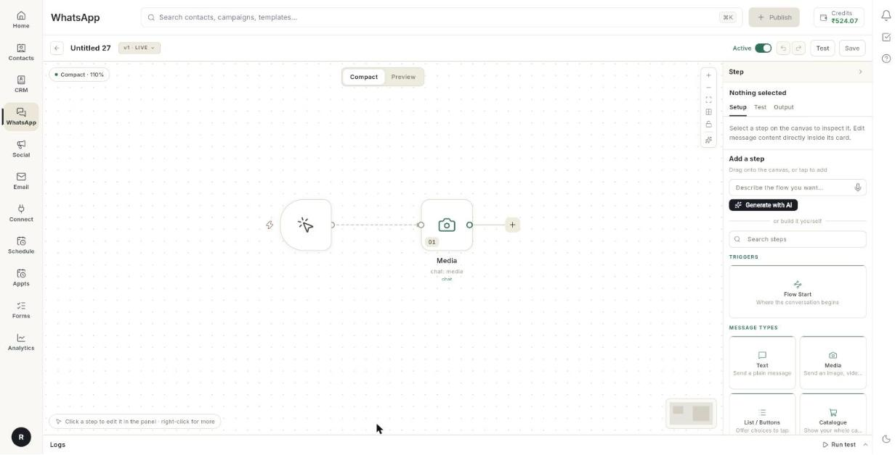
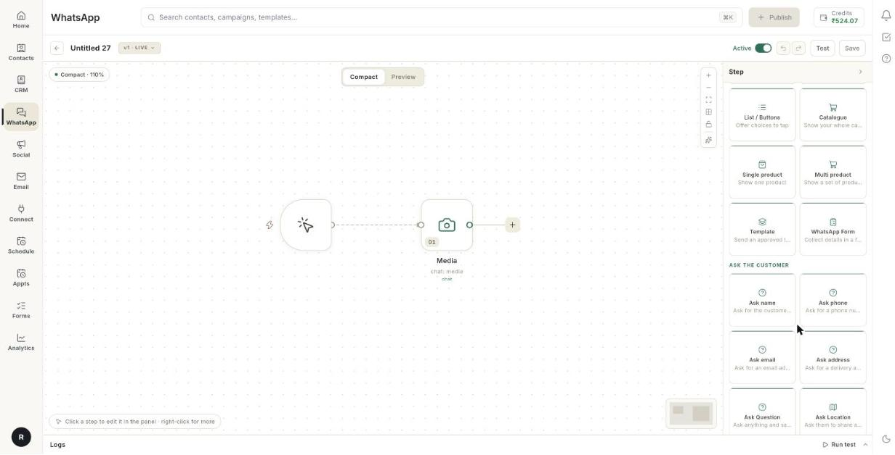

# Add media, catalogue, product, template and form blocks to a chatbot

Add message blocks to a chatbot flow beyond plain text. At the end, your bot can send a file, your catalogue, one product, a group of products, an approved template or a form that opens inside WhatsApp.

## Before you start

- You have a chatbot flow open in the builder. See [Create a WhatsApp chatbot flow](../create-whatsapp-flow.md).
- For **Catalogue**, **Single product** and **Multi product**, a product catalogue is connected to your number. See [Set up your WhatsApp catalog](set-up-whatsapp-catalog.md).
- For **Template**, you have at least 1 template with the status **Approved**. See [Create a WhatsApp message template](create-message-template.md).
- For **WhatsApp Form**, you have a published form.

## How message blocks work

A flow card holds one or more blocks. Each block is one message the bot sends. Every block below sits in the **Message types** group of the step list.

| Block | What the customer gets |
| --- | --- |
| **Text** | A plain message, with up to 3 reply buttons. See [Create a WhatsApp chatbot flow](../create-whatsapp-flow.md). |
| **List / Buttons** | A message with choices to tap. See [Create a WhatsApp chatbot flow](../create-whatsapp-flow.md). |
| **Media** | An image, video, document or audio file, with a caption and up to 3 buttons. |
| **Catalogue** | Your whole catalogue. |
| **Single product** | One product from your catalogue. |
| **Multi product** | A set of products, grouped in sections. |
| **Template** | An approved template. |
| **WhatsApp Form** | A form the customer fills in without leaving the chat. |

## Steps

### Add a block to a card

1. Open your flow in the builder.

    

2. Click **+** next to a step, or click **+ Add Content** at the bottom of a card.
3. Choose **All steps**.
4. Under **Message types**, choose the block you want.

    

5. Click the block in the card to open its fields in the right panel.

!!! note "Keywords on message blocks"
    Most message blocks start with a **Type, press enter to add AI keyword** field. Type a word and press **Enter** to add it. [VERIFY: what AI keywords change in the flow]

### Send media

1. Add a **Media** block.
2. Under **Select media type**, click the row to switch between **IMAGE**, **VIDEO**, **DOCUMENT** and **AUDIO**.
3. In the upload box, browse for a file, or paste one. On the web, press **Ctrl+V** to paste.
4. Wait for the preview to appear. Ohanvi stores the file for you.
5. Type a **Caption...**. It can hold up to 1,024 characters.
6. Optional: click **+ Add Button** and type a label for each reply button.
7. Optional: set **Set Delay** and **Set Timeout**. See [Delay and timeout](#set-a-delay-and-a-timeout).

Button limits:

- Up to 3 buttons on a **Media** block.
- Button labels up to 20 characters.
- The **+ Add Button** row disappears at 3 buttons.

!!! tip "Why the file is stored"
    The builder keeps its own copy of your file. A conversation that reaches this step days later still sends it.

### Send your whole catalogue

1. Add a **Catalogue** block.
2. Type a **Body**. It can hold up to 1,024 characters.
3. Optional: type a **Footer**, up to 60 characters.

### Send one product

1. Add a **Single product** block.
2. Click **+ Add Product**. The **Choose a product** list opens.
3. Pick a product from the list.
4. Type a **Body**, up to 1,024 characters.
5. Optional: type a **Footer**, up to 60 characters.

If the list says **No product catalogue is connected.**, connect a catalogue first.

### Send a group of products

1. Add a **Multi product** block.
2. Type a **Header**. It can hold up to 20 characters.
3. Type a **Body**. It can hold up to 1,024 characters.
4. Optional: type a **Footer**, up to 60 characters.
5. Click **+ Add Section** to add a group of products. [VERIFY: how products are chosen inside each section]
6. The card shows a **View Items** button. WhatsApp fixes its wording, so you cannot rename it.

A multi-product message can hold up to 10 items.

### Send an approved template

1. Add a **Template** block.
2. Click **Select Template**. The **Choose a template** list opens.
3. Pick a template. Only approved templates appear.
4. If the template has a picture, video or document header, find **Header media, shown by Meta**.
5. Click the row to choose the header type. The default is **Image**.
6. Upload a file for the header.

To remove things from the block:

- Click the bin icon on the template name to remove the template. If a header file is attached, the tooltip reads **Remove template and its media**.
- Click the cross beside **Header media, shown by Meta** to remove only the file. The tooltip reads **Remove media only, keep the template**.
- Click the template name to swap it for another one.

If the list says **No approved templates yet.**, create and submit a template first.

### Send a WhatsApp form

1. Add a **WhatsApp Form** block.
2. Under **Message above the form**, type the message, for example `Please fill in your details`.
3. Under **Form**, click **Choose a form** and pick a published form.
4. Under **Button label**, type the words on the button that opens the form, for example `Open form`.
5. Under **Save answers as**, type a name for the saved answers, for example `form`.

If the list says **No forms published yet.**, publish a form first.

### Set a delay and a timeout

Some blocks hold timing settings at the bottom of the card.

1. Find the grey timing area under the block.
2. For **Set Delay**, type the seconds to wait in **Type delay in seconds...**. Only **Media**, **Text** and **AI reply** blocks have a delay.
3. For **Set Timeout**, switch it on, then type minutes in **Timeout after (minutes)**.
4. A new **Timed out** exit appears on the card. Wire it to the step that runs when the customer does not reply.

Timeout is available on **Media** and **WhatsApp Form** blocks, and on list and ask blocks. A message that only informs has no delay.

## Troubleshooting

| Issue | Cause | Fix |
| --- | --- | --- |
| The character count under a field turns red. | The text is longer than the limit for that field. | Shorten the text. WhatsApp refuses an over-long body instead of cutting it. |
| **+ Add Button** is missing. | The block already has 3 buttons. | Remove a button, or use a **List / Buttons** block for more choices. |
| **No approved templates yet.** | No template has the status **Approved**. | Create a template and wait for Meta to approve it. |
| **No product catalogue is connected.** | Your number has no catalogue. | Connect or sync a catalogue. |
| **No forms published yet.** | The form list is empty. | Publish a form, then reopen the block. |
| A media step sends nothing days later. | The file was not uploaded through the builder. | Upload the file again in the upload box. |

## Related

- [Create a WhatsApp chatbot flow](../create-whatsapp-flow.md)
- [Understand the flow builder](understand-the-flow-builder.md)
- [Send text and list messages in a chatbot](chatbot-text-and-list-blocks.md)
- [Ask for a location, a file or a reply](chatbot-ask-and-wait-blocks.md)
- [Test a flow with the chat simulator](test-a-flow-with-the-chat-simulator.md)
- [Set up your WhatsApp catalog](set-up-whatsapp-catalog.md)
- [Create a WhatsApp message template](create-message-template.md)
