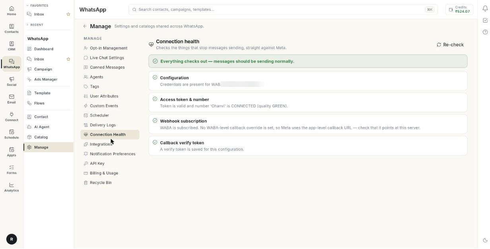

# Check connection health

Connection Health tests your WhatsApp connection straight against Meta. At the end, you know whether messages can go out and come in, and you have a clear fix for anything that failed. A check takes a few seconds.

## Before you start

- You can open **Manage** in the **WhatsApp** panel. If not, ask your admin.
- You added a WhatsApp number to Ohanvi. See [Connect your WhatsApp number](connect-whatsapp-number.md).

## What the four checks mean

| Check | What it tests | What a failure usually means |
| --- | --- | --- |
| **Configuration** | That your WhatsApp setup has an access token, a WABA ID and a Phone Number ID. | A field is empty, or no configuration exists yet. |
| **Access token & number** | That Meta accepts your token and that the number is **CONNECTED**. It also reads the number's quality. | The token expired or was revoked, the Phone Number ID is wrong, or the number is restricted. |
| **Webhook subscription** | That your WhatsApp Business Account is subscribed to an app, and that the **messages** field is on. | Customers' replies do not reach Ohanvi. |
| **Callback verify token** | That a webhook verify token is saved. | Meta cannot confirm your webhook. |

!!! note "Quality rating"
    Meta limits or blocks sending when a number's quality reaches **RED**. If the check warns about quality, send fewer messages and soften your wording.

## Steps

### Run the health check

1. Open **WhatsApp** in the left rail, then select **Manage**.
2. Select **Connection Health**. The page title reads **Connection health**, and it starts a check.

    

3. Read the line at the top. **Everything checks out — messages should be sending normally.** means all is well.
4. Read each of the four checks. A failed check shows what went wrong and how to fix it.

### Fix a failed check

1. Find the failed check in the list.
2. Read its detail line and its fix line.
3. Make the change. The next sections explain the usual fixes.
4. Click **Re-check**. The page runs all four checks again.

Usual fixes:

- **Configuration:** open **Settings** → **WhatsApp** → **Configuration**. Fill in the missing token or ID, then save. See [Connect your WhatsApp number](connect-whatsapp-number.md).
- **Access token & number:** paste a new permanent access token, and check the Phone Number ID.
- **Webhook subscription:** reconnect the webhook. See [Webhooks and integrations](whatsapp-webhooks-and-integrations.md).
- **Callback verify token:** save the same verify token here that you entered in your Meta app.

### Run the check again

1. Click **Re-check** at any time.
2. If the check could not run, click **Retry**.

## Troubleshooting

| Issue | Cause | Fix |
| --- | --- | --- |
| **No WhatsApp configuration found for this organisation.** | No number is added yet. | Add your Cloud API credentials in **Settings** → **WhatsApp** → **Configuration**. |
| **Could not run the health check.** | Ohanvi could not reach the service. | Click **Retry**. |
| **The health check did not return a result.** | The check returned nothing. | Click **Re-check**. |
| Meta rejected the request | The access token has expired or was revoked. | Create a new permanent token and save it in **Configuration**. |
| This WABA is not subscribed to any app | Meta does not send incoming messages to Ohanvi. | Subscribe the account again. See [Webhooks and integrations](whatsapp-webhooks-and-integrations.md). |
| The **messages** field is missing | The webhook is subscribed, but not to messages. | Turn on the **messages** field in your Meta app. |

## Related

- [Check connection health, alerts and WhatsApp billing](health-notifications-and-billing.md)
- [Connect your WhatsApp number](connect-whatsapp-number.md)
- [Set notification preferences](set-notification-preferences.md)
- [Webhooks and integrations](whatsapp-webhooks-and-integrations.md)
