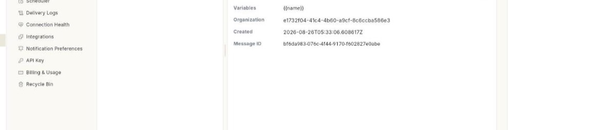
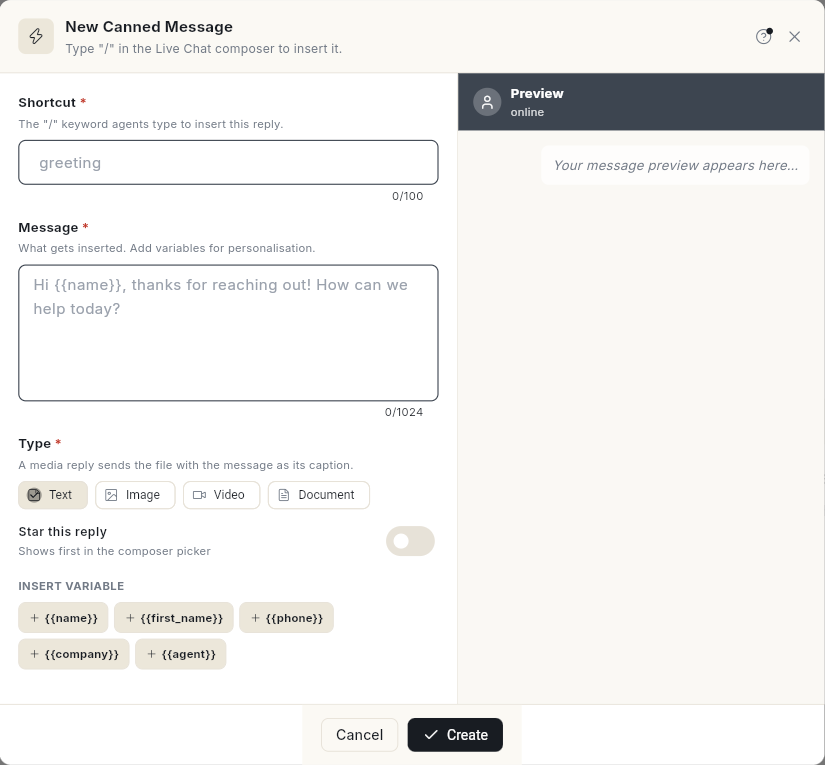

# Create canned messages

Save replies your team can insert in the inbox by typing **/** and a shortcut. At the end, your shortcut shows in the composer picker, with the message ready to send. Takes about 3 minutes.

## Before you start

- Your WhatsApp number is connected to Ohanvi. See [Connect your WhatsApp number](connect-whatsapp-number.md).
- You can see **Manage** in the **WhatsApp** panel. If not, ask your admin to give your role access. See [Roles and permissions](../settings/roles-and-permissions.md).
- Your role can create and edit canned messages. Without that, **New quick reply** is greyed out.
- For an image, video or document reply, you have the file ready.

## What a canned message is

A canned message is a saved reply. Your team inserts it into a chat with **/** and its shortcut. The app calls it a **quick reply** too.

Each canned message has a **Shortcut**, a **Message** and a **Type**. The type is **Text**, **Image**, **Video** or **Document**. A media reply sends the file with the message as its caption.

### Variables

A variable is a placeholder such as `{{name}}`. Insert one from the chips under **INSERT VARIABLE**. When you insert the reply in a chat, Ohanvi fills each variable with that customer's value.

| Variable | Fills in |
| --- | --- |
| `{{name}}` | The customer's name. |
| `{{first_name}}` | The customer's first name. |
| `{{phone}}` | The customer's phone number. |
| `{{company}}` | The customer's company. It is not filled in a chat yet, so it stays as typed. Replace it by hand. |
| `{{agent}}` | The name of the agent who sends the reply. |

## Steps

### Open Canned Messages

1. Open **WhatsApp** in the left rail, then select **Manage**.
2. Select **Canned Messages**. The list opens with the line **Saved quick-replies your team inserts with "/" in the Live Chat composer.**

    

3. Read the **Canned Messages** card. It counts your saved replies.

### Create a canned message

1. Click **New quick reply**. If the list is empty, click **New Canned Message** instead. The **New Canned Message** form opens.

    

2. In **Shortcut**, type the word your team will type after **/**, for example `greeting`. Leave out the slash.
3. In **Message**, type the reply, for example `Hi {{name}}, thanks for reaching out! How can we help today?`
4. To add a variable, put the cursor where it goes. Click a chip under **INSERT VARIABLE**, such as `{{name}}`.
5. Under **Type**, choose **Text**, **Image**, **Video** or **Document**.
6. For **Image**, **Video** or **Document**, go to **Attachment** and add the file. The file is uploaded for you.
7. Optional: turn on **Star this reply**. A starred reply shows first in the composer picker.
8. Check the **Preview**. It shows sample values, but the inbox does not fill them in.
9. Click **Create**. The reply appears in the list.

Both **Shortcut** and **Message** are required. A media type also needs its file.

### Read a canned message

1. Type in **Search shortcut or text…** to find a reply by its shortcut or its words.
2. Click the reply in the list. Its details open on the right.
3. Read the **Shortcut**, **Variables**, **Organization**, **Created** and **Message ID** rows.

If nothing is open, the panel reads **Select a canned message**. It adds **Pick a quick reply from the list to read it here.**

### Edit a canned message

1. Click the reply in the list.
2. Click **Edit**. The **Edit Canned Message** form opens.
3. Change the **Shortcut**, **Message**, **Type** or **Attachment**. Turn **Star this reply** on or off.
4. Click **Save Changes**.

### Copy a message or its shortcut

1. Click the reply in the list.
2. Click **Copy message text** to copy the message. The detail panel names this button **Copy message**.
3. Click **Copy shortcut** to copy the shortcut.

### Delete a canned message

1. Click the reply in the list.
2. Click **Delete**. The **Delete canned message?** window opens. It shows the shortcut.
3. Click **Delete**. The reply leaves the list.

Click **Cancel** to keep it.

### Use your custom attributes

Custom attributes you defined for contacts also appear as chips under **INSERT VARIABLE**. They insert as `{{attribute.Name}}`, for example `{{attribute.City}}`.

1. Open the canned message and click the chip of the attribute, for example `{{attribute.City}}`.
2. To set a fallback, type it after a bar: `{{attribute.City|there}}`. The fallback shows when the customer has no value.
3. Insert the reply in a chat. The attribute value from the contact's profile fills in. With no value and no fallback, the placeholder stays as typed.

### Insert a canned message in the inbox

1. Open **WhatsApp** → **Inbox**, then open a chat.
2. In the composer, type **/**. The **Canned messages** list opens.
3. Type part of the shortcut to narrow the list.
4. Filter by **All**, **Starred**, **Text**, **Image**, **Video** or **Doc**.
5. Click a reply. It is inserted into the composer.
6. Read the message, then send it. The variables show this customer's values. A variable with no value stays as typed, so replace it by hand.

For the 24-hour window and the rest of the composer, see [Use the WhatsApp inbox](use-whatsapp-inbox.md).

## Troubleshooting

| Issue | Cause | Fix |
| --- | --- | --- |
| **Shortcut is required** | The **Shortcut** box is empty. | Type a shortcut, then click **Create**. |
| **Message is required** | The **Message** box is empty. | Type the reply. |
| **A file link is required for this type** | You chose **Image**, **Video** or **Document** and added no file. | Add a file under **Attachment**, or choose **Text**. |
| **Unable to save canned message.** | The save did not go through. | Click **Create** or **Save Changes** again. |
| **New quick reply** is greyed out. | Your role cannot create canned messages. | Ask your admin. See [Roles and permissions](../settings/roles-and-permissions.md). |
| A shortcut does not show after you type **/**. | The filter hides it, or the shortcut is spelled differently. | Choose **All**, then type fewer letters of the shortcut. |

## Related

- [Use the WhatsApp inbox](use-whatsapp-inbox.md)
- [Set up your WhatsApp business profile](whatsapp-business-profile.md)
- [Send files and voice notes](send-files-and-voice-notes.md)
