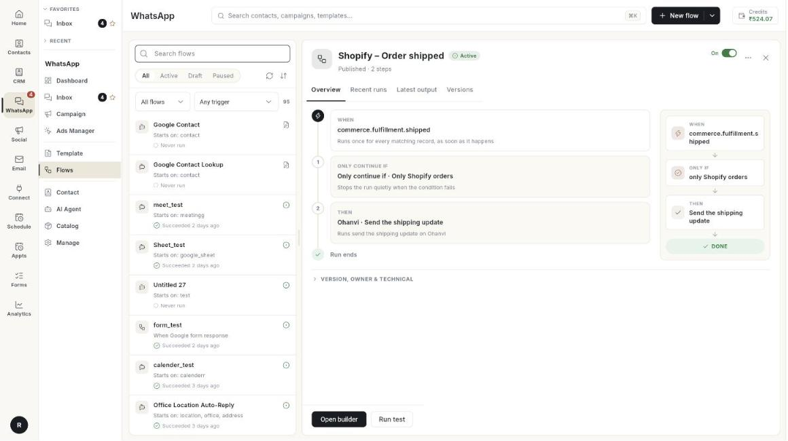

# Flows

Flows are automatic chats. A chatbot flow answers customers for you, asks questions, and hands over to a person when needed. These guides explain every block in the builder and what to fill in.

**Where to find it:** open **WhatsApp** in the left rail, then select **Flows**.

## Guides

| Guide | Use it when |
| --- | --- |
| [Understand the flow builder](../understand-the-flow-builder.md) | You are new to the builder and want a tour of every part and every block group. |
| [Create a chatbot flow](../../create-whatsapp-flow.md) | You are building your first chatbot. |
| [Flow Start and triggers](../chatbot-flow-start-and-triggers.md) | You want to choose how a flow begins. |
| [Text and List / Buttons blocks](../chatbot-text-and-list-blocks.md) | You want the bot to send text or let customers pick from choices. |
| [Media, product and form blocks](../chatbot-message-blocks.md) | You want the bot to send pictures, products, templates or forms. |
| [Ask name, phone, email, address, Delay and Condition](../chatbot-ask-details-blocks.md) | You want to collect details, pause, or branch on an answer. |
| [Ask Question, Location, Media and Wait & Branch](../chatbot-ask-and-wait-blocks.md) | You want the bot to ask for a location, a file or a reply. |
| [Action blocks](../chatbot-action-blocks.md) | You want the bot to tag a contact, call an API or hand over to an agent. |
| [Action step and Condition rules](../flow-action-and-condition-steps.md) | You want to run a ready-made action, call Zapier or Pabbly, or continue only if something is true. |
| [Store action blocks](../chatbot-store-action-blocks.md) | You want the bot to handle orders, returns and addresses. |
| [Google Workspace steps](../flow-google-workspace-steps.md) | You want to use Google Sheets, Calendar, Meet or Contacts. |
| [Integration and advanced steps](../chatbot-integration-and-advanced-steps.md) | You want to split tests, call a webhook or save to CRM. |
| [Test with the chat simulator](../test-a-flow-with-the-chat-simulator.md) | You want to try the flow before you publish it. |

## Before you start

- Your WhatsApp number is connected to Ohanvi. See [Connect your WhatsApp number](../connect-whatsapp-number.md).
- Your role has access to this screen. If you do not see it, ask your admin.
