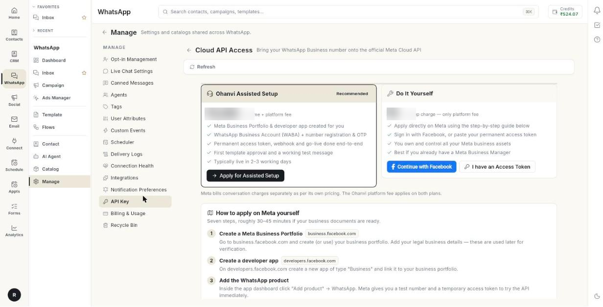

# Get Cloud API access

Cloud API Access helps you bring your WhatsApp Business number onto the official Meta Cloud API. At the end, your number is verified with Meta and saved as a configuration in Ohanvi. Assisted setup takes about 2–3 working days. Doing it yourself takes about 30–45 minutes if your documents are ready.

## Before you start

- You can open **Manage** in the **WhatsApp** panel. If not, ask your admin.
- You have a WhatsApp Business number you want to use.
- For the self-setup route, you have your business documents ready for Meta verification.

## Choose a route

| Route | Best for | What happens |
| --- | --- | --- |
| **Ohanvi Assisted Setup** (marked **Recommended**) | Businesses with no Meta setup yet | The Ohanvi team creates your Meta Business Portfolio and developer app, registers your number, sets up the access token and webhook, and gets your first template approved. |
| **Do It Yourself** | Businesses that already use Meta Business Manager | You apply on Meta yourself and own all your Meta business assets. |

!!! note "Meta bills conversations separately"
    Meta charges for conversations on its own pricing. The Ohanvi platform fee applies on both routes.

## Steps

### Open Cloud API Access

1. Open **WhatsApp** in the left rail, then select **Manage**.
2. Select **API Key**. The **Cloud API Access** page opens.

    

3. Read the banner at the top, if there is one:
    - **Cloud API connected** means an active configuration is already linked. You can still add more numbers.
    - **Assisted setup request under review** means the Ohanvi team received your request and will contact you.

### Apply for assisted setup

1. On the **Ohanvi Assisted Setup** card, click **Apply for Assisted Setup**. The **Apply for Assisted Setup** window opens.
2. Type your **Contact name \***.
3. Type your **Contact phone \***.
4. Optional: type your **Contact email**.
5. Optional: type your **Business name** and **Business website**.
6. Type the **WhatsApp number to register (with country code)**.
7. Optional: write anything the team should know in **Anything else we should know?**
8. Click **Submit Request**. The message **Request submitted — our team will contact you shortly.** appears.

The card then reads **Request pending — our team will reach out**.

### Set up Meta yourself

1. On the **Do It Yourself** card, click **Continue with Facebook** and follow the Meta windows. Or click **I have an Access Token** if you already have a permanent token.
2. Scroll to **How to apply on Meta yourself**. It has seven steps.
3. Follow each step in order:
    1. **Create a Meta Business Portfolio** at business.facebook.com.
    2. **Create a developer app** of type Business at developers.facebook.com.
    3. **Add the WhatsApp product** in the app dashboard.
    4. **Add & verify your phone number** under WhatsApp → API Setup.
    5. **Generate a permanent access token** with a System User in Business Settings.
    6. **Copy your IDs**: the Phone Number ID and the WABA ID.
    7. **Complete business verification & go live**, then switch the app to Live mode.

### Verify your credentials and save them

1. Scroll to **Verify & connect with your credentials**.
2. Paste the token in **Permanent access token \***.
3. Paste your **WABA ID \***.
4. Paste your **Phone Number ID**.
5. Keep or change the **API version**.
6. Keep or change the **Configuration name**.
7. Click **Verify with Meta**. The message **Credentials verified with Meta.** appears, with your business name and number.

8. Click **Save as Configuration**. The message **Configuration saved. Activate it from WhatsApp → Configuration.** appears.

!!! warning "Activate the number after saving"
    A saved configuration is not in use yet. Open **Settings** → **WhatsApp** → **Configuration** and click **Switch to this**. See [Connect your WhatsApp number](connect-whatsapp-number.md).

### Check your onboarding requests

1. Scroll to **My onboarding requests**.
2. Read each row. It says **Assisted setup** or **Self setup**, and the date it was raised.

## Troubleshooting

| Issue | Cause | Fix |
| --- | --- | --- |
| **Contact name and phone are required.** | One of the two required boxes is empty. | Fill in **Contact name \*** and **Contact phone \***. |
| **Could not submit the request. Please try again.** | The request did not reach Ohanvi. | Click **Submit Request** again. |
| **Verification failed** | Meta rejected the token or the IDs. | Check the token, the WABA ID and the Phone Number ID. Then click **Verify with Meta** again. |
| **Could not save the configuration. Please check the details.** | A field is wrong or empty. | Check every field and click **Save as Configuration** again. |
| Messages still do not send after saving | The new configuration is not active. | Click **Switch to this** in **Configuration**. |

## Related

- [Connect your WhatsApp number](connect-whatsapp-number.md)
- [Check connection health](check-connection-health.md)
- [Edit a WhatsApp configuration](whatsapp-configuration-settings.md)
- [Webhooks and integrations](whatsapp-webhooks-and-integrations.md)
