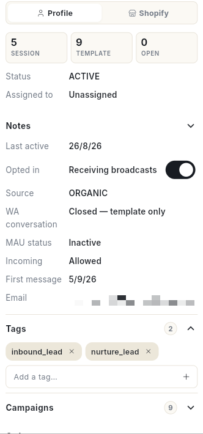

# Handle store orders in the inbox

Find shoppers by order status in the **Orders** tab, then fix their order from the chat without opening your store admin. At the end, you can send order details, mark an order shipped, correct tracking, send a discount code or credit, and cancel, refund or return an order.

## Before you start

- Your WhatsApp number is connected, and your Shopify or WooCommerce store is connected under **Integrations → Stores**. [VERIFY: menu path] The **Orders** tab and the store pane show only when a store is connected.
- You can see **Inbox** in the **WhatsApp** panel. See [Use the WhatsApp inbox](use-whatsapp-inbox.md).
- To mark an order shipped, send a discount code or add store credit, you are an admin or a manager.
- Most order changes need a Shopify connection that allows writing. If a button is greyed out, see [Reconnect a store that is missing permissions](#reconnect-a-store-that-is-missing-permissions).

## What the two places do

| Place | What it is for |
| --- | --- |
| **Orders** tab in the chat list | Lists chats with store activity, so you can find who is owed a reply or has a delivery problem. |
| **Store** pane in the chat | Shows one shopper's orders, cart and history, with buttons to change an order. The pane carries your store's name, for example **Shopify** or **WooCommerce**. |

## Steps

### Find shoppers with the Orders tab

1. Open **WhatsApp** in the left rail, then select **Inbox**.
2. Click the **Orders** tab above the chat list.
3. Click a chip under the tabs to narrow the list:

    | Chip | What it shows |
    | --- | --- |
    | **All** | Every chat with store activity. |
    | **Awaiting reply** | Shoppers who wrote and are still owed a reply. |
    | **Confirmed** | Chats whose latest store event is an order placed. |
    | **Shipped** | Chats whose latest store event is a shipment. |
    | **Abandoned cart** | Chats whose latest store event is an abandoned checkout. |
    | **Cancelled** | Chats whose latest store event is a cancelled order. |
    | **Delivery issue** | Chats with a delivery attempt that failed. |

4. Click a chat. The chip on the row shows the latest store event, for example **Confirmed**, **Out for delivery**, **Delivery failed**, **Refunded** or **Cart abandoned**.

The chips scroll sideways when the list is narrow.

### Open the Store pane

1. Open a chat with a shopper. The profile panel opens on the right.
2. At the top of the panel, click your store's name, for example **Shopify**. The other choice is **Profile**.

    

3. Read the line at the top of the pane. It shows **Live from** your store with **Read from … just now**, or **From last sync** with **Showing our last synced copy of the store**.
4. Click **Refresh from** your store to read the store again.
5. Click **Open** your store **admin** to open the store in a new tab.

The pane lists **Open orders**, an **Abandoned cart** if there is one, **Products & stock**, and **Order history**. If the shopper is not a customer yet, it reads **Not found as a customer in the store — no order under this number or email yet.**

### Read the customer summary

1. At the top of the pane, read the figures **orders**, **lifetime** and **last 7 days**.
2. Read **Customer since** and the customer's tags.
3. If the shopper has store credit, read the **Credit** chip. It applies at checkout.
4. Click **Open customer ↗** to open the customer in the store.

### Send order details or tracking

1. Under **Open orders**, find the order card. It shows the order number, date, items, total and shipment status.
2. Click **Send details** to put the items, total and status into the chat. The message **Order details sent to the chat.** appears.
3. Click **Send tracking** to send the tracking number and link. With no tracking yet, it sends the current status. The message **Tracking sent to the chat.** appears.
4. For an unpaid order, click **Send payment link**. The message **Payment link sent — COD can become prepaid.** appears.
5. To let the shopper buy the same items again, click **Reorder link**. It sends a store checkout with the same items. The message **Reorder link sent — same items, they pay at checkout.** appears.
6. Click **Track ↗** on an order to open the carrier's tracking page.
7. Click **Run flow** to start a chatbot flow for this order, such as a COD confirmation, an address check or a review request.

If **Send details** is greyed out, it reads **Needs a live store read — press Refresh**. Click **Refresh from** your store first.

### Mark an order shipped

1. On the order card, click **Mark shipped**. The window **Mark … shipped** opens.
2. Type the **Tracking number (AWB)**.
3. Type the **Carrier**, for example Delhivery, Blue Dart or DTDC.
4. Optional: type a **Tracking link (optional)**.
5. Choose whether to tick **Also send Shopify's shipping email**.
6. Click **Mark shipped**.

Every open line ships as one fulfilment. The shopper gets the WhatsApp shipping update automatically.

### Correct the tracking on a shipped order

1. On the order card, click **Update tracking**. If the order has more than one shipment, pick one under **Which shipment?**.
2. Change the **Tracking number (AWB)**, **Carrier** or **Tracking link (optional)**.
3. Click **Update**. The message **Tracking updated.** appears.

The new tracking replaces the old one on that shipment in the store. If you leave all three fields empty, the message **Enter a tracking number, carrier or link.** appears.

### Change the delivery address

1. On the order card, click **Edit address**. The window **Delivery address** opens.
2. Edit the fields: **First name**, **Last name**, **Address line 1**, **Address line 2**, **City**, **State / province**, **PIN / ZIP**, **Country** and **Phone**. Fields marked * are required.
3. Click **Save address**. The message **Address updated in the store.** appears.

!!! warning "Not after the order ships"
    The store refuses an address change once the order has shipped.

### Add a note to an order

1. On the order card, click **Note**. The window **Order note** opens.
2. Type the note. The hint says it is seen by your team in the store admin, not by the customer.
3. Click **Save note**. The message **Note saved on the order.** appears.

### Send a discount code

1. At the top of the pane, click the tag icon. Its tooltip is **Send a discount code**.
2. Pick **%** or **₹** for the type of discount.
3. Type the **Percent off** or **Amount off**.
4. Type **Valid for (days)**.
5. Type a **Reason (goes in the message)**, for example `Late delivery`.
6. Click **Create & send**. The message **Discount code sent.** appears.

The code is single use. It is locked to this customer when the store knows them.

### Add store credit

1. At the top of the pane, click the wallet icon. Its tooltip is **Add store credit**.
2. Type the **Amount**, with your currency in brackets.
3. Optional: type **Expires in (days, blank = never)**.
4. Type a **Reason (goes in the message)**, for example `Damaged item`.
5. Click **Add & send**. The message **Store credit added and sent.** appears.

The credit applies automatically at checkout on the next order. Nothing goes back to the payment method. The wallet icon shows only when the store knows the shopper as a customer.

### Send a free replacement

1. On the order card, click **Free replacement**. The window **Send a free replacement of …?** opens.
2. Read the note. It creates a new paid order of the same items at 100% off, to the same address, so the warehouse ships it.
3. Click **Create replacement**. The message **Replacement created and sent.** appears.

The shopper gets the new order number in the chat.

### Open a return

1. On the order card, click **Open return**. The window **Open a return for …** opens.
2. Pick a **Reason**: **Too small**, **Too large**, **Wrong item sent**, **Damaged / defective**, **Not as described**, **Colour**, **Style**, **Changed mind** or **Other**.
3. Optional: type a **Note (optional)**.
4. Click **Open return**. The message **Return opened in the store.** appears.

Every shipped item on the order is included. Shopify tracks the return. **Open return** is greyed out until something has shipped.

### Refund an order

1. On the order card, click **Refund**. The window **Refund … in full?** opens.
2. Read the note. Every refundable item plus shipping goes back to the original payment method.
3. Optional: type a **Reason (optional)**.
4. Click **Refund**. The message **… refunded.** appears.

Do a partial refund in the store admin.

### Cancel an order

1. On the order card, click **Cancel**. The window **Cancel …?** opens.
2. Read the note. The store cancels, restocks and refunds the order as it would from the admin. It then tells the shopper on WhatsApp through the order-update message.
3. Click **Cancel order**. The message **… cancelled.** appears. To back out, close the window. [VERIFY: label of the back-out button]

!!! warning "Cancelling refunds the shopper"
    The shopper is refunded and told on WhatsApp. This cannot be undone from the inbox.

### Work with an abandoned cart

1. Under **Abandoned cart**, read **Left** with the date, the first items and the total.
2. Click **Copy recovery link**. The message **Recovery link copied.** appears.
3. Paste the link into the chat.

### Search products and send one

1. Under **Products & stock**, type in **Search the catalogue — name, SKU…**.
2. Click **Search**. Each result shows the price and the stock for each variant.
3. Click **Send product** to send it to the chat. The message **… sent to the chat.** appears.
4. Click **View** to open the product in the store.

If nothing matches, the pane reads **No product matches** with your search.

### Read the order history

1. Scroll to **Order history**.
2. Click **Show all** with the number, or **Show fewer**, to open or close the full list.

If nothing is synced, it reads **No orders synced for this contact yet.**

### Reconnect a store that is missing permissions

1. If a button is greyed out, read its tooltip. It reads **Needs Shopify to be reconnected**, followed by the permission name.
2. Read the banner at the top of the pane. It says the store was connected before some features existed.
3. Click **Reconnect now**. Shopify asks only for the new permissions.
4. Or click **Integrations → Stores ↗** to manage the store connection.

Write buttons stay greyed out on a copy of an order from the last sync. Click **Refresh from** your store to read it live.

## Troubleshooting

| Issue | Cause | Fix |
| --- | --- | --- |
| There is no **Orders** tab or store pane | No store is connected. | Connect a store under **Integrations → Stores**. |
| **Could not read the store.** | The store did not answer. | Click **Try again**. |
| **Live read failed** with an error | The store could not be reached. | The pane shows the last synced copy. Click **Refresh from** your store later. |
| A button is greyed out with **Needs Shopify to be reconnected** | The store connection lacks a permission. | Click **Reconnect now**. |
| **Mark shipped** is missing | The order is not open, or you are not an admin or a manager. | Check the order status. Ask an admin or a manager. |
| **Update tracking** is missing | The order has no shipment yet. | Click **Mark shipped** first. |
| **Open return** is greyed out and reads **Nothing has shipped yet** | No item has shipped. | Mark the order shipped first. |
| **Edit address** fails after shipping | The store refuses address changes after shipment. | Contact the carrier. |

## Related

- [Use the WhatsApp inbox](use-whatsapp-inbox.md)
- [Use the inbox Board and List views](inbox-board-and-list-views.md)
- [Read Store Analytics](../analytics/read-store-analytics.md)
- [Manage WhatsApp integrations](manage-whatsapp-integrations.md)
