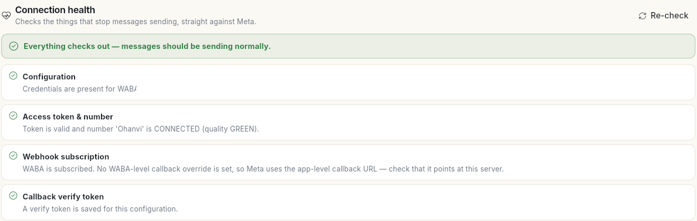
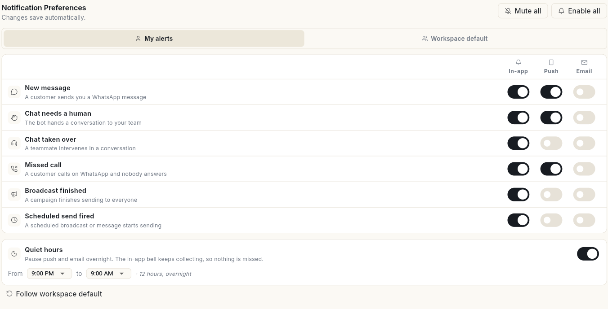
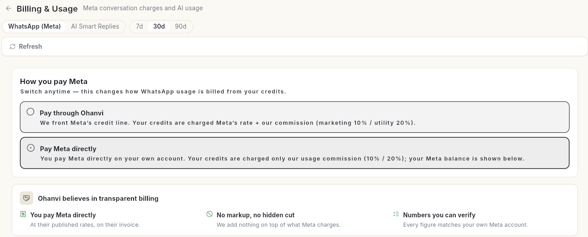

# Check connection health, alerts and WhatsApp billing

Three WhatsApp settings keep the account running: **Connection Health** checks that messages can go out, **Notification Preferences** decides which events alert you, and **Billing & Usage** shows how you pay Meta. At the end, you know your number is healthy, your alerts are set, and you know how WhatsApp usage is billed.

## Before you start

- Your role can open WhatsApp **Manage**. See [Manage team members, roles and permissions](../settings/roles-and-permissions.md).

## Steps

### Check connection health

1. Open **WhatsApp** in the left rail, select **Manage**, then **Connection Health**.
2. Read the result at the top. **Everything checks out — messages should be sending normally.** means all is well.
3. Read each check: **Configuration**, **Access token & number** (with your number's quality), **Webhook subscription** and **Callback verify token**.
4. After you fix something, click **Re-check**.

### Choose your WhatsApp alerts

1. In **Manage**, select **Notification Preferences**. Changes save automatically.
2. Keep **My alerts** selected to set your own alerts. **Workspace default** holds the defaults for the whole workspace.
3. For each event, switch **In-app**, **Push** and **Email** on or off:

    | Event | When it fires |
    | --- | --- |
    | **New message** | A customer sends you a WhatsApp message. |
    | **Chat needs a human** | The bot hands a conversation to your team. |
    | **Chat taken over** | A teammate intervenes in a conversation. |
    | **Missed call** | A customer calls on WhatsApp and nobody answers. |
    | **Broadcast finished** | A campaign finishes sending to everyone. |
    | **Scheduled send fired** | A scheduled broadcast or message starts sending. |

4. Optional: turn on **Quiet hours** and pick **From** and **to**, for example 9:00 PM to 9:00 AM. Push and email pause overnight; the in-app bell keeps collecting, so nothing is missed.
5. Use **Mute all** or **Enable all** to change every switch at once, or **Follow workspace default** to go back to the default.

For notifications from other parts of Ohanvi, see [Choose how notifications reach you](../settings/notification-preferences.md).

### See how you pay Meta

1. In **Manage**, select **Billing & Usage**.
2. Pick **WhatsApp (Meta)** or **AI Smart Replies**, and a period: **7d**, **30d** or **90d**.
3. Under **How you pay Meta**, check the option picked:
    - **Pay through Ohanvi**: Ohanvi fronts Meta's credit line. Your credits are charged Meta's rate plus Ohanvi's commission.
    - **Pay Meta directly**: you pay Meta on your own account. Your credits are charged only Ohanvi's usage commission.

    You can switch at any time. It changes how WhatsApp usage is billed from your credits.

4. Scroll down for **Billable messages** and the split **By category** and **By pricing type**.

For your Ohanvi credits and top-ups, see [Credits and billing](../credits-and-billing.md).

## Video walkthrough

[VIDEO]

## Related

- [Connect your WhatsApp number](connect-whatsapp-number.md)
- [Webhooks and integrations](whatsapp-webhooks-and-integrations.md)
- [Credits and billing](../credits-and-billing.md)
