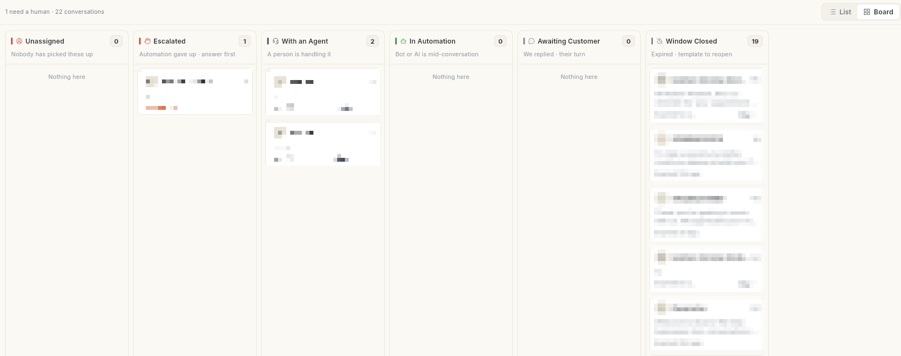

# Use the inbox Board and List views

Switch the WhatsApp inbox to a Board that sorts every chat into six lanes by what needs to happen next. At the end, you can see who needs a human, hand a chat to a teammate or the bot, and open an old chat from your history.

## Before you start

- Your WhatsApp number is connected. See [Connect your WhatsApp number](connect-whatsapp-number.md).
- You can see **Inbox** in the **WhatsApp** panel. See [Use the WhatsApp inbox](use-whatsapp-inbox.md).
- To hand a chat to a teammate, you are an admin or a manager. Executives see a read-only list in the handler menu.

## How the Board sorts chats

The Board shows the same chats as the **List**. It adds no new chats and keeps no settings of its own. Each chat sits in one lane.

| Lane | What the lane says | Which chats land here |
| --- | --- | --- |
| **Unassigned** | Nobody has picked these up | The customer wrote last and nobody owns the chat. |
| **Escalated** | Automation gave up · answer first | The bot handed the chat to a person and nobody has answered. |
| **With an Agent** | A person is handling it | An agent took the chat over, or it is assigned to someone. |
| **In Automation** | Bot or AI is mid-conversation | Nobody owns the chat and your side wrote last, inside the 24-hour window. |
| **Awaiting Customer** | We replied · their turn | [VERIFY: the lane is on the Board, but chats where you replied last appear under **In Automation**] |
| **Window Closed** | Expired · template to reopen | 24 hours passed since the customer's last message. Only a template can reopen it. |

A chat in **Window Closed** stays there, even when it is escalated or assigned. WhatsApp only allows templates after the window closes.

Each card shows a short note under the name:

- **Unassigned** and **Escalated**: **Waiting** with the time, or **Needs a human** or **Handed off**. Red once the wait passes 30 minutes in **Unassigned**, or 15 minutes in **Escalated**.
- **With an Agent**: **Unread reply**, or **Idle** with the time after 30 quiet minutes.
- **In Automation**: **Waiting** with the time after 30 quiet minutes.
- **Window Closed**: **Expired** with how long ago, or **No inbound message**.

## Steps

### Switch between List and Board

1. Open **WhatsApp** in the left rail, then select **Inbox**.
2. Click **Board** at the right edge of the strip above the chats. The six lanes open side by side.

    

3. Read the line **N need a human · N conversations** where the tabs were. **N need a human** counts **Unassigned** and **Escalated** only.
4. Click **List** at the same spot to go back to the tabs and the chat list.

The Board loads the chats of every tab at once, up to 500 chats. Scroll sideways to see all six lanes.

### Open a chat from the Board

1. Find the card in its lane. Each card shows the contact, an unread count and the note.
2. Click the card. The inbox switches to **List** with that chat open on the right.
3. Right-click a card to open the same menu as in the list: **Open conversation**, **Intervene**, **Resolve — back to bot**, **Mark as read** and **Assign to teammate**.

### Change who handles a chat from the Board

1. On the card, click the handler chip. It reads **You**, a teammate's name, **Bot** or **Assign**. Its tooltip is **Change who handles this chat**.
2. Under **AUTOMATION**, click **Bot** to give the chat back to the bot. This is the same as resolving the chat.
3. Under **TEAM**, click **You** or a teammate to assign the chat to that person.
4. To put the chat back in the queue, click **Unassign**. Its caption reads **Back to queue**.

The chat moves to its new lane after the change. If the change fails, an error message appears.

!!! note "No dragging"
    You cannot drag a card between lanes. Use the handler chip to move a chat.

### See more than 100 chats in a lane

1. Scroll to the bottom of a full lane. A lane shows at most 100 cards, the oldest and most urgent first.
2. Click **N more in list**. The inbox switches to **List**.
3. From **Escalated**, the list opens on the **Requesting** tab. From **Window Closed**, it opens on the **All** tab. The other lanes keep all chats in one list.

An empty lane reads **Nothing here**.

### Mark chats as read

1. In **List**, right-click an empty part of the chat list. The menu header shows the tab name and the unread count, for example **3 unread messages**.
2. Click **Mark all as read**. The unread badges clear.
3. To clear one chat, right-click it and click **Mark as read**.

**Mark all as read** is greyed out when nothing is unread.

### Open an old chat from Chat history

1. In the list header next to **Inbox**, click the history icon. Its tooltip is **Chat history**.
2. Pick a chat from the list. It shows the contact name and how long ago the last message was. The icon shows whether the customer or you wrote last.
3. The chat opens on the right.

The list holds your 15 most recent chats. While it loads it reads **Loading…**. If it is empty it reads **No conversations yet**. If it fails, click **Couldn't load — tap to retry**.

### Send a chat to your mobile

1. Open a chat. In the chat header, click the phone-forward icon. Its tooltip is **Call on Mobile**.
2. Wait for the message **Sent to your mobile app — open it to call**.
3. On your phone, open the notification **Call from WhatsApp**. It shows the contact name and number.
4. Tap **Call** to place a normal phone call. Tap **Dismiss** to close it.

The icon shows only when the contact has a phone number. You need the Ohanvi mobile app on your phone.

## Troubleshooting

| Issue | Cause | Fix |
| --- | --- | --- |
| Some lanes are empty on the Board | The chats of that kind are not loaded or do not exist. | Wait for the Board to finish loading. Lanes read **Nothing here** when empty. |
| A chat sits in **Window Closed** though it is assigned | The 24-hour window has passed. | Open the chat and click **Send Template**. See [Use the WhatsApp inbox](use-whatsapp-inbox.md). |
| The handler menu lists no teammates | Your role cannot assign chats. | Ask an admin or a manager. See [Add WhatsApp agents](add-whatsapp-agents.md). |
| **Could not send this contact to your mobile** | The mobile app is not reachable. | Open the Ohanvi mobile app on your phone, then try again. |
| **Mark all as read** is greyed out | Nothing is unread. | No action needed. |
| A lane shows only 100 chats | The Board caps each lane at 100. | Click **N more in list** to continue in the list. |

## Related

- [Use the WhatsApp inbox](use-whatsapp-inbox.md)
- [Handle store orders in the inbox](handle-orders-in-the-inbox.md)
- [Send files and voice notes](send-files-and-voice-notes.md)
- [Use WhatsApp Calling](whatsapp-calling.md)
