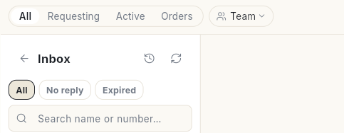

# Inbox

The Inbox is where your team chats with customers. You can reply, assign chats, move them on a board, handle store orders and make calls.

**Where to find it:** open **WhatsApp** in the left rail, then select **Inbox**.

## Guides

| Guide | Use it when |
| --- | --- |
| [Use the inbox](../use-whatsapp-inbox.md) | You reply to customers, assign chats or add notes. |
| [Use the Board and List views](../inbox-board-and-list-views.md) | You want to see all chats sorted into lanes. |
| [Handle store orders](../handle-orders-in-the-inbox.md) | A customer asks about an order and you want to act on it. |
| [Send files and voice notes](../send-files-and-voice-notes.md) | You want to send a photo, a file, a voice note or an AI-written reply. |
| [Use WhatsApp Calling](../whatsapp-calling.md) | You want to call customers or take their calls. |

## Before you start

- Your WhatsApp number is connected to Ohanvi. See [Connect your WhatsApp number](../connect-whatsapp-number.md).
- Your role has access to this screen. If you do not see it, ask your admin.
