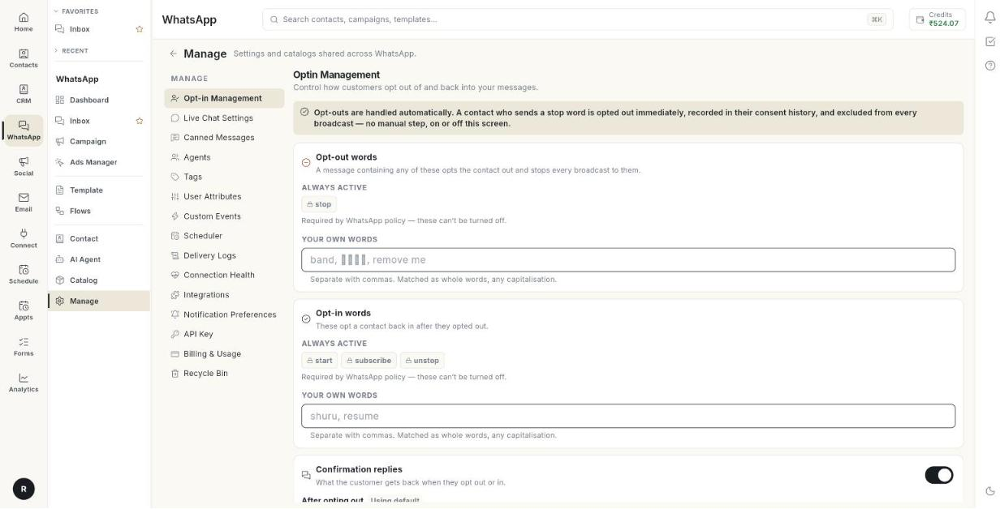

# Manage opt-in and opt-out words

Opt-in Management decides which words stop your messages and which words start them again. At the end, customers can opt out in their own language, and they get a clear reply when they do. Opt-outs are always handled for you. This page only lets you add more words.

## Before you start

- Your WhatsApp number is connected to Ohanvi. See [Connect your WhatsApp number](connect-whatsapp-number.md).
- You can open **Manage** in the **WhatsApp** panel. If not, ask your admin.
- You know the words your customers use, for example in Hindi or in your brand's own phrase.

## How opt-out works

When a customer sends a stop word, Ohanvi does these things at once, with no manual step:

- It opts the contact out.
- It records the change in the contact's consent history.
- It leaves the contact out of every broadcast.

WhatsApp policy requires this, so the built-in words are always active. They show as **ALWAYS ACTIVE** and cannot be turned off. Your own words only add to them.

## Steps

### Open Opt-in Management

1. Open **WhatsApp** in the left rail, then select **Manage**.
2. Select **Opt-in Management**. The page title reads **Optin Management**.

    

### Add your own opt-out words

1. Find the **Opt-out words** card. It lists the built-in words under **ALWAYS ACTIVE**.
2. Click the box under **YOUR OWN WORDS**.
3. Type your words, separated by commas. For example: `band, रोको, remove me`
4. Click **Save changes**. The message **Opt-in settings saved.** appears.

Rules for the words:

- Separate words with commas.
- A word matches only as a whole word.
- Capital letters do not matter.

### Add your own opt-in words

1. Find the **Opt-in words** card. It says these words opt a contact back in after they opted out.
2. Click the box under **YOUR OWN WORDS**.
3. Type your words, separated by commas. For example: `shuru, resume`
4. Click **Save changes**.

### Edit the confirmation replies

1. Find the **Confirmation replies** card. Keep its switch on.
2. In **After opting out**, type the reply a customer gets when they opt out.
3. In **After opting back in**, type the reply a customer gets when they opt back in.
4. Leave a box empty to use the standard wording. The card then shows **Using default**.
5. Click **Save changes**.

!!! warning "Keep confirmation replies on"
    If you turn the switch off, the opt-out still happens, but the customer hears nothing back. That can feel like being ignored. It can lead to blocks and lower your number's quality rating.

### Reload your last saved settings

1. Click **Reload**. The page shows the last saved words and replies.

## Troubleshooting

| Issue | Cause | Fix |
| --- | --- | --- |
| **No WhatsApp account is connected yet.** | No number is linked to this workspace. | Connect a number. See [Connect your WhatsApp number](connect-whatsapp-number.md). |
| **Could not save opt-in settings.** | The save request failed. | Check your connection, then click **Save changes** again. |
| A customer's opt-out word does not work | The word is part of a longer word, or it is not on the list. | Add the exact word. Words match as whole words. |
| A built-in word is missing from your list | Built-in words show under **ALWAYS ACTIVE**, not in your own box. | Add only extra words in **YOUR OWN WORDS**. |

## Related

- [Manage WhatsApp contacts](manage-whatsapp-contacts.md)
- [Send a WhatsApp broadcast campaign](send-broadcast-campaign.md)
- [Check connection health](check-connection-health.md)
