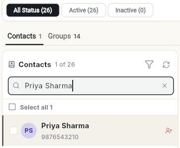
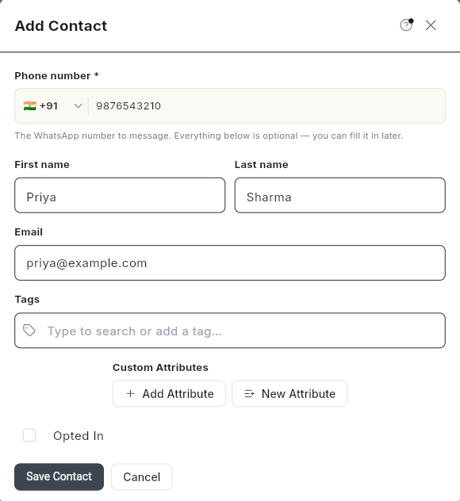
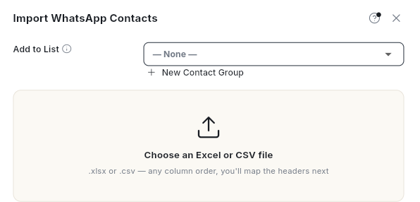
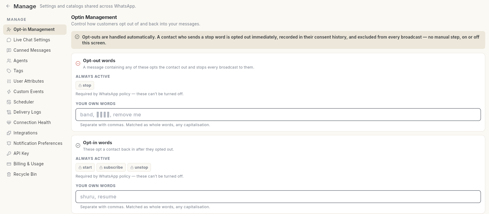

# Manage WhatsApp contacts

Build your WhatsApp audience and keep its consent up to date. At the end of this page you can add or import contacts, group and tag them, opt contacts in or out, and set the extra words customers can send to stop your messages.

## Before you start

- You can see **Contact** in the **WhatsApp** panel. If not, ask your admin. See [Manage team members, roles and permissions](../settings/roles-and-permissions.md).
- To import, you have a CSV or Excel file with a phone number column.
- For CRM contact records, deals and activities, see the [CRM overview](../crm/index.md).

## Steps

### Open your contacts

1. Open **WhatsApp** in the left rail, then select **Contact**. The **Contacts** screen opens.
2. The top row filters by status: **All Status**, **Active** and **Inactive**, each with its count. Below it, the **Contacts** and **Groups** tabs show how many of each you have.

    

3. Type in **Search name, phone or email…** to find someone. Click a row to see the contact on the right, in the sections **Identity**, **Messaging**, **Custom Attributes**, **Activity** and **Record**.

### Add a contact

1. Click **Add contact** at the top right. **Add Contact** opens.
2. In **Phone number \***, pick the country and type the number. Everything else is optional.
3. Fill in **First name**, **Last name** and **Email** if you have them. You can also add **Tags** and **Custom Attributes**.
4. Tick **Opted In** only if the person agreed to get your messages. It is off by default.

    

5. Click **Save Contact**. The contact is added to the list. Search for the name to find it.

### Import contacts

1. Click the **Import** (upload) icon at the top right. **Import WhatsApp Contacts** opens.

    

2. In **Add to List** at the top, pick a contact group, or leave **— None —** to use the **Business Contact** group. Click **New Contact Group** to make a new one.
3. Click **Download Sample CSV** if you need a template.
4. Click **Choose an Excel or CSV file** and pick your file. It can be `.xlsx` or `.csv`, with the columns in any order.
5. Under **Header identifiers**, pick the column in your file for each field, such as **Phone Number** and **First Name**.
6. Under **Options**, set **Default Country Code** for numbers without one. Turn on **Replace Tags** to replace existing tags with the file's tags.
7. Click **Import**. **Import complete** appears when it finishes.

A phone number that already exists is merged into that contact. Rows without a phone number are skipped. Click **Import history** to see past imports.

To import and send a campaign straight away, choose **Import and broadcast** instead.

### Group and tag contacts

1. Tick the contacts you want. A dark bar appears with **Add tag**, **Add to group**, **Send broadcast** and **Export** for the selection.
2. Click **Add to group**. **Add to contact group** opens. Pick a group in **Contact Group**, or click **New Contact Group**, then click **Confirm**. To take a contact out of a group, click the contact, then click **Remove…** next to **Groups** on the right. The message **Removed 1 contact from "All Customers".** appears, with your group's name.
3. Click **Tags**, type in **Type to search or add a tag…**, then click **Add Tags**.

To create or edit groups, click **Contact Groups**, or open the **Groups** tab. Groups are shared with CRM. See [Create and manage contact groups](../crm/contact-groups.md).

### Opt contacts in or out

Opted-out contacts cannot receive any WhatsApp message from you until they opt back in.

For one contact:

1. Click the contact. The details open on the right.
2. Under **Messaging**, switch **Opted in** on or off. It shows **Can receive campaigns** or **Campaigns will skip this contact**.
3. Click **Save**.

For many contacts:

1. Tick the contacts.
2. Click **Block & opt**. **Opt in/out** opens.
3. Click **Opt Out** or **Opt In**.

Every change is recorded in the contact's **Consent History**, with its source, such as a STOP/START keyword, a manual change or an import.

### Set opt-out and opt-in words

A customer who sends **stop** is opted out at once and left out of every broadcast. Sending **start**, **subscribe** or **unstop** opts them back in. These words are always active and cannot be turned off.

1. Open **WhatsApp** in the left rail, then select **Manage**.
2. Select **Opt-in Management**.

    

3. Under **Opt-out words**, type your own words in **Your own words**, separated with commas. For example, words in your customers' language. They match whole words in any capitalisation.
4. Under **Opt-in words**, add words that opt a contact back in.
5. Under **Confirmation replies**, edit **After opting out** and **After opting back in**. Leave them empty to use the standard wording.
6. Click **Save changes**. The message **Opt-in settings saved.** appears.

## Video walkthrough

[VIDEO]

## Troubleshooting

| Issue | Cause | Fix |
| --- | --- | --- |
| **No importable rows found — check the Phone Number column mapping.** | No column was mapped to **Phone Number**, or it is empty. | Under **Header identifiers**, pick the right column for **Phone Number**. |
| **Could not update opt-in status — try again.** | The change did not save. | Try again. If it keeps failing, refresh the page. |
| A contact shows **Needs attention — invalid number** | The last 3 broadcasts to them all failed, and none ever reached them. | Check the number is on WhatsApp. Click **Stop sending** or **Keep sending**. |
| A contact shows **Needs attention — possibly blocked** | They received messages before, but recent sends keep failing. WhatsApp never confirms a block. | Review, then click **Stop sending** or **Keep sending**. |
| A customer who sent **stop** still appears | Opt-out stops messages, it does not delete the contact. | This is expected. Their status shows **Opted out**. |

## Related

- [Use the WhatsApp inbox](use-whatsapp-inbox.md)
- [Create and manage contact groups](../crm/contact-groups.md)
- [Import and sync contacts](../crm/import-and-sync-contacts.md)
- [Track contact consent](../crm/consent-and-compliance.md)
- [Add custom contact fields](../crm/custom-fields.md)

!!! note "Screenshots to add"
    - After step 4 of Import contacts — **Header identifiers** with columns mapped.
    - After step 2 of Opt contacts in or out (for one contact) — the **Messaging** section.
    - After step 3 of Set opt-out and opt-in words — the **Opt-out words** card.
