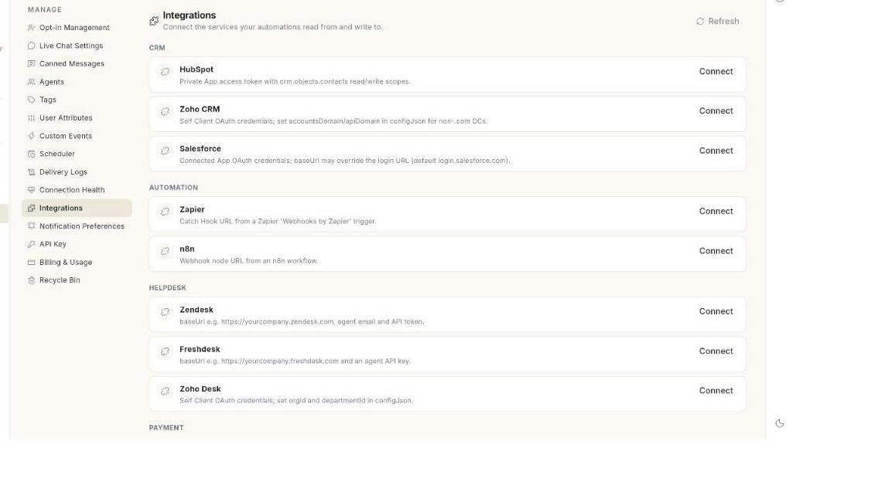

# Manage WhatsApp integrations

Open **Integrations** in **Manage** to connect the outside services your WhatsApp automations use. At the end, a service shows **Connected**, you have tested it, and you know how to change its details or remove it. Connecting takes about 2 minutes.

## Before you start

- Your role can open WhatsApp **Manage**. If not, ask your admin. See [Manage team members, roles and permissions](../settings/roles-and-permissions.md).
- You have the details the service asks for, such as a key or a token. Each service shows a short setup hint in its card.
- You know which automation will use the service. See [Connect apps for flows](../flows/connect-apps-for-flows.md).

## What the Integrations screen shows

The screen is titled **Integrations**. Under it you read **Connect the services your automations read from and write to.** Services are grouped under a heading in capital letters, one heading per category.

| What you see on a card | What it means |
| --- | --- |
| **Connected** | The service is connected and switched on. |
| **Paused** | The service is connected but switched off. |
| A red status label | The last connection check did not return OK. Run **Test**. |
| **Set up under AI Settings.** | This service is set up on the AI settings screen. The card has no buttons. |

## Steps

### Connect a service

1. Open **WhatsApp** in the left rail, then select **Manage**.
2. Select **Integrations**. The list of services opens.

    

3. Find the service. Read the setup hint under its name.
4. Click **Connect**. A window opens with the name of the service as its title.
5. Fill in each field. Fields for a key, secret, token or password hide what you type.
6. If the window reads **This integration needs no credentials — connecting is enough.**, there is nothing to fill in.
7. Click **Save**. The message **Integration saved.** appears and the card shows **Connected**.

!!! note "Field names"
    The window takes its fields from the service. A field named `apiKey` shows as **Api key**.

### Test a connection

1. Find a card that shows **Connected** or **Paused**.
2. Click **Test**.
3. Read the message that appears. It is the service's own answer, for example why a key was refused. If the service sends no text, the message reads **Connection test finished.**
4. If you see a red status label on the card afterwards, click **Edit** and check the details.

### Change the details of a service

1. Find the connected service.
2. Click **Edit**. The same window opens.
3. Type the new values.
4. Click **Save**. The message **Integration saved.** appears.

Leave a field empty to keep the value you saved before. [VERIFY: whether an empty field keeps the saved value]

### Remove a service

1. Find the connected service.
2. Click **Remove**. The **Remove this integration?** window opens.
3. Read the warning. **Automations that depend on** the service **will stop working until it is connected again.**
4. Click **Remove** to confirm, or **Cancel** to keep it. The message **Integration removed.** appears.

!!! warning "Automations stop right away"
    Check which flows use the service before you remove it. You can get a removed integration back from the **Recycle Bin**. See [Restore deleted items](restore-deleted-items.md).

### Reload the list

1. Click **Refresh** at the top right of the screen.
2. If the list does not load, the screen shows **Could not load integrations.** Click **Retry**.

## Troubleshooting

| Issue | Cause | Fix |
| --- | --- | --- |
| **Could not save the integration.** | A required field is empty or wrong, or the service could not be reached. | Check each field, then click **Save** again. |
| **Could not reach the service.** | The test could not connect. | Check your internet connection and the service's own status, then click **Test** again. |
| A card has no **Connect** button and reads **Set up under AI Settings.** | The service is configured on the AI settings screen, not here. | Open the AI settings. See [Set up the WhatsApp AI agent](set-up-ai-agent.md). |
| A card shows a red status label | The last check failed, for example a key was revoked. | Click **Test** to read the reason, then **Edit** to fix the details. |
| **Could not remove the integration.** | The removal did not go through. | Click **Refresh**, then try **Remove** again. |
| The service you need is not in the list | Ohanvi does not offer it here. | Use a webhook or the API instead. See [Webhooks and integrations](whatsapp-webhooks-and-integrations.md). |

## Related

- [Set up WhatsApp webhooks and integrations](whatsapp-webhooks-and-integrations.md)
- [Connect apps for flows](../flows/connect-apps-for-flows.md)
- [Choose connectors](../settings/choose-connectors.md)
- [Restore deleted items](restore-deleted-items.md)
