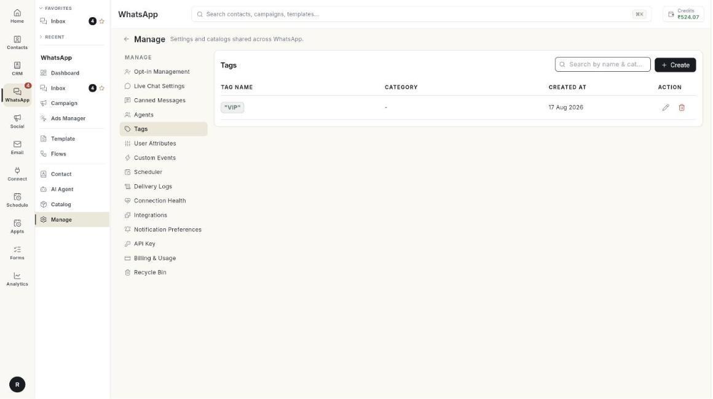

# Manage

Manage holds the settings and lists that support the rest of WhatsApp: chat rules, opt-in words, saved replies, your team, tags, schedules, logs and more.

**Where to find it:** open **WhatsApp** in the left rail, then select **Manage**.

## Guides

| Guide | Use it when |
| --- | --- |
| [Opt-in Management](../manage-opt-in-and-opt-out-words.md) | You want to set the words that opt people in or out. |
| [Live Chat Settings](../set-up-live-chat-settings.md) | You want auto-replies, working hours and handoff rules. |
| [Canned Messages](../create-canned-messages.md) | You want saved replies your team can insert with /. |
| [Agents](../add-whatsapp-agents.md) | You want to add teammates to WhatsApp. |
| [Tags, User Attributes and Custom Events](../tags-attributes-and-events.md) | You want to label contacts or store extra details. |
| [Scheduler and Delivery Logs](../scheduler-and-delivery-logs.md) | You want to see scheduled messages or check delivery. |
| [Connection Health](../check-connection-health.md) | You want to know if your number is working. |
| [Integrations](../manage-whatsapp-integrations.md) | You want to connect other services. |
| [Notification Preferences](../set-notification-preferences.md) | You want to choose which WhatsApp events notify you. |
| [API Key and Cloud API access](../get-cloud-api-access.md) | You want help to connect your number to the Meta Cloud API. |
| [Billing and Usage](../read-billing-and-usage.md) | You want to see what Meta charges. |
| [Health, alerts and billing](../health-notifications-and-billing.md) | You want one overview of health, alerts and billing. |
| [Media Library](../manage-media-library.md) | You want to see the media your account stores, or free space. |
| [Recycle Bin](../restore-deleted-items.md) | You deleted something and want it back. |

## Before you start

- Your WhatsApp number is connected to Ohanvi. See [Connect your WhatsApp number](../connect-whatsapp-number.md).
- Your role has access to this screen. If you do not see it, ask your admin.
