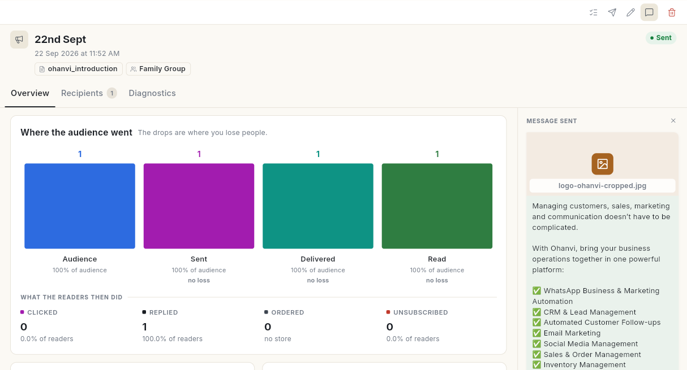
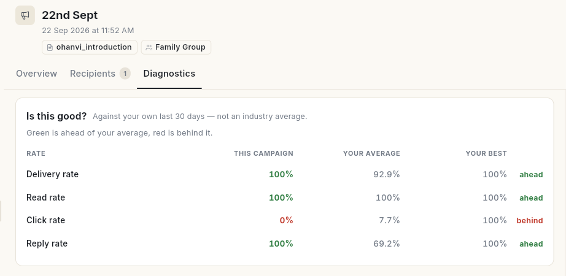
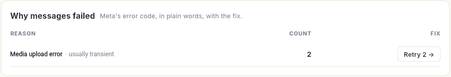
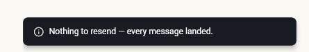
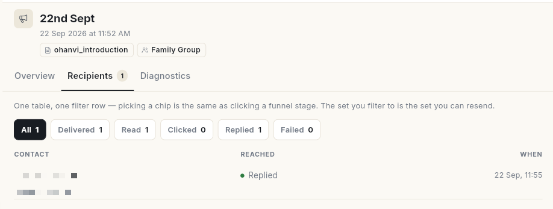
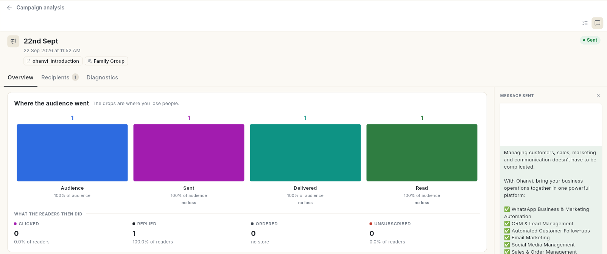

# Read a WhatsApp campaign report

Open a sent campaign and read how it landed: how many people got it, read it and acted on it, and why some messages failed. At the end, you know what to fix and you have resent the failures.

## Before you start

- You have sent at least 1 campaign. See [Send a broadcast campaign](send-broadcast-campaign.md).
- You can see **Campaign** in the **WhatsApp** panel.

## What each delivery status means

Figures fill in as WhatsApp confirms each message, so a campaign sent a minute ago is still counting.

| Status | Meaning |
| --- | --- |
| **Queued** | Waiting to be handed to WhatsApp. |
| **Sent** | WhatsApp accepted the message. |
| **Delivered** | The message reached the person's phone. |
| **Read** | The person opened it. People who turned off read receipts never show as **Read**, even when they read it. |
| **Clicked** | The person tapped a tracked link button. Needs **Enable Click Tracking** on the template. |
| **Replied** | The person wrote back. |
| **Failed** | WhatsApp did not deliver it. The reason is written on the row. Failed messages are not charged. |

## Steps

### Read the summary

1. Open **WhatsApp** in the left rail, then select **Campaign**.
2. At the top, read the totals across all campaigns: **Campaigns**, **Messages sent**, **Delivered**, **Read** and **Failed**.
3. Click a campaign in the list. Its report opens on the right, with a **GRADE** and 3 tabs: **Overview**, **Recipients** and **Diagnostics**. On the right, **Message sent** shows the message that went out.

    

### Read the Overview tab

- **Where the audience went** shows each stage from sent to delivered, read, clicked, replied and ordered. The drops are where you lose people. Click a stage to open that exact list of people.
- **What the readers then did** shows how many readers **Clicked**, **Replied**, **Ordered** or **Unsubscribed**.
- **vs your last broadcast** compares this send with the broadcast before it. Green beat the one before, red slipped.
- **What it drove** shows reads and clicks. With a store connected, it also shows the revenue.
- **Do this next** lists suggested actions, for example following up people who read but never clicked, or leaving out numbers that failed twice in a row.
- **How fast it landed** shows the **Median time to deliver**, **Median time to read** and **Peak reading hour**.

### Read how fast it landed

The **How fast it landed** card shows time since launch in minutes, not calendar days. A broadcast finishes in minutes, so a per-day chart would show a single point.

1. Open the **Overview** tab and scroll to **How fast it landed**.
2. Read **Median time to deliver**. Half of the messages reached the phone faster than this time.
3. Read **Median time to read**. Half of the readers opened the message faster than this time. Under it, **p95** shows the time that 95 of every 100 readers stayed within.
4. Read **Peak reading hour**. It shows the clock hour with the most reads, for example `19:00–20:00`. The caption reads **when to send the next one**.
5. If nobody has read the message yet, **Peak reading hour** shows **—** and the caption reads **no reads yet**. Check again later.
6. Read **Never delivered**. It is the messages sent minus the messages delivered. The caption reads **see Diagnostics for why**.

Times show in the shortest honest unit, for example `45 s`, `12 min 30 s` or `2 h 15 m`.

!!! tip "Send when people read"
    Schedule your next broadcast for the **Peak reading hour** of this one. See [Check scheduled messages and delivery logs](scheduler-and-delivery-logs.md).

### Find out why messages failed

1. Open the **Diagnostics** tab. **Is this good?** compares this campaign's **Delivery rate**, **Read rate**, **Click rate** and **Reply rate** with **Your average** and **Your best** over your own last 30 days. Green is **ahead** of your average, red is **behind** it.

    

2. When messages failed, read **Why messages failed**. It groups failures by WhatsApp's reason, in plain words, with the **Count** and a **Fix** button, for example **Retry 2**.

    

3. Read **Links & buttons** for clicks per link, and **Template health** for the template's quality rating.
4. Read **What this send cost your list**: **Reached first time**, **At risk** (2 or more failures in a row), **Unsubscribed** and **Excluded**.

### Resend to the people it missed

1. On the campaign, click the **Resend** icon (a paper plane) at the top right. The **Resend?** window shows how many people it goes to. If every message was delivered, the message **Nothing to resend — every message landed.** appears instead.

    

2. Click **Resend**. **Resend started** appears. Delivery updates arrive as WhatsApp confirms each one.

Resend goes to the failed recipients. When nothing failed, it goes to the people whose message was not delivered. Each resent message is charged when it is delivered.

### See who received it

1. On the campaign, open the **Recipients** tab, or click the **Who received it** icon (a list with ticks) at the top right. Each row shows the **Contact**, how far the message **Reached**, and **When**.
2. Filter with the chips **All**, **Delivered**, **Read**, **Clicked**, **Replied** or **Failed**. Each chip shows its count. The set you filter to is the set you can resend.

    

3. To resend only the failures, click **Resend … failed**.

### Open the report on its own page

1. Open **WhatsApp** → **Dashboard** and click a broadcast in the **Broadcasts** table. **Campaign analysis** opens on its own page.
2. It has the same **Overview**, **Recipients** and **Diagnostics** tabs as the report in **Campaign**, with **Message sent** on the right.
3. Click the back arrow next to **Campaign analysis** to return.

For totals across all your campaigns, including revenue from broadcasts, use **Analytics**. See [Read Marketing Analytics](../analytics/read-marketing-analytics.md).

## Video walkthrough

[VIDEO]

## Troubleshooting

| Issue | Cause | Fix |
| --- | --- | --- |
| **Read** is lower than **Delivered** by a lot | Some people turned off read receipts, or have not opened it yet. | Compare with **Replied** and **Clicked**, and check again later. |
| Clicks show 0% with **No URL button on template** | The template has no link button, so no click can be tracked. | Add a URL button with **Enable Click Tracking** to your next template. |
| Failure reason: **This person has chosen not to receive marketing messages from your business, so WhatsApp blocked this one.** | The person opted out of marketing messages in WhatsApp. | Leave them out of marketing campaigns. |
| Failure reason: **WhatsApp did not deliver this one. It limits how many marketing messages a person receives so their inbox stays useful …** | Meta caps the marketing messages each person gets. | Try again later, or reach this person another way. |
| Failure reason: **This number cannot receive WhatsApp messages. …** | The number is not on WhatsApp, is mistyped, or blocked you. | Check the number on the contact. |
| **Nothing to resend — every message landed.** | No message failed or was left undelivered. | No action needed. |

## Related

- [Send a broadcast campaign](send-broadcast-campaign.md)
- [Create a WhatsApp message template](create-message-template.md)
- [Read Marketing Analytics](../analytics/read-marketing-analytics.md)
