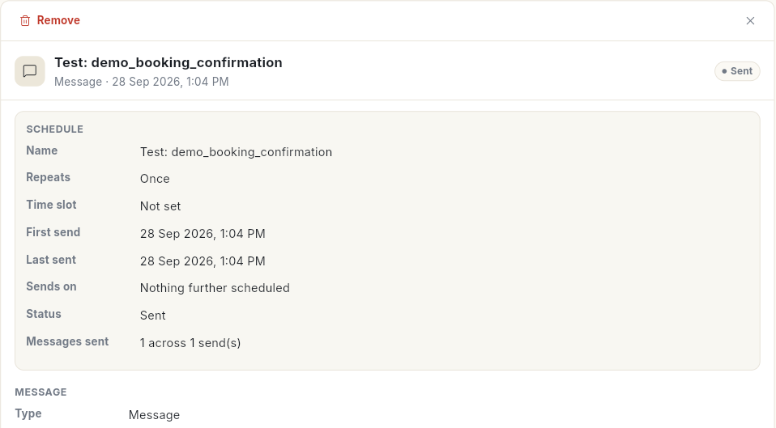
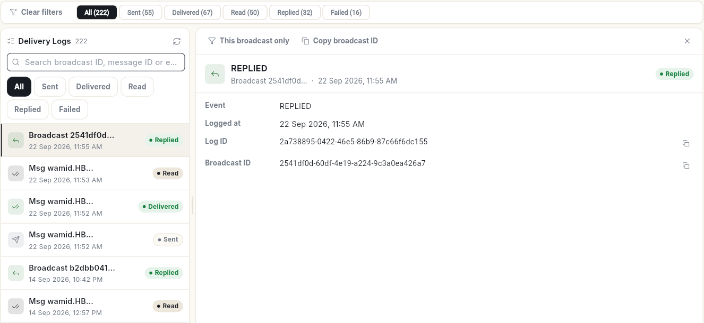

# Check scheduled messages and delivery logs

The **Scheduler** holds every WhatsApp message set to go out later, and the **Delivery Logs** record what happened to each message sent. At the end, you can find a scheduled send, read its details, and trace any message from sent to replied or failed.

## Before you start

- Your role can open WhatsApp **Manage**. See [Manage team members, roles and permissions](../settings/roles-and-permissions.md).

## Steps

### Read the Scheduler

1. Open **WhatsApp** in the left rail, select **Manage**, then **Scheduler**.
2. Filter at the top with **All**, **Scheduled**, **Paused**, **Sent**, **Failed** or **Stopped**. Each shows its count.
3. Search with **Search title, type or number…**, then click an item. Its details open on the right.

The **Schedule** card shows the **Name**, how it **Repeats**, the **Time slot**, **First send**, **Last sent**, **Sends on**, its **Status** and **Messages sent**. Click **Remove** at the top to delete it.

To schedule a new message, click **Schedule** above the list, or **Schedule Message** at the top right. Test messages also appear here, named **Test:** and the template name.

The cards above the list count **Upcoming**, **Sent**, **Failed** and **Stopped**. **Upcoming** counts the items the **Scheduled** filter shows.

For a calendar of everything scheduled across Ohanvi, see [View everything scheduled](../schedule/view-schedule.md). For repeating sends, see [Manage recurring schedules](../schedule/manage-recurring-schedules.md).

### Schedule a message

1. In **Scheduler**, click **Schedule Message**. The **Schedule Message** window opens.
2. Optional: type a **Title (optional)**.
3. Under **Contact Group**, pick one or more groups. The label reads **Contact Groups (2 selected)** once you pick 2. Members are picked up fresh at every send.
4. Under **Template**, pick an approved template.
5. Under **Variables**, fill each placeholder, or insert an attribute so every contact gets their own value. Add a fallback for contacts with no value.
6. Under **Repeat**, choose **Once**, **Daily**, **Weekly**, **Monthly**, **Yearly**, **Special Days** or **Holidays**.
7. Under **Time slot**, choose one of 6 windows of 4 hours, from **12:00 AM – 4:00 AM** to **8:00 PM – 12:00 AM**. The message goes out at the start of the window.
8. Set **Send date**. For a repeating schedule it reads **First send date**. For **Special Days** and **Holidays**, pick the dates on the calendar instead.
9. Optional: set **End date (optional)**. Without one, the schedule runs until stopped.
10. Optional: tick **Also add to Google Calendar**. Click **Connect Google** on the **Scheduler** page first.
11. Check **Message Preview**, then click **Schedule Message**. The message **Message scheduled.** appears.

If something is missing, the form says what, for example **Select at least one contact group.** or **Fill every template variable.**

### Change, pause or stop a schedule

Click an item in the list. Its buttons show above the details. Right-click an item to see the same actions as a menu.

1. To move it, click **Reschedule**. Change **Repeat**, **Time slot**, the next date or the end date, then click **Save**. The message **Schedule updated.** appears.
2. For a failed item, the same button reads **Retry**. Click **Retry** in the window to put the send back in the queue.
3. To hold a schedule that has not gone out yet, click **Pause**. The message **Schedule paused — nothing sends until you resume it.** appears.
4. To continue a paused schedule, click **Resume**. The message **Schedule resumed.** appears.
5. To end a send that has not gone out, click **Stop**, then **Stop it**. The item stays in the list as **Stopped**.
6. To start a stopped item again, click **Restart**. The message **Schedule restarted.** appears.
7. To clear a finished item, click **Remove**, then **Remove it**. The message **Removed from the scheduler.** appears.
8. If an item failed, click **Copy error** to copy the reason.

!!! warning "Removing is final"
    **Remove** takes a stopped or sent item off the list for good. A stopped item cannot be restarted after that. Messages already sent are not affected.

Only the 6 time slots can be used. A slot that has already passed today is refused: **The … slot has already passed on that date — pick a later slot or date.**

### Read the Delivery Logs

1. In **Manage**, select **Delivery Logs**.
2. Filter at the top with **All**, **Sent**, **Delivered**, **Read**, **Replied** or **Failed**. Each shows its count. Click **Clear filters** to start again.
3. Search by broadcast ID, message ID or error, then click an entry. Its details open on the right.

Each entry shows the **Event**, when it was **Logged at**, the **Log ID** and the **Broadcast ID**. A failed message also shows its **Error code** and **Error message**. Click **This broadcast only** to see just that broadcast, or **Copy broadcast ID** to share it.

!!! note "Failed messages"
    **Delivery Logs** only shows what happened. It has no button to send a failed message again. The **Retry** button on this page only reloads the list. To send again, use the campaign report. See [Read a WhatsApp campaign report](read-campaign-report.md).

You can also reach the failed entries from the dashboard: **Review failures** → **Open Delivery Logs**. See [Read the WhatsApp dashboard](whatsapp-dashboard.md).

## Video walkthrough

[VIDEO]

## Related

- [Send a broadcast campaign](send-broadcast-campaign.md)
- [Read a WhatsApp campaign report](read-campaign-report.md)
- [Read the WhatsApp dashboard](whatsapp-dashboard.md)
