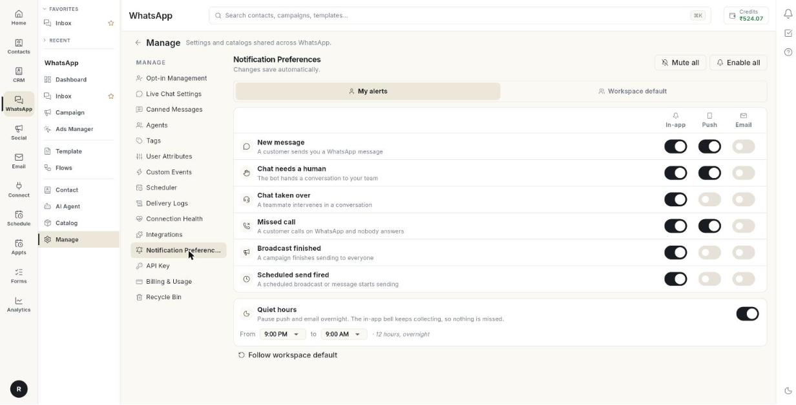

# Set notification preferences

Notification Preferences decide how you hear about WhatsApp events such as a new message or a chat that needs a human. At the end, each event reaches you the way you want, and quiet hours keep your nights calm. Changes save as you make them.

## Before you start

- You can open **Manage** in the **WhatsApp** panel. If not, ask your admin.
- To set the team default, your role needs permission to edit it.

## The events and the three ways to be told

| Event | When it fires |
| --- | --- |
| **New message** | A customer sends you a WhatsApp message. |
| **Chat needs a human** | The bot hands a conversation to your team. |
| **Chat taken over** | A teammate intervenes in a conversation. |
| **Missed call** | A customer calls on WhatsApp and nobody answers. |
| **Broadcast finished** | A campaign finishes sending to everyone. |
| **Scheduled send fired** | A scheduled broadcast or message starts sending. |

| Way to be told | What it is |
| --- | --- |
| **In-app** | The notification bell inside Ohanvi. |
| **Push** | A push notification on your phone. |
| **Email** | An email to your account address. |

## Steps

### Open Notification Preferences

1. Open **WhatsApp** in the left rail, then select **Manage**.
2. Select **Notification Preferences**.

    

3. Keep **My alerts** selected to set your own alerts.

### Choose how you hear about each event

1. Find the event, for example **New message**.
2. Switch **In-app** on or off.
3. Switch **Push** on or off.
4. Switch **Email** on or off.

The page says **Changes save automatically**. There is no save button. If a change fails, you see **Couldn't save that change — please try again.** Switch it again.

### Turn every alert on or off at once

1. Click **Mute all** to switch every alert off.
2. Click **Enable all** to switch every alert on.

### Set quiet hours

1. Find **Quiet hours**. It pauses push and email overnight.
2. Turn the switch on.
3. Pick the time after **From**, for example 9:00 PM.
4. Pick the time after **to**, for example 9:00 AM.

The in-app bell keeps collecting alerts during quiet hours, so you miss nothing.

### Use the team default instead of your own choices

1. Click **Follow workspace default**.
2. In the window **Follow the workspace default?**, read the message. Your own choices are cleared.
3. Click **Follow default**.

You then get whatever your admin sets, including later changes. Click **Cancel** to keep your own choices.

### Set the default for the whole team

1. Click **Workspace default** at the top.
2. Set the events, the three switches and **Quiet hours** the same way as above.

The page then says **What a teammate gets before they change anything themselves.**

## Troubleshooting

| Issue | Cause | Fix |
| --- | --- | --- |
| **Couldn't save that change — please try again.** | The change did not reach the server. | Check your connection and switch it again. |
| You get no push alerts | **Push** is off, or **Quiet hours** is on. | Turn **Push** on, and check **Quiet hours**. |
| You get no emails | **Email** is off for that event. | Turn **Email** on for it. |
| Your choices keep changing | You chose **Follow workspace default**. | Switch the switches yourself to leave the default. |
| You do not see **Workspace default** | Your role cannot edit the team default. | Ask your admin. |

## Related

- [Check connection health, alerts and WhatsApp billing](health-notifications-and-billing.md)
- [Choose how notifications reach you](../settings/notification-preferences.md)
- [Use the WhatsApp inbox](use-whatsapp-inbox.md)
