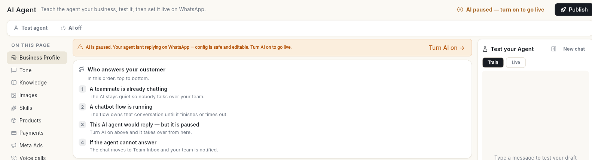
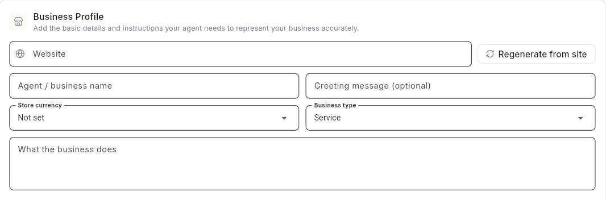
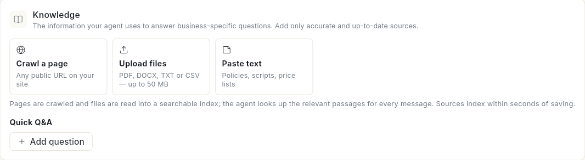
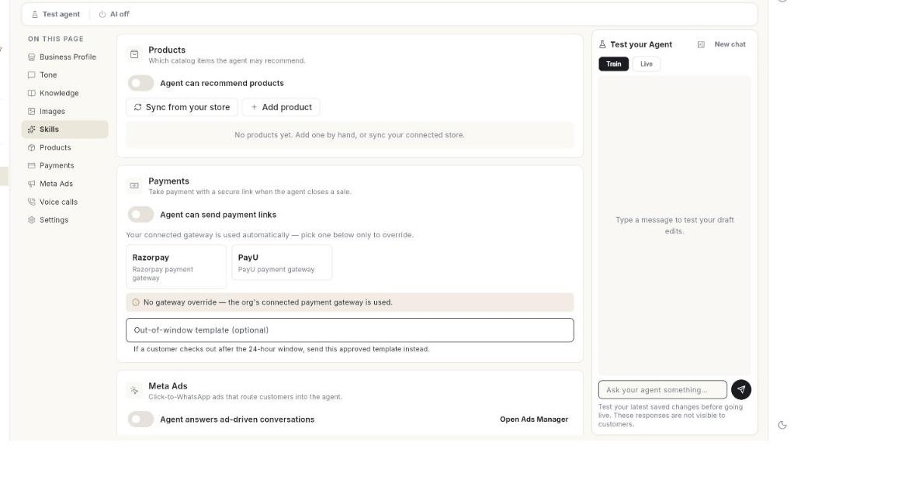
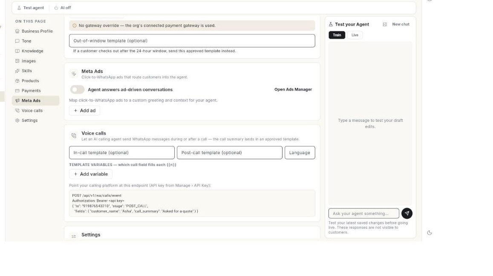
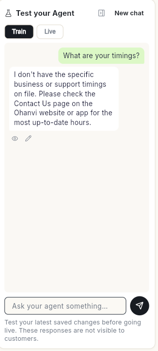
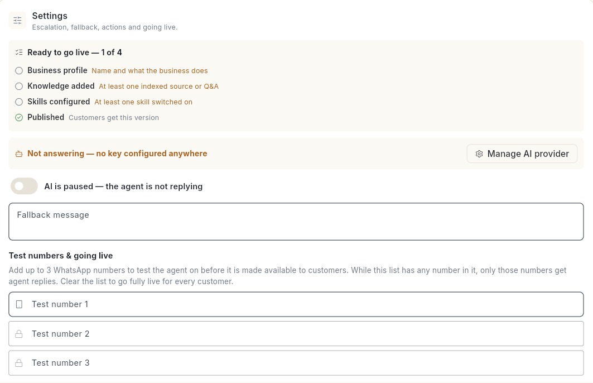

# Set up the WhatsApp AI agent

Set up an AI agent that answers customers on WhatsApp from your own business information. At the end, the agent knows your business, hands chats to your team when it cannot help, and is live for test numbers or for every customer.

## Before you start

- Your WhatsApp number is connected. See [Connect your WhatsApp number](connect-whatsapp-number.md).
- You can see **AI Agent** in the **WhatsApp** panel. It uses the same access as **Flows**. If you cannot see it, ask your admin. See [Manage team members, roles and permissions](../settings/roles-and-permissions.md).
- You have credits. Each AI reply delivered to a customer is charged to your credits. See [Credits and billing](../credits-and-billing.md).

## Steps

### Know who answers first

Open **WhatsApp** in the left rail, then select **AI Agent**. The **Who answers your customer** card shows the order, top to bottom:

1. **A teammate is already chatting** — the AI stays quiet so nobody talks over your team.
2. **A chatbot flow is running** — the flow owns the conversation until it finishes or times out.
3. **Otherwise this AI agent replies** — from everything you set up on this page.
4. **If the agent cannot answer** — the chat moves to the inbox and your team is notified.

While the AI is off, line 3 reads **This AI agent would reply — but it is paused**, and a bar at the top offers **Turn AI on**.



### Describe your business

1. Select **Business Profile** in the list on the left.
2. In **Website**, type your site address, then click **Regenerate from site**. Ohanvi drafts your details from the website.
3. Check **Agent / business name**, **Greeting message (optional)**, **Store currency**, **Business type** and **What the business does**. If you pick **Other** as the business type, describe it.

    

4. Under **Persona & guardrails**, fill in **Allowed topics**, **Forbidden topics**, **Off-topic response** and **Escalation triggers** as needed.
5. Select **Tone**. Pick a tone and a **Response length**: **Short**, **Medium** or **Long**.
6. Click **Save changes**. The message **AI agent saved.** appears.

### Add a persona, extra notes and a custom tone

1. Select **Business Profile** in the list on the left.
2. Under **Persona & guardrails**, type a **Persona statement**, for example `You are Meera, our support assistant.`
3. Type **Additional notes** for anything the agent must always or never do that does not fit the other boxes.
4. Select **Tone**. Pick a tone and a **Response length**.
5. Click **Advanced tone settings** to open it.
6. Type **Custom tone instructions**, for example `Always answer in Hinglish. Address customers as "ji".`
7. Click **Save changes**.

### Add knowledge

1. Select **Knowledge**.
2. Add a source:
    - **Crawl a page** — any public URL on your site.
    - **Upload files** — PDF, DOCX, TXT or CSV, up to 50 MB each.
    - **Paste text** — policies, scripts or price lists.

    

3. Under **Quick Q&A**, click **Add question** and type a question and its **Answer**.
4. Click **Save changes**. Sources index within seconds of saving.

If a source shows **Not indexed yet — use Re-index all**, click **Re-index all**.

### Add a page, a file or text by name

1. Select **Knowledge**.
2. To add a page, click **Crawl a page**. In the **Crawl a page** window, type a **Name** and the **Page URL**, then click **Add**.
3. To add text, click **Paste text**. In the **Paste text** window, type a **Name** and the **Text**, then click **Add**.
4. To add a file, click **Upload files** and pick a PDF, DOCX, TXT, CSV or MD file. The message **[file name] added — save to index it.** appears.
5. Click **Save changes** to index the new sources.
6. To remove a source, click the trash icon (**Remove**), then click **Save changes**.

The link to an uploaded file lasts 7 days. After that, upload the file again to re-index it. See [Review and correct AI agent answers](review-and-correct-ai-agent-answers.md).

### Add images the agent may send

1. Select **Images** in the list on the left.
2. Type the picture's web address in **Image URL**, for example a product shot, a menu or a brochure. To upload a file first, use the [Media Library](manage-media-library.md).
3. Click **Add**. The image appears in the list.
4. To stop the agent sending an image, click the trash icon (**Remove**) beside it.
5. Click **Save changes**.

Product images appear here once you add products.

### Choose skills

1. Select **Skills**. Each skill is a job the agent can do.
2. Expand a skill and click **Configure** to set it up:

    | Skill | What it does |
    | --- | --- |
    | **FAQ / Support** | Answers general questions from your knowledge. |
    | **Human Handoff** | Hands the chat to your team when the customer asks for a person, is frustrated, or raises something out of scope. |
    | **Lead Qualification** | Asks your questions to a prospect and can push the lead to your CRM. |
    | **Order Status** | Looks up an order through a connected action and reports its status. |

3. To add your own job, click **Add custom skill** under **Custom skills**.

**Products**, **Payments**, **Meta Ads** and **Voice calls** in the same list let the agent recommend products, send payment links, answer ad-driven chats and work with a calling agent.

### Say when a skill is used and what it collects

Every skill has the same 2 boxes.

1. Select **Skills**, expand a skill and click **Configure**.
2. In **When it is used**, describe the moment, for example `The customer asks about delivery times or shipping charges`.
3. Under **Information to collect**, click **Add question**.
4. Type the **Question** the agent asks, for example `Which city are you in?`
5. Type **Save as attribute**, for example `City`. Each answer is saved on the contact under that attribute.
6. Tick the box on the skill to turn it on.
7. Click **Save changes**.

### Set up Lead Qualification

1. Expand **Lead Qualification** and click **Configure**.
2. Type the **First qualifying question**.
3. Type **Question 2** and **Question 3**.
4. Under **Questions to collect**, type each detail the agent gathers before it hands the lead to your team, then click **Add**. [VERIFY: example text for this box]
5. Optional: type **Template the agent can send (optional)**. Use an approved template name.
6. Optional: type **Use when contacts arrive from this ad**. Leave it as **Any / no ad** for all ads.
7. Optional: tick **Push qualified leads to your CRM (optional)**.
8. Click **Save changes**.

### Add a custom skill

1. Under **Custom skills**, click **Add custom skill**. A new skill card opens.
2. Type an **Icon**, for example one emoji.
3. Type a **Skill name**, for example `Book a demo`.
4. Type **Step-by-step instructions**. Number the steps, for example `1. Ask which product…`
5. Fill in **When it is used** and **Information to collect**, as above.
6. Tick the box on the card to turn the skill on.
7. To remove the skill, click **Delete skill**.
8. Click **Save changes**.

### Let the agent recommend products

1. Select **Products**.
2. Turn on **Agent can recommend products**.
3. To bring products from your store, click **Sync from your store**. The integrations screen opens.
4. To add one by hand, click **Add product**. The **Add product** window opens.
5. Type a **Name**, a **Price** such as `₹4,999`, and a **Description**.
6. Optional: type an **Image URL (optional)**.
7. Click **Add**.
8. To remove a product, click the trash icon (**Remove**).
9. Click **Save changes**.

With no products, the list reads **No products yet. Add one by hand, or sync your connected store.** To build a catalog first, see [Set up your WhatsApp catalog](set-up-whatsapp-catalog.md).

### Let the agent send payment links

1. Select **Payments**.

    

2. Turn on **Agent can send payment links**.
3. Optional: click **Razorpay** or **PayU** to use that gateway. Click it again to clear the choice.
4. Optional: type an **Out-of-window template (optional)**, for example `order_payment_reminder`. The agent sends this approved template if a customer checks out after the 24-hour window.
5. Click **Save changes**.

With no choice made, the page shows **No gateway override — the org's connected payment gateway is used.**

### Send ad chats to the agent

1. Select **Meta Ads**.

    

2. Turn on **Agent answers ad-driven conversations**. Click **Open Ads Manager** to see your ads. See [Create an ad](ads-manager/create-an-ad.md).
3. Click **Add ad**. The **Add ad** window opens.
4. Type the **Ad name / id**.
5. Type a **Custom greeting** for people who come from that ad.
6. Type **Context for the agent**, so it knows what the ad promised.
7. Click **Add**.
8. To remove an ad, click the trash icon (**Remove**).
9. Click **Save changes**.

### Connect voice calls

Use this when an AI calling agent should send WhatsApp messages during or after a call.

1. Select **Voice calls**.
2. Type an **In-call template (optional)** and a **Post-call template (optional)**. Use approved template names.
3. Type the **Language**, for example `en_US`.
4. Under **Template variables**, click **Add variable**.
5. In **{{n}}**, type the variable number, for example `1`.
6. In **Call field**, type the call detail that fills it, for example `customer_name`, `call_summary` or `agent_name`.
7. Open **Manage** → **API Key** and copy your API key.
8. Point your calling platform at the endpoint shown on the page, with the key as a bearer token.
9. Click **Save changes**.

The page shows this example:

```
POST /api/v1/wa/calls/event
Authorization: Bearer <api key>
{ "to": "919876543210", "stage": "POST_CALL",
  "fields": { "customer_name": "Asha", "call_summary": "Asked for a quote" } }
```

For calling on your WhatsApp number, see [WhatsApp Calling](whatsapp-calling.md).

### Add an API action

An action lets the agent look up live information or finish a task, such as an order status or a new lead.

1. Select **Settings**. Scroll to **Actions**.
2. Click **Add custom API action**. The window opens.
3. Optional: paste a cURL command into **Paste cURL (optional)**, then click **Fill from cURL**. It fills the method, URL, headers, body and a bearer token.
4. Type an **Action name**, for example `Check order status`.
5. In **When should the agent call it?**, describe the moment, for example `The customer asks where their order is and gives an order number`.
6. Type an **Intent group**, for example `orders`, `appointments` or `crm`.
7. Choose a **Sensitivity**: **Low — runs without asking** or **High — confirm first**.
8. Choose a **Method**: **GET**, **POST**, **PUT**, **PATCH** or **DELETE**.
9. Type the **URL**, for example `https://api.example.com/orders/{{order_id}}`.
10. Type **Headers** and **Query params**, one per line as `Key: value`.
11. For **POST**, **PUT** or **PATCH**, type the **Body**, for example `{"order_id": "{{order_id}}"}`.
12. Choose **Authentication**: **None**, **Bearer token**, **Basic auth** or **API key (header)**. Fill in the boxes that appear.
13. Under **Variables**, click **Add variable**. Type a **Name**, for example `order_id`, and **What it is**.
14. Type **Examples (one per line, 1–5)**, for example `Customer: "where is order 1001?" → order_id=1001`.
15. Optional: type sample values in **Test call — sample values (name=value per line)**, then click **Test call**. The result shows the HTTP status and body, or the error.
16. Click **Add**. When you edit an action, the button reads **Save**.

An action needs a name and a URL. A shield icon marks a **High** sensitivity action. Use the pencil (**Edit**) and trash (**Remove**) icons beside an action to change or delete it. Click **Save changes** on the page to keep your actions.

!!! tip "Test before you save"
    **Test call** sends a real request to your URL. Use sample values that are safe to send.

### Set the handoff to a human

1. Select **Settings**.
2. Under **Hand off to a human**, type the **Trigger phrases** that start a handoff, for example **talk to a human**.
3. Type the **Handoff message** the customer gets.
4. Optional: under **Handoff webhook (optional)**, add a **Webhook URL** to tell your helpdesk or CRM about each handoff.
5. Type a **Fallback message** for when the agent has no answer.

A handed-off chat moves to the inbox and your team is notified. See [Use the WhatsApp inbox](use-whatsapp-inbox.md).

### Secure the handoff webhook

1. Select **Settings**. Under **Hand off to a human**, find **Webhook URL**.
2. Type an **Authorization header (optional)**, for example `Bearer …`.
3. Type **Extra headers (JSON, optional)**, for example `{"X-Source":"whatsapp"}`.
4. Click **Save changes**.

Ohanvi sends each handoff as JSON with these fields: `event`, `orgId`, `phone`, `contactName`, `reason`, `lastMessage` and `at`.

### Test the agent

1. Click **Test agent**. The **Test your Agent** panel opens.
2. Keep **Train** selected to test your latest saved changes. Type in **Ask your agent something…** and read the reply. Test replies are not visible to customers. Click **New chat** to start over.

    

3. If an answer is wrong, click the pencil icon under the reply (**Correct this answer**), type **What the agent should say**, then click **Save & teach**.

### Go live

1. Under **Settings** → **Test numbers & going live**, add up to 3 WhatsApp numbers to try the agent first. While the list has a number, only those numbers get agent replies.
2. Check **Ready to go live**. It shows how many are done, for example **1 of 4**, and lists **Business profile**, **Knowledge added**, **Skills configured** and **Published**. If **Not answering — no key configured anywhere** shows below it, click **Manage AI provider** and add a key first.

    

3. Click **Publish & go live**. The message **Published — customers now get this version.** appears.
4. Turn the agent on with **Turn AI on**. The status shows **AI is live**.
5. When you are ready for every customer, clear the test numbers.

To stop the agent, click **Pause AI**. Saved changes reach customers only after you publish.

## Video walkthrough

[VIDEO]

## Troubleshooting

| Issue | Cause | Fix |
| --- | --- | --- |
| **Tell us your business type — "Other" needs a description.** | **Business type** is **Other** with no description. | Describe your business type, then save. |
| **Enter your website first.** | **Website** is empty. | Type your site address, then click **Regenerate from site**. |
| **Could not draft anything from that site.** | The site could not be read. | Fill in **What the business does** by hand. |
| **Files must be 50 MB or smaller.** | The file is too large. | Split or compress the file. |
| Customers get old answers | Your changes are saved but not published. | Click **Publish & go live**. |
| The agent stopped replying | Your credits ran out, or only test numbers get replies. | Recharge, and clear the test numbers. See [When credits run low or run out](../billing/low-or-empty-credits.md). |

## Related

- [Review and correct AI agent answers](review-and-correct-ai-agent-answers.md)
- [Use the WhatsApp inbox](use-whatsapp-inbox.md)
- [Create a WhatsApp chatbot flow](../create-whatsapp-flow.md)
- [Choose your own or managed services](../settings/choose-connectors.md)
- [Add funds to your account](../add-funds.md)
