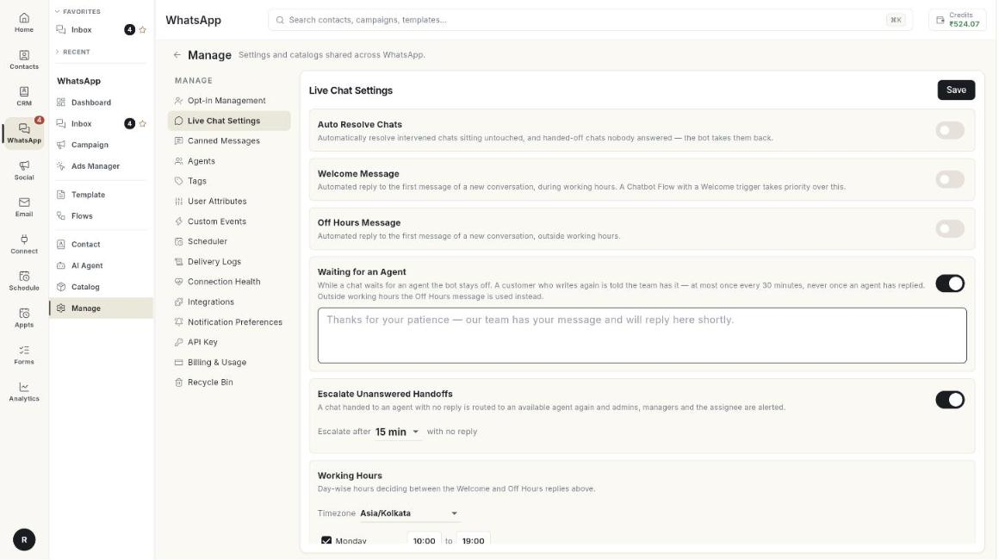

# Set up live chat settings

Live Chat Settings control the automatic replies and timers around your team inbox. At the end, customers get a welcome or off-hours reply, waiting customers are told your team has their chat, and unanswered chats move on to another agent. It takes about 5 minutes.

## Before you start

- Your WhatsApp number is connected to Ohanvi. See [Connect your WhatsApp number](connect-whatsapp-number.md).
- You can open **Manage** in the **WhatsApp** panel. If not, ask your admin.
- You have agents who answer chats. See [Add WhatsApp agents](add-whatsapp-agents.md).

## What each setting does

| Setting | What it does |
| --- | --- |
| **Auto Resolve Chats** | Closes chats that sit untouched after you took them over, and handed-off chats nobody answered. The bot then takes the customer back. |
| **Welcome Message** | An automatic reply to the first message of a new conversation, sent during working hours. |
| **Off Hours Message** | An automatic reply to the first message of a new conversation, sent outside working hours. |
| **Waiting for an Agent** | Tells a customer who writes again that your team has the chat. |
| **Escalate Unanswered Handoffs** | Sends a handed-off chat with no reply to another available agent, and alerts your team. |
| **Working Hours** | The days and times that decide between the Welcome and Off Hours replies. |

!!! note "Chatbot flows come first"
    A chatbot flow with a Welcome trigger takes priority over the **Welcome Message**. See [Create a WhatsApp chatbot flow](../create-whatsapp-flow.md).

## Steps

### Open Live Chat Settings

1. Open **WhatsApp** in the left rail, then select **Manage**.
2. Select **Live Chat Settings**. The page shows the settings above and a **Save** button.

    

If no number is connected, the page says **No WhatsApp account connected**. Connect a number first.

### Resolve idle chats automatically

1. Turn on **Auto Resolve Chats**.
2. Open the **Resolve after** list.
3. Pick the idle time: **1 h**, **2 h**, **4 h**, **8 h**, **12 h**, **24 h**, **48 h** or **72 h**.
4. Click **Save**.

### Send a welcome message

1. Turn on **Welcome Message**. A text box opens.
2. Type the reply. The box shows an example: `Hey, welcome! How can we help you?`
3. Click **Save**.

The reply goes out only during your working hours.

### Send an off-hours message

1. Turn on **Off Hours Message**. A text box opens.
2. Type the reply. The box shows an example: `Hey there, our support is currently offline. We'll get back to you soon.`
3. Click **Save**.

### Tell waiting customers that the team has their chat

1. Turn on **Waiting for an Agent**. A text box opens.
2. Type the reply. The box shows an example: `Thanks for your patience — our team has your message and will reply here shortly.`
3. Click **Save**.

Limits:

- The reply goes out at most once every 30 minutes.
- It is never sent after an agent has replied.
- Outside working hours, the **Off Hours Message** is used instead.

### Escalate chats nobody answers

1. Turn on **Escalate Unanswered Handoffs**. The **Escalate after** list opens.
2. Pick **5 min**, **10 min**, **15 min**, **30 min** or **60 min**. The default is **15 min**.
3. Click **Save**.

From then on, a handed-off chat with no reply goes to another available agent. Admins, managers and the assignee are alerted.

### Set your working hours

1. Scroll to **Working Hours**.
2. Open the **Timezone** list and pick your timezone, for example **Asia/Kolkata**.
3. For each day, tick the box in front of the day name to mark it as open.
4. Click the first time to set when you open. A time picker opens. Pick the time.
5. Click the second time, after **to**, to set when you close.
6. To close a day, clear its box. The row then reads **Closed**.

7. Click **Save**. The message **Live chat settings saved.** appears.

!!! tip "Save once at the end"
    One **Save** keeps every setting on the page. If you see **Could not save settings.**, click **Save** again.

## Troubleshooting

| Issue | Cause | Fix |
| --- | --- | --- |
| **No WhatsApp account connected** | No number is linked to this workspace. | Connect a number. See [Connect your WhatsApp number](connect-whatsapp-number.md). |
| **Could not save settings.** | The save request failed. | Check your connection, then click **Save** again. |
| The welcome message does not send | The chat started outside working hours, or a chatbot flow with a Welcome trigger answered first. | Check **Working Hours**, and check your flows. |
| Customers get the off-hours message during the day | The **Timezone** or the day's hours are wrong. | Fix them under **Working Hours** and click **Save**. |
| Chats are not escalating | **Escalate Unanswered Handoffs** is off, or the **Escalate after** time has not passed. | Turn it on and pick a time. |

## Related

- [Use the WhatsApp inbox](use-whatsapp-inbox.md)
- [Add WhatsApp agents](add-whatsapp-agents.md)
- [Check connection health](check-connection-health.md)
- [Create a WhatsApp chatbot flow](../create-whatsapp-flow.md)
