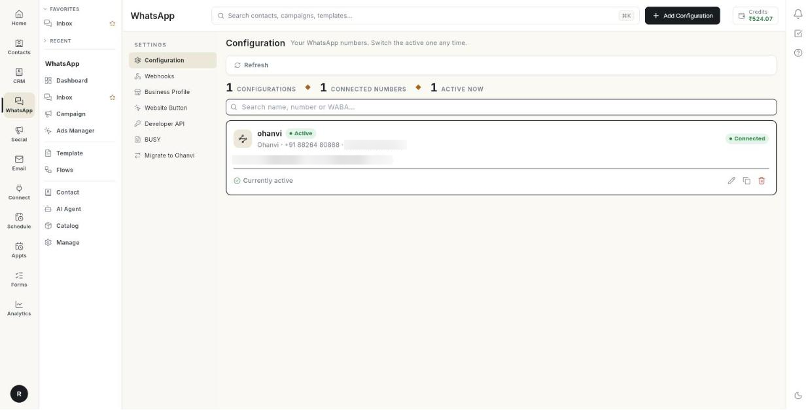

# Set up WhatsApp

These screens are not in the WhatsApp panel. Click your initials at the bottom left, then Settings → WhatsApp. They connect and configure your number.

**Where to find it:** click your initials at the bottom left, select **Settings**, then **WhatsApp**.

## Guides

| Guide | Use it when |
| --- | --- |
| [Connect your number](../connect-whatsapp-number.md) | You are setting up WhatsApp for the first time. |
| [Edit a configuration](../whatsapp-configuration-settings.md) | You want to change a connected number's settings. |
| [Business profile](../whatsapp-business-profile.md) | You want to change your picture, description or hours. |
| [Move your number to Ohanvi](../migrate-to-ohanvi.md) | You are moving from another WhatsApp provider. |
| [Add a chat button to your website](../add-website-chat-button.md) | You want a WhatsApp button on your site. |
| [Webhooks, Developer API and BUSY](../whatsapp-webhooks-and-integrations.md) | You send messages from your own software. |

## Before you start

- Your role has access to this screen. If you do not see it, ask your admin.
