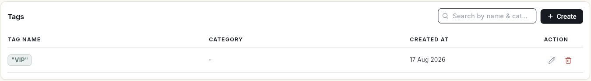
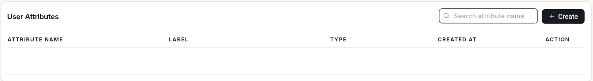
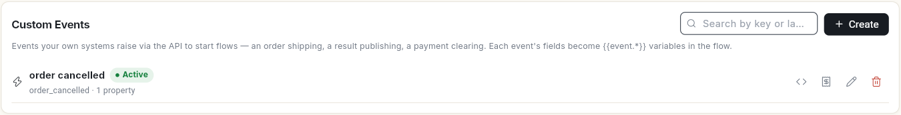

# Manage tags, user attributes and custom events

Tags group your contacts, user attributes store extra details on each contact, and custom events let your own systems start a flow. At the end, you know where each list lives and how to add to it.

## Before you start

- Your role can open WhatsApp **Manage**. These are admin screens. See [Manage team members, roles and permissions](../settings/roles-and-permissions.md).

## Steps

### Open the lists

1. Open **WhatsApp** in the left rail, then select **Manage**.
2. In the **Manage** list on the left, pick **Tags**, **User Attributes** or **Custom Events**.

### Tags

**Tags** lists every tag with its **Tag Name**, **Category**, **Created At** and **Action**.

1. Click **Create**. **Create Tag** opens.
2. Type a **Tag Name**. **Category (optional)** helps you group tags.
3. Click **Save**.

Use the pencil icon to rename a tag and the bin icon to delete it. To put a tag on contacts, see [Manage WhatsApp contacts](manage-whatsapp-contacts.md).

### User attributes

**User Attributes** are extra fields stored on each contact. The list shows the **Attribute Name**, its **Label**, the **Type** and **Created At**.

1. Click **Create** to add an attribute.
2. Search with **Search attribute name** to find one.

Attributes appear on each contact under **Custom Attributes**, and you can insert them into broadcasts with the **@** icon. See [Send a broadcast campaign](send-broadcast-campaign.md).

### Custom events

**Custom Events** are events your own systems raise through the API to start flows, for example an order shipping, a result publishing or a payment clearing. Each event's fields become `{{event.*}}` variables in the flow.

Each event shows its name, **Active** status, its key (for example `order_cancelled`) and how many properties it has. Click **Create** to add an event. Search by key or label to find one.

## Video walkthrough

[VIDEO]

## Related

- [Manage WhatsApp contacts](manage-whatsapp-contacts.md)
- [Send a broadcast campaign](send-broadcast-campaign.md)
- [Set up your WhatsApp business profile](whatsapp-business-profile.md)
