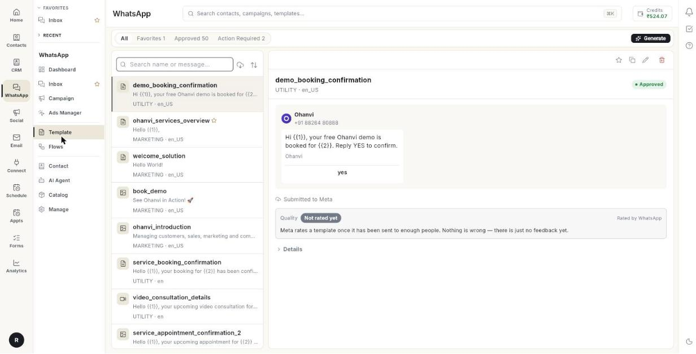

# Template

WhatsApp only lets a business start a chat with a template that Meta has approved. Here you create, submit and manage those templates.

**Where to find it:** open **WhatsApp** in the left rail, then select **Template**.

## Guides

| Guide | Use it when |
| --- | --- |
| [Create a message template](../create-message-template.md) | You want to write a new template and send it to Meta. |
| [Use the template library](../use-template-library.md) | You want to start from a ready-made template. |

## Before you start

- Your WhatsApp number is connected to Ohanvi. See [Connect your WhatsApp number](../connect-whatsapp-number.md).
- Your role has access to this screen. If you do not see it, ask your admin.
