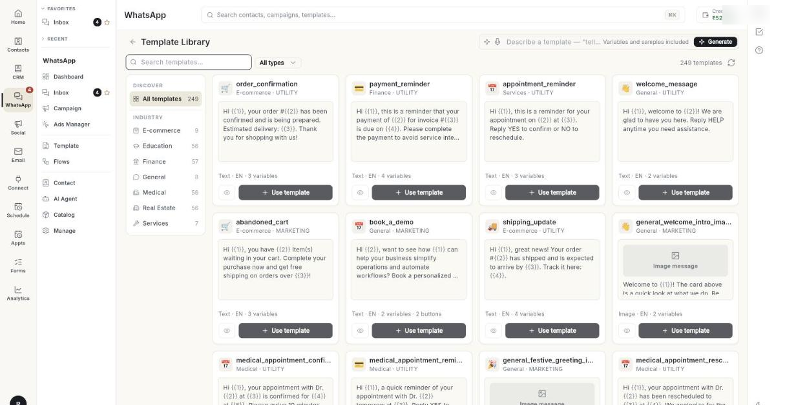

# Use the template library

Pick a ready-made WhatsApp template from the library, or describe a message and let AI write it. At the end, the template is saved to your account and submitted to Meta. Takes about 5 minutes. Meta usually decides within a few minutes.

## Before you start

- Your WhatsApp number is connected to Ohanvi. See [Connect your WhatsApp number](connect-whatsapp-number.md).
- You can see **Template** in the **WhatsApp** panel. If not, ask your admin to give your role template access. See [Roles and permissions](../settings/roles-and-permissions.md).
- Your role can create templates. Without that, you can browse and preview, but you cannot use a template or write one with AI.
- You know which category your message belongs to. See [Create a WhatsApp message template](create-message-template.md).

## What the library holds

The **Template Library** holds ready-made templates grouped by industry. Each card shows the industry, the kind of message (**Image message**, **Video message**, **Document message** or text), and two buttons: **Preview** and **Use template**.

A template you use is copied to your account. You can change it before you submit it. The library template itself does not change.

## Steps

### Open the library

1. Open **WhatsApp** in the left rail, then select **Template**. The **Templates** page opens.
2. Click **Browse Library**. The **Template Library** page opens.

    

3. To go back to your templates, use the back arrow at the top left of the page.

!!! tip "Other ways in"
    Click the arrow beside **New template** and choose **Start from the library…**. You can also click **Generate**. Both open the same **Template Library** page.

!!! note "No Explore tab"
    The **Templates** page does not show an **Explore** tab. Use **Browse Library** instead. [VERIFY: an Explore tab is not shown on the Templates page]

### Find a template

1. On a wide screen, look at the **DISCOVER** panel on the left. Click **All templates** to see everything.
2. Under **INDUSTRY**, click an industry. Each industry shows how many templates it holds.
3. On a narrow screen, the industries appear as filters in the strip above the list instead.
4. Type in **Search templates…** to search by name, use case or industry.
5. Choose a language from the language list. The list shows **All languages** first. It appears only when the library has more than 1 language.
6. Choose a message type: **All types**, **Text**, **Image**, **Video** or **Document**.
7. Read the count beside the list, for example "12 templates".
8. Click **Refresh** to reload the list.

### Preview a template

1. On a card, click **Preview**. A phone-style preview opens.
2. Check the header, body, footer and buttons.
3. Click the close icon to return to the list.

### Use a library template

1. On the card, click **Use template**. The **Customize Template** form opens with the fields already filled in.
2. Change the **Template name** if you want a different name. Use lowercase letters, numbers and underscores only.
3. Check the **Template Category** and **Template Language**.
4. Edit the header, body, footer and buttons as you need. The form works like the one for a new template. See [Create a WhatsApp message template](create-message-template.md).
5. Check the **Example** for each variable. Use real-looking values.
6. Click **Save & Submit for Approval**. The message **Template saved. Awaiting WhatsApp approval.** appears.
7. Open **Template**. The template shows **In review** until Meta decides.

### Write a template with AI

1. On the **Template Library** page, click the box at the top. It reads **Describe a template — "tell customers their order has shipped"**.
2. Type what the message should do. Or click an idea under **TRY THESE**.
3. Optional: pick an industry first. The AI writes for that industry.
4. Optional: click the microphone icon, **Describe the template out loud**, and speak your description.
5. Click **Generate**. The box reads **Writing…** while the draft is made. The draft includes variables and samples.
6. Read the **Review AI Draft** form. Check the wording, category, variables and examples.
7. Change anything that is wrong.
8. Click **Save & Submit for Approval**. A message says the template was added to your templates, and the **Templates** page opens.

!!! warning "Check every AI draft"
    AI can get facts and offers wrong. You are responsible for what your template says. Meta can still reject it.

Inside the template form, AI buttons are named **Generate with AI**, **Fix template name** and **Improve wording**. [VERIFY: where these buttons appear in the form]

### Filter your templates by tab

1. Open **WhatsApp** → **Template**.
2. Click a tab: **All**, **Favorites**, **Pending**, **Approved** or **Action Required**.
3. Read the number beside the tab name. It counts the templates in that tab.
4. Click **All** to see every template again.

A tab with no templates is hidden. **All** and the tab you have open always stay. **Action Required** holds every template you need to fix. See [Create a WhatsApp message template](create-message-template.md).

### Pin a favorite template

1. On the **Templates** page, find the template.
2. Click **Add to favorites**.
3. Click the **Favorites** tab to see your pinned templates.
4. To unpin a template, click **Remove from favorites**.

If the star does not change, the message **Could not update favorite.** appears. Try again.

## Troubleshooting

| Issue | Cause | Fix |
| --- | --- | --- |
| **No library templates found** | Your search, language, type or industry filter matches nothing. | Try a different search term or industry. Choose **All types** and **All languages**. |
| **Could not load the template library** | The library did not load. | Click **Refresh**. If it still fails, reload the page and try again. |
| The box for writing with AI is missing, or **Use template** does not work. | Your role cannot create templates. | Ask your admin for template access. See [Roles and permissions](../settings/roles-and-permissions.md). |
| **Describe the template you want first.** | You clicked **Generate** with an empty box. | Type a description, then click **Generate**. |
| **Could not generate a template.** | The draft did not come back. | Click **Generate** again. Make the description more specific. |
| A tab such as **Pending** is missing. | A tab with no templates is hidden. | Nothing to fix. The tab returns when it holds a template. |
| The template shows **Rejected** after you submit it. | Meta refused the wording or layout. | See **Fix a rejected template** in [Create a WhatsApp message template](create-message-template.md). |

## Related

- [Create a WhatsApp message template](create-message-template.md)
- [Send a broadcast campaign](send-broadcast-campaign.md)
- [Read a campaign report](read-campaign-report.md)
- [Create canned messages](create-canned-messages.md)
