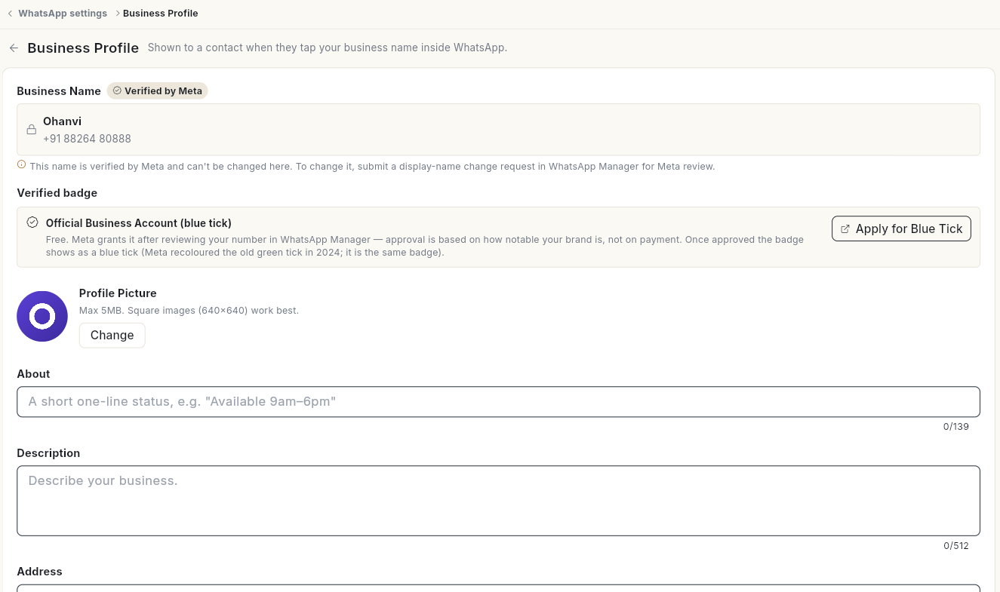
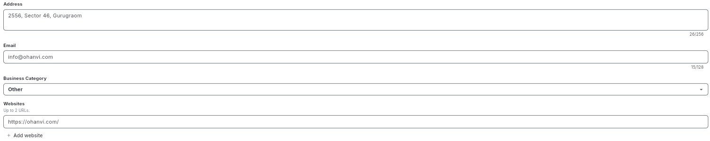
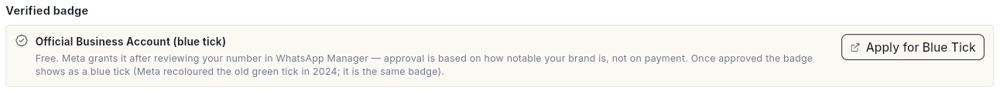
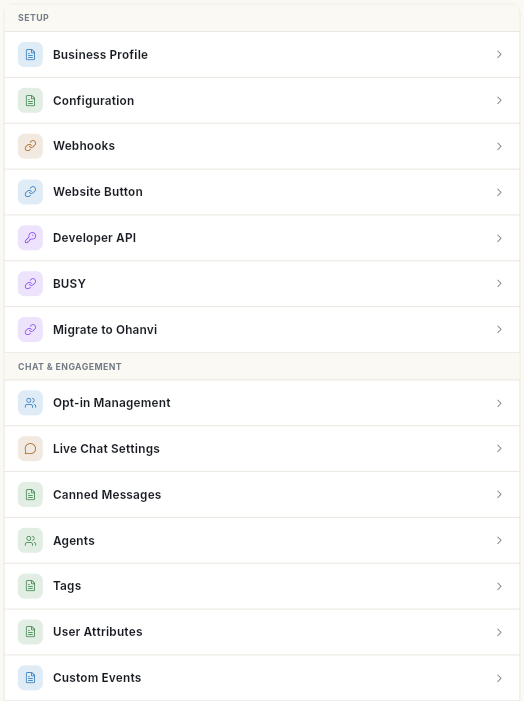
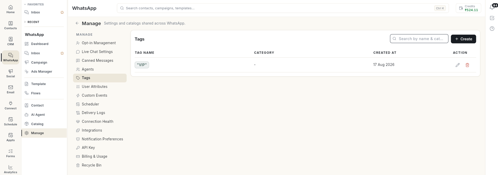

# Set up your WhatsApp business profile

Fill in the profile customers see when they tap your business name inside WhatsApp. At the end, your picture, about line, address, email and websites are live on WhatsApp, and you know where every other WhatsApp setting lives.

## Before you start

- Your WhatsApp number is connected. See [Connect your WhatsApp number](connect-whatsapp-number.md).
- Your role can open WhatsApp **Configuration** and **Business Profile**. These are admin screens. See [Manage team members, roles and permissions](../settings/roles-and-permissions.md).
- Your logo is a square image of 5 MB or less, with a solid background.

## Steps

### Open the business profile

1. Click your initials in the bottom-left corner, then click **Settings**.
2. Select **WhatsApp**, then **Business Profile**. The **Business Profile** screen opens.

    

When you are already on a WhatsApp settings screen, you can also pick **Business Profile** in the **Settings** list on the left.

### Change the profile picture

1. Under **Profile Picture**, click **Change**.
2. Pick an image. Square images of 640×640 work best.
3. If **This image has a transparent background** appears, click **Pick another** and choose one with a solid background. WhatsApp fills transparent areas with black.
4. The message **Profile picture updated.** appears.

### Edit the profile details

1. Fill in the fields you need:

    | Field | What to enter | Limit |
    | --- | --- | --- |
    | **About** | A short one-line status, for example **Available 9am–6pm**. | 139 characters |
    | **Description** | What your business does. | 512 characters |
    | **Address** | Your business address. | 256 characters |
    | **Email** | The email customers can contact. | 128 characters |
    | **Business Category** | The category that fits your business best. | — |
    | **Websites** | Click **Add website** for each link. | Up to 2 URLs |

    

2. Click **Save Changes** at the top right. The message **Business profile saved.** appears.

**Business Name** shows **Verified by Meta** and cannot be edited here. To change it, submit a display-name change request in WhatsApp Manager for Meta review.

### Apply for the blue tick

1. Under **Verified badge**, read the **Official Business Account (blue tick)** note.

    

2. Click **Apply for Blue Tick**. Meta's WhatsApp Manager opens in a new tab.
3. Complete the request there. The badge is free. Meta approves it based on how notable your brand is.

### Find other WhatsApp settings

The WhatsApp settings are split between **Settings** and the **Manage** screen.

In **Settings** → **WhatsApp**, under **Setup**:

| Row | What it holds |
| --- | --- |
| **Business Profile** | This page. |
| **Configuration** | Your connected numbers. See [Connect your WhatsApp number](connect-whatsapp-number.md). |
| **Webhooks** | The Webhook URL and Verify Token for Meta, and incoming events. See [Webhooks and integrations](whatsapp-webhooks-and-integrations.md). |
| **Website Button** | The WhatsApp chat button for your website. |
| **Developer API** | Keys for sending WhatsApp messages from your own software. See [Webhooks and integrations](whatsapp-webhooks-and-integrations.md). |
| **BUSY** | Sends invoices from BUSY accounting software on WhatsApp. See [Webhooks and integrations](whatsapp-webhooks-and-integrations.md). |
| **Migrate to Ohanvi** | Steps to move from another WhatsApp provider. See [Move your number to Ohanvi](migrate-to-ohanvi.md). |

Open **WhatsApp** in the left rail, then select **Manage**. Its list on the left holds:

| Item | What it holds |
| --- | --- |
| **Opt-in Management** | Extra opt-out and opt-in words, and the confirmation replies. See [Manage WhatsApp contacts](manage-whatsapp-contacts.md). |
| **Live Chat Settings** | Auto-resolve, welcome, off-hours and handoff messages, and working hours. See [Use the WhatsApp inbox](use-whatsapp-inbox.md). |
| **Canned Messages** | Saved replies your team inserts with **/** in the inbox. |
| **Agents** | Your WhatsApp team. See [Add WhatsApp agents](add-whatsapp-agents.md). |
| **Tags** | The tag list for contacts. Click **Create** and enter a **Tag Name**. |
| **User Attributes** | Custom fields stored on each contact, such as **Text**, **Number**, **Date** or **Yes / No**. |
| **Custom Events** | Events your own systems raise through the API to start flows. |
| **Scheduler** | Messages and jobs scheduled to send later. |
| **Delivery Logs** | The delivery status of each message sent. |
| **Connection Health** | Whether your number's connection is working. |
| **Integrations** | The services your automations read from and write to. |
| **Notification Preferences** | Which WhatsApp events notify you. |
| **API Key** | Opens **Cloud API Access**: get Ohanvi's assisted setup, or connect your number to the Meta Cloud API yourself. See [Connect your WhatsApp number](connect-whatsapp-number.md). |
| **Billing & Usage** | Meta conversation charges. |
| **Recycle Bin** | Items you deleted. Select them and click **Restore selected**. |

## Video walkthrough

[VIDEO]

## Troubleshooting

| Issue | Cause | Fix |
| --- | --- | --- |
| **That image is …MB. WhatsApp allows up to 5MB — please pick a smaller one.** | The picture is larger than 5 MB. | Resize or compress the image, then click **Change** again. |
| Logo shows on a black background in WhatsApp | The image had a transparent background. | Upload a version with a solid background. |
| **Could not load business profile** | Ohanvi could not read the profile from WhatsApp, often because no number is connected or the token expired. | Click **Retry**. If it still fails, check the number in **Configuration**. |
| You cannot edit **Business Name** | Meta verifies the display name. | Submit a display-name change request in WhatsApp Manager. |
| **Could not save the business profile.** | WhatsApp rejected the change. | Check the field limits above and try again. |

## Related

- [Connect your WhatsApp number](connect-whatsapp-number.md)
- [Move your number to Ohanvi](migrate-to-ohanvi.md)
- [Open Settings and find a setting](../settings/open-settings.md)

