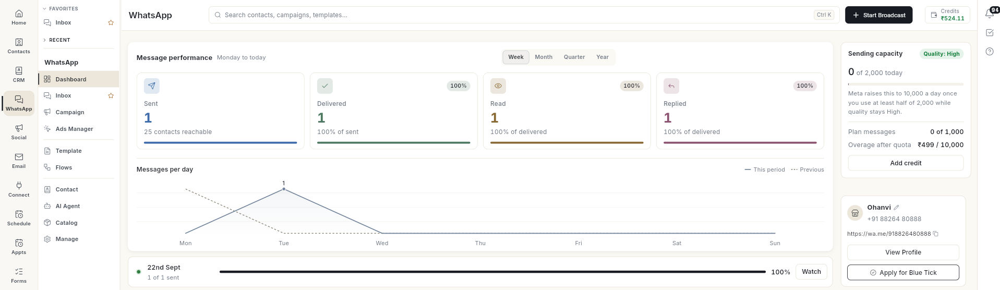
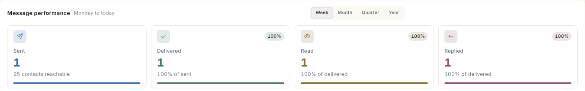
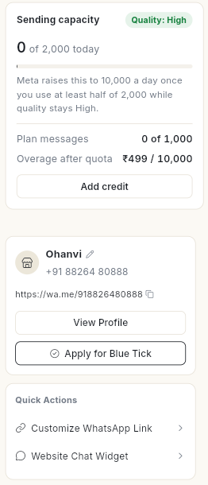
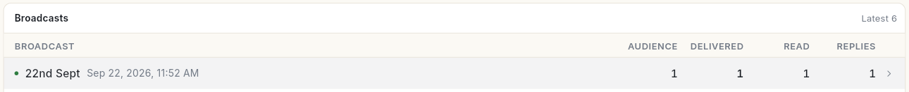
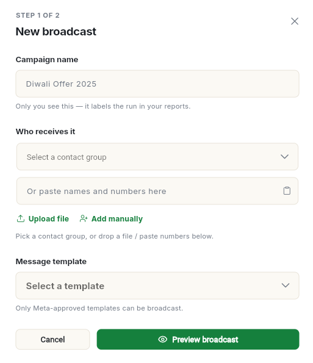

# Read the WhatsApp dashboard

Use the WhatsApp **Dashboard** to see how your messages are doing at a glance. At the end of this page you can read your sent, delivered, read and replied numbers, check your daily sending limit and quality rating, and open the broadcast or chat behind any number.

## Before you start

- Your WhatsApp number is connected. Until it is, the **Dashboard** shows the connect steps instead. See [Connect your WhatsApp number](connect-whatsapp-number.md).
- You can see **Dashboard** in the **WhatsApp** panel. If not, ask your admin. See [Manage team members, roles and permissions](../settings/roles-and-permissions.md).

## Steps

### Open the dashboard

1. Open **WhatsApp** in the left rail, then select **Dashboard**.
2. The dashboard opens. What it shows depends on your role:

    | Role | Main section |
    | --- | --- |
    | Admin or business owner | **Message performance** for the whole business. |
    | Manager | **Team throughput**, with **Sent today**, **Running now**, **Waiting for a reply** and **Failed today**. Click **Open shared inbox** to go to the inbox. |
    | Executive | **Your messages**, with shortcuts to **Inbox**, **Contacts**, **Chat history** and **Your WhatsApp link**. |

    

### Act on alerts

When something needs your attention, a bar shows at the top of the dashboard. Click the button on the right of the bar:

| Bar | Button | What opens |
| --- | --- | --- |
| **2 messages failed.** | **Review failures** | **Failed messages** for the period. Each message shows the contact, the reason, for example **Media upload error**, and the broadcast it came from. Click **Open Delivery Logs** at the bottom to see every failed message with its **Error code** and **Error message**. |

### Read message performance

1. Pick a period: **Week**, **Month**, **Quarter** or **Year**. The text next to **Message performance** shows the dates covered, for example **Monday to today** for **Week** and **This calendar month** for **Month**.
2. Read the 4 numbers:

    | Number | What it means |
    | --- | --- |
    | **Sent** | Messages sent in the period, with how many contacts are reachable. |
    | **Delivered** | Messages that reached the phone, as a share of sent. |
    | **Read** | Messages the customer opened, as a share of delivered. |
    | **Replied** | Messages the customer answered, as a share of delivered. |

    

3. Click any number to open the messages behind it. For example, **Sent** opens **Messages sent** for the period. Each message shows the contact, its status (**Sent**, **Delivered**, **Read**, **Replied**) and the broadcast it came from. Click a message to read it on the right.
4. Read the **Messages per day** chart below. **This period** is a solid line and **Previous** is dashed.

Under the chart, a strip shows your latest broadcast and how many of its messages are sent, for example **1 of 1 sent**. Click **Watch** on the strip to open a side panel with its status, for example **Completed**, the sent, delivered, read and failed counts, and the list of recipients.

### Check sending capacity and quality

On a wide screen, the panel on the right shows your account:

| Item | What it means |
| --- | --- |
| **Sending capacity** | How many people you can message today. Meta sets it once the number is verified and sending. |
| Quality | **Quality: High**, **Quality: Medium**, **Quality: Low** or **Quality: Not rated yet**. Meta rates it from how customers react to your messages. |
| **Plan messages** | Messages used this month out of your plan, with the charge for any messages over it. The **Add credit** button is below it. |
| Business card | Your business name, WhatsApp number and `wa.me` link, with **View Profile** and **Apply for Blue Tick**. |
| **Quick Actions** | **Customize WhatsApp Link** and **Website Chat Widget**. |
| **Setup Progress** | Shows until **WhatsApp Business API Connected** and **Business Name Verified by Meta** are both done. After that it is hidden. |

Meta raises your daily limit once you use at least half of it while quality stays **High**. While quality is Medium or Low, Meta does not raise it.

### Check recent broadcasts

1. Scroll to **Broadcasts**. It lists your latest 6 broadcasts with **Audience**, **Delivered**, **Read** and **Replies**.

    

2. Click **View all campaigns** at the bottom to open the full campaign list in **Campaign**.
3. To start a new one, click **Start Broadcast** at the top. The **New broadcast** dialog opens. See [Send a broadcast campaign](send-broadcast-campaign.md).

    

## Video walkthrough

[VIDEO]

## Troubleshooting

| Issue | Cause | Fix |
| --- | --- | --- |
| The **Dashboard** shows **Connect WhatsApp** instead of numbers | No number is connected yet. | Follow [Connect your WhatsApp number](connect-whatsapp-number.md). |
| **Some WhatsApp data could not load** | Part of the data failed to load. | Refresh the page. If it keeps showing, check your number in **Configuration**. |
| **No broadcasts yet** | You have not sent a broadcast. | Click **Start Broadcast**. |
| Sending capacity stays the same | Quality is Medium or Low, or you used less than half of your limit. | Improve quality, then keep using at least half of the limit each day. |
| **Cloud storage is full.** | Your media storage is full. | Delete old media or upgrade your plan. Click **Manage storage**. |

## Related

- [Use the WhatsApp inbox](use-whatsapp-inbox.md)
- [Connect your WhatsApp number](connect-whatsapp-number.md)
- [Read marketing analytics](../analytics/read-marketing-analytics.md)
- [Credits and billing](../credits-and-billing.md)

